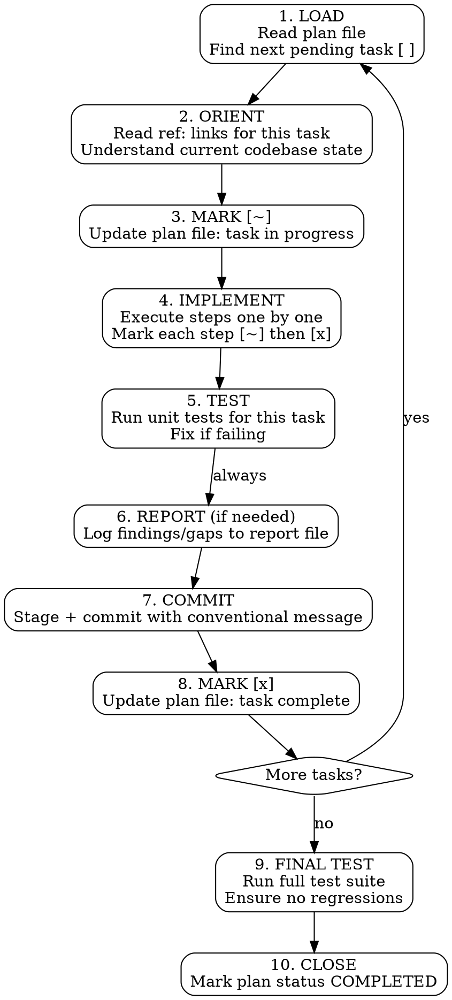
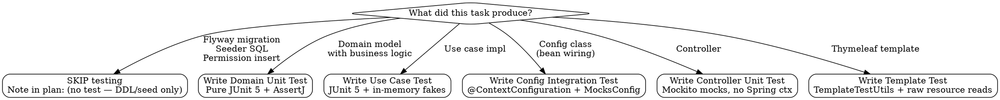
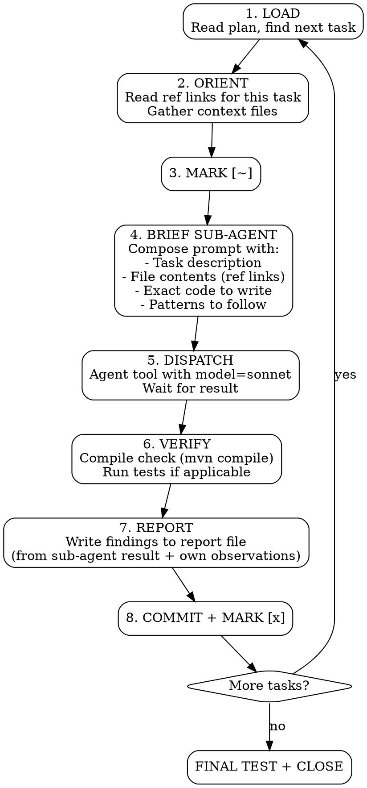

# Execute Plan

## Overview

Executes a structured implementation plan task-by-task. Marks progress, runs tests, commits per task, and writes findings to the report file when gaps or issues are discovered.

**Core principle:** One task at a time. Mark it, implement it, test it, commit it. Never skip ahead.

## When to Use

- User has an existing plan in `docs/plans/`
- User says: "execute plan", "jalankan plan", "implement task 1", "lanjut task berikutnya"
- User passes a plan file path as argument

**When NOT to use:**
- No plan exists yet (use `plan-from-brainstorm` skill first)
- User wants to brainstorm (use `copilot-brainstorming` skill)

## Invocation

```
/execute-plan docs/plans/2026-05-15-vendor-payment.md
```

Optional: specify a task number to start from:
```
/execute-plan docs/plans/2026-05-15-vendor-payment.md --task 3
```

## Workflow



## Phase Details

### 1. LOAD

- Read the plan file
- Find the first task with `[ ]` status (or use `--task N` if specified)
- If all tasks are `[x]`, go to FINAL TEST

### 2. ORIENT (Context Recovery)

This phase is critical after context compaction or fresh session start.

- Read ALL `ref:` links listed in the current task
- If a ref file doesn't exist or lines shifted, use the description hint to locate the correct section
- Read the brainstorming source doc section relevant to this task (linked in plan header)
- Understand what was already done (check previous tasks marked `[x]`)

**For template/JS tasks (additional ORIENT steps):**
- Read `docs/spec/index.md` to identify which UI component specs apply to this task
- Read each relevant spec (`autocomplete-generic.md`, `modal-selector.md`, `numeric-standards.md`, `datetime-standards.md`, `header-lines-form.md`, `form-submission.md`) based on the UI components described in the brainstorming doc's UI/UX section
- Do NOT rely solely on the reference module's template — it may be a special case (e.g., vendor bill has readonly derived fields, not interactive autocompletes)
- Cross-reference with an existing **interactive** form (e.g., Purchase Order form) if the feature requires user-selectable autocompletes or modal selectors

### 3. MARK [~] — In Progress

Update the plan file: change the task's checkbox from `[ ]` to `[~]`

```markdown
### Task 3: Application Use Cases
- [~] Step 1: Create CreateVendorPaymentUseCase interface...
```

### 4. IMPLEMENT

Execute each step in order:
- Mark step `[~]` when starting
- Do the actual implementation (write code, create files, modify configs)
- Mark step `[x]` when verified
- If a step reveals something unexpected, note it for the REPORT phase

**Implementation rules:**
- Follow project standards in `docs/AGENTS.md`
- Match patterns from reference modules cited in the task
- Use lean-ctx tools for reading/searching
- Never introduce patterns not already in the codebase

**FE implementation rules (for template/JS tasks):**
- Autocomplete fields MUST use either the `fragments/inputs :: autocomplete(...)` Thymeleaf fragment OR manual `initLookup()` in page-specific JS — a bare `data-autocomplete` attribute alone is non-functional
- Modal selectors MUST include: (1) modal shell fragment in template, (2) selector controller endpoint returning HTMX fragment, (3) page-specific JS consumer that opens modal and maps `data-*` payload to form fields
- Numeric inputs with `data-autonumeric` MUST use `ErpNumeric.get(input)` / `ErpNumeric.set(input, value)` in JS — never raw `parseFloat` or `input.value`
- Date inputs MUST use `data-picker="date"` attribute (Flatpickr auto-initializes via global handler)
- Dynamic lines MUST use `ErpLineManager` if adding/removing rows, or at minimum rewrite `name` indices on add/remove
- Form submission MUST follow `docs/spec/form-submission.md` — either `data-ajax-form="true"` with `data-redirect-on-success` or HTMX pattern
- Cascading behavior (e.g., vendor change → reload bills, currency change → filter bank accounts) MUST be wired in page-specific JS with proper event listeners and AJAX calls to reload dependent data

### 5. TEST

**A task is NOT complete until its tests pass.** This is a hard gate — no exceptions for testable tasks.

#### 5a. Determine if task is testable



#### 5b. Test patterns by layer

**Domain Unit Test** (for domain model tasks):
- Pure JUnit 5 + AssertJ, zero framework dependencies
- Test: status transitions, validation rules, invariants, defensive copies
- Pattern: construct domain object → call method → assert state/exception
- ref: `src/test/.../vendorbill/domain/model/VendorBillTest.java`

**Use Case Test** (for application layer tasks):
- `@ExtendWith(MockitoExtension.class)` + `@Mock` annotations
- `@Mock` for repository, cross-slice ports, and external use cases
- Construct use case impl manually in `@BeforeEach` with mocked deps
- `when(...).thenReturn(...)` for stubbing query results
- `verify(...)` for side-effect assertions (e.g., verify repo.save called)
- `assertThatThrownBy(...)` for every validation rule → DomainException
- Test: happy path, each validation rule, edge cases (boundary values, empty lists)
- ref: `src/test/.../purchasing/purchaseorder/application/usecase/command/CreatePurchaseOrderUseCaseTest.java`

**Config Integration Test** (for infrastructure config tasks):
- `@ExtendWith(SpringExtension.class)` + `@ContextConfiguration(classes = {XxxConfig.class, MocksConfig.class})`
- Inner `@Configuration` class `MocksConfig` provides mocked external deps
- Test: all beans are non-null (proves wiring works)
- ref: `src/test/.../vendorbill/infrastructure/config/VendorBillConfigTest.java`

**Controller Unit Test** (for web layer tasks):
- `@ExtendWith(MockitoExtension.class)` with `mock()` for all use cases
- NO Spring context, NO `@WebMvcTest` (removed in Spring Boot 4)
- Test: view name returned, model attributes populated, `@PreAuthorize` annotation values via reflection
- ref: `src/test/.../vendorbill/web/controller/VendorBillControllerTest.java`

**Template Test** (for Thymeleaf template tasks):
- Two sub-patterns:
  1. **Static check** — `readResource(path)` + `assertThat(html).contains(...)` for fragment IDs, DTO property names, permission strings
  2. **Security render** — `TemplateTestUtils.renderWithSecurity(template, vars, auth(...))` for `sec:authorize` show/hide
- Test: permission-gated buttons visible/hidden, HTMX targets exist, CSRF token present
- ref: `src/test/.../vendorbill/web/template/VendorBillTemplateTest.java`

#### 5c. Execute tests

```bash
# 1. Compile check (always)
mvn compile -q -pl .

# 2. Run tests for this task's module
mvn test -pl . -Dtest="VendorPayment*" -DfailIfNoTests=false

# 3. If tests fail → fix implementation, NOT the test (unless test is wrong)
# 4. Re-run until green
```

#### 5d. Skip criteria

A task may skip testing ONLY if it produces:
- Pure DDL (Flyway migration creating tables)
- Seed data SQL (permissions, menu entries, accounting schema lines)
- Interface-only files (ports with no implementation logic)
- Simple DTO classes (no conditional logic, just fields + getters/setters)

When skipping, annotate the plan: `(no test — {reason})`

**If in doubt, write the test.** A 5-line test that proves wiring works is better than no test.

### 6. REPORT (After Every Task)

Write to `docs/reports/{plan-filename}.md` after EVERY task completion. This is NOT optional — even a "clean" task gets a one-line entry confirming no issues found.

**Always write (minimum):**
```markdown
## Task {N}: {Title}
- **Status:** clean | findings
- **Summary:** {1-line what was done}
```

**Write detailed entry when ANY of these occur:**

| Trigger | What to Log |
|---|---|
| Spec gap found | Missing detail in brainstorming doc that required a judgment call |
| Code pattern violation | Existing code doesn't match documented standards |
| Possible bug discovered | Pre-existing issue found while implementing |
| Design decision made | Choice not covered by brainstorming doc |
| Dependency issue | Missing library, version conflict, etc. |
| Test adjustment needed | Existing test needed updating due to new dependencies |
| Deviation from plan | Step was done differently than planned (explain why) |

**Detailed report entry format:**

```markdown
## Task {N}: {Title}

### Finding: {short description}
- **Type:** gap | violation | bug | decision | dependency | deviation
- **Severity:** info | warning | critical
- **Detail:** {what was found}
- **Action taken:** {what you did about it}
- **Ref:** {file path if relevant}
```

**Why mandatory:** The report serves as an audit trail for manual testing. When QA finds a bug, they check the report to understand what judgment calls were made and where deviations occurred. An empty report means the implementor didn't reflect on their work — which is a red flag, not a sign of perfection.

### 7. COMMIT

After tests pass, create a commit for this task:

**Commit message format (Conventional Commits, English):**

```
{type}({scope}): {description}

{body - what was done in this task}
```

Types: `feat`, `fix`, `refactor`, `chore`, `docs`, `test`
Scope: module name in kebab-case (e.g., `vendor-payment`, `bank-account`)

**Examples:**
```
feat(vendor-payment): add domain model and repository port

- VendorPayment aggregate root with status lifecycle
- VendorPaymentLine value object for bill allocation
- VendorPaymentRepository port interface
```

```
chore(bank-account): add currencyId and coaId fields

- Flyway migration V45__bank_account_refactor.sql
- Update BankAccount entity with new fields
- Update seeder with currency and COA references
```

**Staging rules:**
- Stage only files related to this task
- Never stage unrelated changes
- Check `git status` before committing

### 8. MARK [x] — Complete

Update the plan file: change task checkbox from `[~]` to `[x]`

```markdown
### Task 3: Application Use Cases [x]
- [x] Step 1: Create CreateVendorPaymentUseCase interface...
- [x] Step 2: ...
```

### 9. FINAL TEST (After All Tasks)

When all tasks are `[x]`:

```bash
# Full test suite
mvn test -pl .

# If specific integration tests exist
mvn verify -pl .
```

Fix any regressions before closing.

### 10. CLOSE

- Update plan header: `Status: COMPLETED`
- Add completion date
- Final report entry summarizing overall findings

## Context Recovery Protocol

When starting a fresh session or after compaction:

1. Read the plan file — identify current task (the one marked `[~]` or first `[ ]`)
2. Read the plan header for source brainstorming doc path
3. Read `ref:` links for the current task
4. Check `git log --oneline -10` to see what was already committed
5. Resume from where you left off

**This is why ref links exist.** Without them, a compacted agent would need to re-discover the entire codebase context.

## Parallel Execution (Multiple Agents)

If multiple agents work on the same plan:
- Each agent claims a task by marking it `[~]` immediately
- Check for `[~]` tasks before claiming — if one exists and isn't yours, skip to next `[ ]`
- Respect `Depends on: Task N` — don't start a task if its dependency isn't `[x]`

## Common Mistakes

- **Skipping ORIENT phase** — Reading ref links is not optional. After compaction you WILL write wrong code without them.
- **Committing with failing tests** — Never. Fix first.
- **Giant commits** — One commit per task. Not one commit for the entire plan.
- **Forgetting to update plan file** — The plan file IS the source of truth for progress. Update it.
- **Not writing reports** — If you made a judgment call not in the brainstorming doc, log it. Future you (or another agent) needs to know.
- **Implementing deferred items** — If the plan doesn't include it, don't build it.
- **Modifying the plan structure** — The plan was approved. If you think a task needs splitting, add a note in the report but don't restructure the plan without user approval.

## Testing Red Flags — STOP and Fix

- **Skipping config integration test** — If you created or modified a `XxxConfig.java`, you MUST write a `XxxConfigTest.java` that proves beans wire correctly.
- **No edge case tests for use cases** — Happy path alone is insufficient. Every validation rule in the brainstorming doc needs a test that triggers the DomainException.
- **Using `@WebMvcTest`** — Removed in Spring Boot 4. Use plain Mockito-based controller tests without Spring context.
- **Using `@MockBean`** — Removed in Spring Boot 4. Use `@Mock` with `@ExtendWith(MockitoExtension.class)` instead.
- **Template test without security render** — If the template has `sec:authorize`, you MUST test visibility with `TemplateTestUtils.renderWithSecurity`.
- **Marking task [x] without running tests** — A task with test steps is NOT complete until `mvn test -Dtest="XxxTest"` passes green.
- **Using `@SpringBootTest` for use case tests** — Use case tests must be fast (no Spring context). Use `@ExtendWith(MockitoExtension.class)` only.
- **Not testing `@PreAuthorize` annotations** — Controller tests must verify security annotations via reflection (see `VendorBillControllerTest.cancel_should_require_cancel_authority`).

## E2E (Playwright) Red Flags — STOP and Fix

These rules apply to any task that creates or modifies a Playwright spec. Violations are not theoretical — every item here represents a bug from prior sessions. Reference: `docs/tests/playwright-pitfalls.md`.

- **Marking E2E task [x] without running the spec at least once** — Unit tests pass != spec works. Compile (`tsc --noEmit`) and listing (`playwright test --list`) are not substitutes. Run minimum: `npx playwright test {file} -g "{scenario name}"` for the new/changed scenario. The ENTIRE class of bugs in 4 rounds of fixes (selectTomSelect signature, badge selector, Bootstrap modal vs native dialog, page-still-on-about:blank) would have been caught by ONE actual run.
- **Calling `page.evaluate(fetch)` before `page.goto`** — `about:blank` has no origin; relative URLs do not resolve. Use `page.request.get(url)` instead — APIRequestContext carries storage-state cookies and resolves against `baseURL` regardless of navigation state.
- **Using `setTomSelectValue` for fields where page JS reads `options[val].payload`** — The helper injects `{id, name, text}` only — no payload. Page change handlers reading `payload.uomId`/`payload.lastCost`/etc. silently fail. For payload-dependent fields, fetch the LookupDto explicitly and inject via `addOption(opt)` + `setValue(id)`. ALL dependent-field forms (SA product → uomId, PR product → lastCost, anywhere with `data-payload-driven`) need this pattern.
- **Using `selectTomSelect` helper from `helpers/tomselect.ts`** — Known broken: `ts.load(query, callback)` does not match TomSelect API; promise never resolves. Until helper is fixed, use payload-aware local helper or `setTomSelectValue` (when payload not needed).
- **Using `page.on('dialog', d => d.accept())` for Solusi ERP confirm flows** — Project uses Bootstrap modal `#modal-global-confirm` via `ErpModal.confirm` and `ErpAction.confirmAndSubmit`, NOT native `window.confirm`. Click `#confirm-modal-btn-yes` instead. Dialog handler matches nothing and times out.
- **Time-based freshness checks on `.auth/*.json` storage state** — H2 in-memory wipes sessions on JVM restart but mtime stays "fresh". Use server probe (`page.context().request.get('/dashboard', {maxRedirects:0})` and accept only 2xx) instead of `Date.now() - mtimeMs < TTL`.
- **Picking JAR via alphabetical order in run scripts** — After version bump, both old and new JARs co-exist in `target/`. Sort by `LastWriteTime -Descending` (PowerShell) or `ls -t` (bash) and clean stale artifacts before build.
- **Asserting status badge on the form/edit page** — Many ERP modules render the badge ONLY on the view page, not on the form. Check `templates/{module}/view.html` vs `templates/{module}/form.html` before writing the assertion. PR-style "edit page has badge" is the exception, not the norm.
- **URL from entity name instead of `@RequestMapping`** — Many controllers are mounted on rebranded URLs (e.g., `/security/menu-groups` for "PermissionGroup" entity). Always grep `@RequestMapping` for the actual Thymeleaf route. The `/api/...` URL is the JSON API; the view URL is usually different.
- **Returning view name from `@ExceptionHandler` without `@ResponseStatus`** — Spring renders the error view but with HTTP 200. Test classifiers checking `status >= 400` will mis-classify. Always pair view-returning error handlers with `@ResponseStatus(HttpStatus.XXX)` matching the semantic status.

### E2E Task Test Gate

For tasks producing Playwright specs, the test gate is stricter than unit-test tasks:

1. **Compile the TS:** `cd e2e-tests && npx tsc --noEmit` — must be clean
2. **List the spec:** `npx playwright test {file} --list` — confirms structure parses
3. **Run the spec at least once:** `npx playwright test {file}` — green required, not just compile
4. **For SA/PR-class transactional specs:** run the cold path too (`rm -rf .auth/ && npx playwright test {file}`) — catches storage state assumptions

If the test gate cannot run (no JAR built, server unavailable), DO NOT mark task `[x]`. Instead leave it `[~]` and write a report finding noting "E2E run deferred — gate not executed". The next session must execute the gate before considering the task complete. Deferring without a finding is the bug pattern that caused 10 distinct E2E failures in one stream.

---

## Sub-Agent Delegation Mode (Optional)

**Trigger:** User explicitly says "gunakan sub agent", "use sub-agent", "delegate to sub-agent", "sub agent driven", or similar phrasing in the invocation prompt.

**Default behavior (no trigger):** The orchestrator agent implements each task directly, one by one, within its own context. This is the standard mode.

### When to Use Sub-Agent Mode

- Plan has 5+ independent tasks
- Tasks are well-scoped (clear inputs/outputs, no ambiguous judgment calls)
- User wants faster execution and is willing to trade some nuance for speed
- Tasks don't require deep cross-task context (each task is self-contained)

### When NOT to Use Sub-Agent Mode

- Tasks require iterative discovery (e.g., "investigate and fix")
- Tasks have heavy cross-dependencies where Task N's output shapes Task N+1's approach
- Plan has fewer than 3 tasks (overhead not worth it)
- Tasks require subjective design decisions that need user input mid-task

### Sub-Agent Workflow



### Briefing the Sub-Agent (Critical)

The quality of sub-agent output depends entirely on the briefing. The orchestrator MUST:

**1. Provide complete context (not references to read):**
- Include the ACTUAL file contents the sub-agent needs (not just paths)
- Include the exact pattern to follow (copy from reference module)
- Include the exact file paths to create/edit

**2. Be prescriptive, not exploratory:**
- Tell the sub-agent WHAT to write, not "figure out what to write"
- Provide code templates/skeletons when possible
- Specify exact class names, method signatures, package paths

**3. Include validation step:**
- Always end with "Run `mvn compile -q -pl .` to verify"
- For test tasks: "Run `mvn test -Dtest=XxxTest` to verify"

**4. Request findings explicitly:**
- Add to the prompt: "If you encounter anything unexpected (missing files, pattern deviations, possible bugs, decisions not covered by the plan), list them at the end of your response under a FINDINGS section."

### Sub-Agent Prompt Template

```
You are implementing Task {N} of a plan for the Solusi ERP project.
The task is to {task description}.

## Project Context
- Java 21, Spring Boot 4, Clean Architecture + DDD + CQRS
- Package base: `com.solusi.erp`
- Working directory: `F:\solusi-program-erp`

## What to Create/Edit

### 1. {File description}
Path: `{exact path}`
{Exact code or detailed instructions}

### 2. {File description}
Path: `{exact path}`
{Exact code or detailed instructions}

## Reference Patterns
{Paste actual file contents of reference implementations}

## Important Notes
{Entity fields, existing methods, constraints}

## Execution
1. {Step 1}
2. {Step 2}
3. Run `mvn compile -q -pl .` to verify

## Findings
If you encounter anything unexpected (missing files, pattern deviations,
possible bugs, decisions not covered by the plan), list them at the end
of your response under a FINDINGS section with format:
- **Type:** gap | bug | decision | deviation
- **Detail:** what you found
- **Action:** what you did about it
```

### Orchestrator Responsibilities (Cannot Delegate)

The orchestrator (main agent) MUST handle these itself — never delegate to sub-agent:

1. **ORIENT phase** — Reading ref links and gathering context
2. **Plan file updates** — Marking `[~]` and `[x]`
3. **Report writing** — Writing to `docs/reports/` (sub-agent findings are INPUT, orchestrator writes the report)
4. **Commit creation** — Staging files and creating commits
5. **Test failure diagnosis** — If compile/test fails after sub-agent, orchestrator fixes it
6. **Cross-task decisions** — If Task N's result affects Task N+1's approach

### Handling Sub-Agent Findings

After each sub-agent returns:
1. Check if the result mentions FINDINGS
2. If yes: write them to the report file using the standard format
3. If no explicit findings but orchestrator notices something (e.g., test needed fixing): write that as an orchestrator finding
4. Always write at minimum the "clean" one-liner to the report

### Model Selection for Sub-Agents

- Default: `model=sonnet` (fast, good for well-specified tasks)
- Use `model=opus` for tasks requiring:
  - Complex architectural decisions
  - Multi-file refactors with subtle interdependencies
  - Tasks where the orchestrator can't fully prescribe the solution

### Performance Notes (from real usage)

Observed in Vendor Payment FE Refactor (6 tasks):
- Each sub-agent task: 1-4 minutes (vs 5-15 min for orchestrator doing it directly)
- Compile success rate: 100% on first try (good briefing = good output)
- Test failures: 1 out of 6 (constructor mismatch — expected when adding deps)
- Report gap: Sub-agents didn't surface findings → fixed by adding FINDINGS section to prompt template
- Quality: Code was correct but minimal — sub-agents don't add polish or handle edge cases they weren't told about
