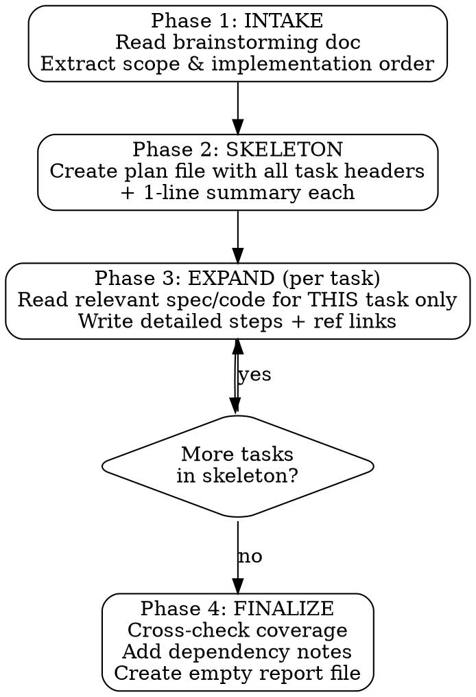

# Plan from Brainstorm

## Overview

Transforms a brainstorming/discussion document into a structured, incremental implementation plan. The plan is built task-by-task to avoid context exhaustion, with reference links for context recovery after compaction.

**Core principle:** Skeleton first, then expand each task by reading only the relevant spec/codebase for that task. Never load everything at once.

## When to Use

- User has a completed brainstorming doc (typically in `docs/brainstorming/`)
- User wants a step-by-step implementation plan before coding
- User says: "buat plan", "plan dari brainstorming", "generate implementation plan"
- User passes a brainstorming doc path as argument

**When NOT to use:**
- User wants to execute an existing plan (use `execute-plan` skill instead)
- User wants to brainstorm/discuss (use `copilot-brainstorming` skill)
- Task is trivial (single file change, obvious fix)

## Invocation

```
/plan-from-brainstorm docs/brainstorming/2026-05-15-vendor-payment.md
```

The argument is the path to the brainstorming/discussion document.

## Workflow



## Phase Details

### Phase 1: INTAKE

1. Read the brainstorming document passed as argument
2. Identify:
   - Implementation order (usually a numbered section in the doc)
   - Domain models and their relationships
   - Business rules and validation
   - Cross-slice dependencies
   - Deferred items (explicitly excluded from plan)
3. Note the brainstorming filename for output path derivation

### Phase 2: SKELETON

Create the plan file at: `docs/plans/{brainstorm-filename}.md`

Example: brainstorm at `docs/brainstorming/2026-05-15-vendor-payment.md` → plan at `docs/plans/2026-05-15-vendor-payment.md`

Write the skeleton with:
- Header metadata (source doc, date, sprint)
- All task headers with 1-line summary
- Task count derived from brainstorming's implementation order
- Empty report file created at `docs/reports/{brainstorm-filename}.md`

**Skeleton format:**

```markdown
# Implementation Plan: {Feature Name}

> Source: docs/brainstorming/{filename}.md
> Created: {date}
> Sprint: {N}
> Status: IN_PROGRESS

## Summary

{2-3 sentence overview of what this plan implements}

## Tasks

### Task 1: {Title}
{1-line summary of what this task accomplishes}

### Task 2: {Title}
{1-line summary}

...

### Task N: {Title}
{1-line summary}
```

### Phase 3: EXPAND (Incremental, per task)

For each task in the skeleton, IN ORDER:

1. **Identify relevant files** — What specs, existing code patterns, or docs does this task need?
2. **Read only those files** — Do NOT load the entire codebase. Read the minimum needed.
3. **Find reference implementations** — Look at existing modules that solved similar problems (see Reference Modules below)
4. **Write detailed steps** — Each step is a concrete action with a checkbox
5. **Add reference links** — Every critical step gets a `ref:` link

**MANDATORY for template/JS tasks:** Before expanding any task that produces Thymeleaf HTML or page-specific JavaScript:
1. Read `docs/spec/index.md` to identify which UI component specs apply
2. Read each relevant spec (autocomplete, modal-selector, numeric, datetime, form-submission, etc.)
3. Cross-reference the brainstorming doc's UI/UX section for component requirements
4. Write steps that explicitly reference the spec patterns (fragment usage, JS initialization, data attributes)
5. Do NOT just copy a reference module's template — it may be a special case. The specs are the source of truth for FE patterns.

**Expanded task format:**

```markdown
### Task 1: {Title}
{1-line summary}

**Depends on:** (none) | Task N
**Reference module:** `accountspayable.vendorbill` | `master.tax` | etc.

Steps:
- [ ] Step 1 description
      ref: src/main/java/com/solusi/erp/path/File.java:L10-L45 — pattern description
- [ ] Step 2 description
      ref: docs/spec/relevant-spec.md — what to look for
- [ ] Step 3 description

**Validation criteria:**
- What must be true when this task is complete
- Compile check / test that should pass
```

**Step checkbox states:**
- `[ ]` — pending
- `[~]` — in progress
- `[x]` — verified complete

### Phase 4: FINALIZE

1. **Coverage check** — Walk through every section of the brainstorming doc. Is every non-deferred item covered by at least one task?
2. **Dependency notes** — Add `Depends on: Task N` where ordering matters
3. **Create report file** — Empty file at `docs/reports/{brainstorm-filename}.md` with header:

```markdown
# Implementation Report: {Feature Name}

> Plan: docs/plans/{filename}.md
> Source: docs/brainstorming/{filename}.md
> Created: {date}

## Findings

(Populated during execution by execute-plan skill)
```

## Reference Modules (ERP-Specific)

When expanding tasks, use these as code pattern references:

| Pattern Needed | Reference Module | Key Files |
|---|---|---|
| Simple CRUD + use case | `master.tax` | domain/model, app/usecase, web/controller |
| CRUD + lookup provider | `inventory.brand` | domain/port/BrandInUseChecker |
| Many-to-many relations | `security.role` | domain/model, persistence mapper |
| Cross-slice query port | `inventory.brand` | domain/port/, infrastructure/adapter/ |
| Cross-slice command port | `inventory.stock` | domain/port/StockService |
| Header-Lines document | `accountspayable.vendorbill` | domain/model, web/dto, persistence |
| Flyway migration | `src/main/resources/db/migration/` | naming convention V{N}__{desc}.sql |
| Thymeleaf form (static/derived) | `accountspayable.vendorbill` | form.html (readonly vendor/currency from GR) |
| Thymeleaf form (interactive) | `purchasing.purchaseorder` | form.html (autocomplete, modal selector, dynamic lines) |
| Journal posting | `accounting.journal` | PostJournalForEventUseCase |
| Sequence generator | `core.infrastructure.sequence` | SequenceGeneratorService |

### Frontend Component Specs (MANDATORY for template/JS tasks)

When expanding any task that involves Thymeleaf templates or page-specific JavaScript, you MUST read the relevant specs from `docs/spec/`. These specs define the **exact** HTML structure, data attributes, JS initialization, and fragment usage required.

| UI Component | Spec File | Key Patterns |
|---|---|---|
| Autocomplete (TomSelect) | `docs/spec/autocomplete-generic.md` | `fragments/inputs :: autocomplete(...)`, `initLookup()`, trinity data (id/name/subtext) |
| Modal Selector | `docs/spec/modal-selector.md` | modal shell fragment, HTMX selector endpoint, page-specific JS consumer, `data-*` payload |
| Numeric Input (AutoNumeric) | `docs/spec/numeric-standards.md` | `data-autonumeric="currency"`, `ErpNumeric.get/set`, dynamic line numeric init |
| Date Input (Flatpickr) | `docs/spec/datetime-standards.md` | `data-picker="date"`, format conventions, pre-fill from DB |
| Header-Lines Form | `docs/spec/header-lines-form.md` | `ErpLineManager`, dynamic line add/remove, index rewriting |
| Form Submission | `docs/spec/form-submission.md` | AJAX JSON vs HTMX, `data-ajax-form`, redirect-on-success, beforeunload guard |
| Action Buttons | `docs/spec/action-buttons.md` | `ErpForm.postAction`, confirm dialog, redirect after action |

**CRITICAL:** Never rely solely on a reference module's template as the FE pattern source. Reference templates may be special cases (e.g., vendor bill form has readonly vendor/currency derived from GR selection — NOT the interactive autocomplete pattern). Always cross-reference with `docs/spec/` to understand the correct component initialization.

### E2E (Playwright) Task Expansion (MANDATORY for `e2e-tests/` tasks)

When a task produces or modifies a Playwright spec, the standard expansion is insufficient. E2E tasks have a higher rate of "looks correct, fails at runtime" bugs because the spec asserts against UI shape, page JS event flow, and storage state — none of which are visible from the brainstorming doc alone.

**Before writing the task body:**

1. **Read `docs/tests/playwright-pitfalls.md`** — the catalog of known failure patterns. Every item in the pitfalls doc represents a real bug from prior sessions.
2. **Read the target page's view template AND form template** — Status badges and action buttons live on the view page, NOT on the form/edit page in most modules. Check `templates/{module}/view.html` for badge selectors before writing assertions.
3. **Read the target page's JS** — Find the `change` handler on TomSelect fields. If the handler reads `tsProd.options[val].payload.xxx`, the spec MUST inject the option with full payload (not via `setTomSelectValue`). If the handler triggers `ErpModal.confirm` or `ErpAction.confirmAndSubmit`, the spec MUST click `#confirm-modal-btn-yes` (not `page.on('dialog')`).
4. **Read `@RequestMapping`, never assume URL from entity name** — Many controllers are rebranded (e.g., PermissionGroup → `/security/menu-groups`, not `/security/permission-groups`).
5. **Read existing Playwright helpers (`e2e-tests/helpers/`)** — Note the known issues. `selectTomSelect` is currently broken (`load(query, callback)` signature mismatch — promise never resolves). Until fixed, only use `setTomSelectValue` (when payload not needed) or write a local payload-aware helper that bypasses both.

**Steps in the expanded E2E task MUST include:**

- A step that runs `npx playwright test {file} -g "{scenario name}"` — listed explicitly, not implied. Compile-only and `--list` are NOT substitutes.
- A step that captures screenshot/video on first failure for diagnosis.
- For storage-state-dependent specs: a step verifying setup probe works (the setup test must actually re-login on a fresh server, not reuse stale cookies).

**Steps the expanded E2E task MUST NOT include:**

- "E2E run deferred — will validate at finalize" with task marked `[x]`. If the run cannot be executed in the same task, the task stays `[~]` with a report finding. Marking complete without running the spec is the single biggest source of E2E bugs.
- `page.evaluate(fetch(...))` calls before any `page.goto` — `about:blank` has no origin. Use `page.request.get(...)` instead.
- Time-based freshness logic anywhere (`mtimeMs < TTL`). H2 in-memory wipes sessions on JVM restart; trust the server, not file timestamps.

**Reference validation criteria for any E2E task:**

```markdown
**Validation criteria:**
- `cd e2e-tests && npx tsc --noEmit` clean
- `npx playwright test {file} --list` shows expected scenarios
- `npx playwright test {file}` green at least once (not just compile)
- For transactional specs (SA/PR/PO): `rm -rf .auth/ && npx playwright test {file}` also green (cold-cache run catches storage state assumptions)
- No new known-issues entry needed in `docs/tests/playwright-pitfalls.md`
```


## Reference Link Format

Every critical step MUST include a reference link:

```
ref: path/to/file.java:L45-L60 — description of what to look for
```

Three parts:
1. **Path** — absolute from project root
2. **Line range** — approximate, helps locate quickly
3. **Description hint** — what the agent should look for if lines shifted

Examples:
```
ref: src/main/java/com/solusi/erp/accountspayable/vendorbill/domain/model/VendorBill.java:L1-L50 — aggregate root pattern with status enum and lines collection
ref: docs/spec/numeric-standards.md — AutoNumeric input pattern for currency fields
ref: src/main/java/com/solusi/erp/accounting/journal/application/usecase/command/PostJournalForEventUseCaseImpl.java:L30-L80 — journal posting command construction
```

## Task Ordering Strategy

Always order tasks from foundation to surface. **Tests are co-located with each task, NOT a separate final task.**

1. **Database changes** — Flyway migrations, schema alterations (no tests)
2. **Domain model + domain tests** — Entities, VOs, enums, ports + pure JUnit tests
3. **Infrastructure + config test** — JPA entities, repos, adapters, config + `@ContextConfiguration` integration test
4. **Application use cases + use case tests** — Commands/queries + unit tests with Mockito mocks
5. **Web layer + controller tests** — Controller, DTOs, mappers + Mockito-based controller tests
6. **Templates & JS** — Split into sub-concerns:
   - **6a. HTML structure** — Thymeleaf templates with correct fragments (`autocomplete`, `modal-selector` shell), layout slots, `sec:authorize`, i18n keys
   - **6b. JS interactive wiring** — Page-specific JS: `initLookup()` for autocompletes, modal selector consumer, `ErpNumeric` init for dynamic lines, `ErpLineManager` if applicable, cascading behavior (e.g., vendor change → reload bills), recap calculation, form submission handler
   - **6c. Selector endpoints** — If modal selector is used: controller endpoint returning selector fragment, selector row DTO, HTMX search/pagination
   - **Template tests** — `TemplateTestUtils` security/binding tests
7. **Cross-slice integration** — Status updates, event publishing (tested via use case tests)
8. **Seeder data** — Permissions, menu, accounting schema (no tests)

**Note on step 6:** These sub-concerns can be in ONE task if the form is simple, or split into separate tasks if the form has complex interactive behavior (multiple autocompletes, modal selectors, cascading lookups, dynamic lines with live calculation). Use judgment based on granularity — a task should be completable in 30-90 min.

## Test Requirements per Task

Every non-trivial task MUST include test steps. The planning agent embeds test steps WITHIN the task, not as a separate task at the end.

### Test Classification Matrix

| Task Type | Test Required? | Test Pattern | Reference File |
|---|---|---|---|
| Flyway migration / seeder SQL | No | — | — |
| Domain model (aggregate, VO, enum with logic) | **Yes** | Pure JUnit 5 + AssertJ. Test status transitions, invariants, validation rules. | `VendorBillTest.java` |
| Domain port (interface only) | No | — | — |
| Infrastructure adapter | Optional | Unit test if query logic is complex | `BillableGrQueryAdapterTest.java` |
| Infrastructure config (bean wiring) | **Yes** | `@ExtendWith(SpringExtension)` + `@ContextConfiguration` with MocksConfig | `VendorBillConfigTest.java` |
| Application use case (command) | **Yes** | `@ExtendWith(MockitoExtension.class)` + `@Mock` for deps. Test happy path + every validation → DomainException. | `CreatePurchaseOrderUseCaseTest.java` |
| Application use case (query) | **Yes** | `@ExtendWith(MockitoExtension.class)` + `@Mock` for deps | `FindVendorBillsUseCaseTest.java` |
| Web controller | **Yes** | Mockito mocks for use cases, no Spring context. Test view names, model attrs, `@PreAuthorize` annotations. | `VendorBillControllerTest.java` |
| Web mapper (complex logic) | **Yes** | Unit test if conditional mapping exists | `VendorBillWebMapperTest.java` |
| Web mapper (simple field copy) | No | — | — |
| Thymeleaf template | **Yes** | `TemplateTestUtils.renderWithSecurity` for sec:authorize + raw resource reads for fragment/DTO binding | `VendorBillTemplateTest.java` |
| JavaScript (form logic) | No | No JS test framework in project | — |
| Permission / menu seeder | No | — | — |

### Critical Testing Conventions

1. **Use case tests use Mockito (`@ExtendWith(MockitoExtension.class)`):**
   - `@Mock` for repository and cross-slice ports
   - `when(...).thenReturn(...)` for stubbing, `verify(...)` for side-effect assertions
   - Construct use case impl manually in `@BeforeEach` with mocked deps
   - Test happy path + every validation rule (assertThatThrownBy for DomainException)
   - Reference: `CreatePurchaseOrderUseCaseTest.java`, `ConfirmVendorBillUseCaseTest.java`

2. **Controller tests also use Mockito** (same pattern as use case tests):
   - `mock(CreateXxxUseCase.class)` for all injected use cases
   - Test `@PreAuthorize` annotation values via reflection
   - No Spring context needed
   - Reference: `VendorBillControllerTest.java`

3. **Template tests have two sub-patterns:**
   - **Static check** — `readResource()` + `assertThat(html).contains(...)` for fragment IDs, DTO properties
   - **Security render** — `TemplateTestUtils.renderWithSecurity(template, vars, auth)` for `sec:authorize` visibility

4. **Config integration test** — Proves bean wiring works. Uses `@ContextConfiguration(classes = {XxxConfig.class, MocksConfig.class})` with mocked external dependencies.

### How to Embed Tests in Plan Tasks

When expanding a task, add test steps AFTER the implementation steps:

```markdown
### Task 4: Application Use Cases (Command)

Steps:
- [ ] Create CreateVendorPaymentUseCase interface
- [ ] Create CreateVendorPaymentUseCaseImpl with validation
- [ ] Create ConfirmVendorPaymentUseCaseImpl with journal posting
- [ ] **TEST:** Write CreateVendorPaymentUseCaseTest (@ExtendWith MockitoExtension, @Mock repo + ports)
- [ ] **TEST:** Write ConfirmVendorPaymentUseCaseTest (verify journal args, FX calc, VB status update)
      ref: src/test/.../purchaseorder/application/usecase/command/CreatePurchaseOrderUseCaseTest.java:L1-L50 — Mockito use case test pattern

**Validation criteria:**
- All use case tests pass: `mvn test -Dtest="*VendorPayment*UseCaseTest"`
- Edge cases covered: amount mismatch, exceeds outstanding, bank currency mismatch
```

## Output Files

| File | Path | Purpose |
|---|---|---|
| Implementation Plan | `docs/plans/{brainstorm-filename}.md` | The structured plan |
| Report (empty) | `docs/reports/{brainstorm-filename}.md` | Populated during execution |

## Common Mistakes

- **Loading all specs at once** — Only read what's needed for the current task being expanded
- **Skipping reference links** — Every non-trivial step needs a ref. Context compaction will erase your memory of why you wrote a step.
- **Vague steps** — "Implement the service" is not a step. "Create CreateVendorPaymentUseCaseImpl with validation rules from brainstorm section 4" is.
- **Missing validation criteria** — Each task needs a way to verify it's done (compile, test, specific behavior)
- **Ignoring deferred items** — If the brainstorming doc says "deferred to Sprint 6+", do NOT include it in the plan
- **Wrong task granularity** — A task should be completable in one focused session (30-90 min of agent work). Split if larger.
- **Static FE templates** — Copying a reference module's HTML without reading `docs/spec/` produces dead forms. A form with `data-autocomplete="vendor"` but no `initLookup()` call or fragment usage is non-functional. Always read the relevant FE specs and produce steps for: fragment includes, JS initialization, cascading behavior, and form submission wiring.
- **Using wrong reference for interactive forms** — Vendor Bill form has readonly vendor/currency (derived from GR). If your feature needs user-selectable autocompletes or modal selectors, reference Purchase Order form or the `docs/spec/` standards instead.
