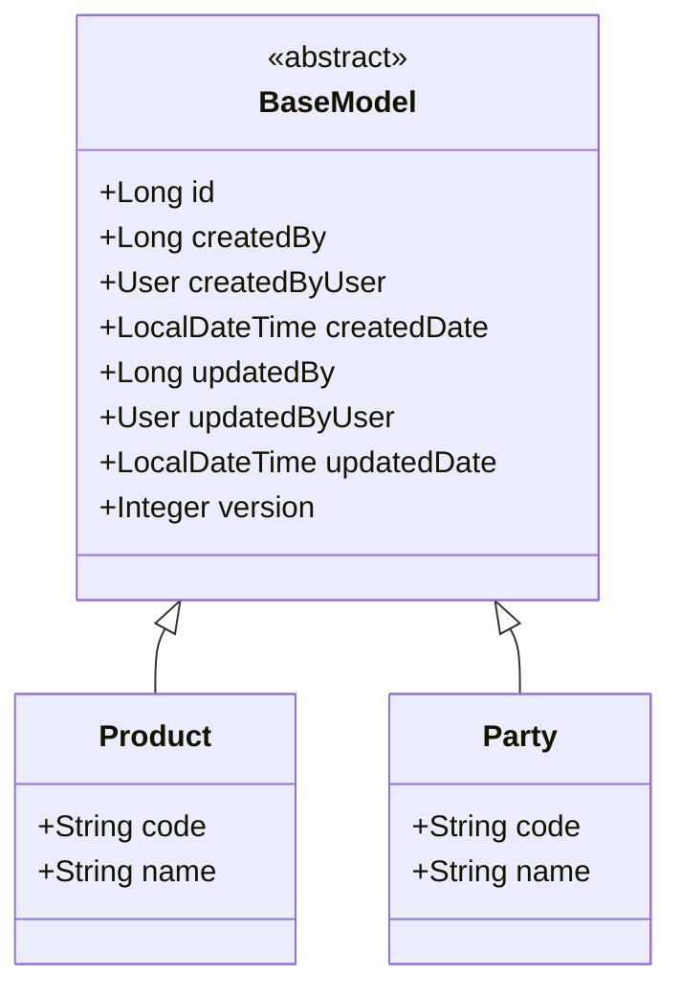

# BaseModel & Entity Inheritance Pattern

Dokumen ini menjelaskan pola pewarisan (inheritance) entitas di aplikasi ERP ini menggunakan class `BaseModel`. Seluruh entitas bisnis wajib mengikuti pola ini untuk menjaga standarisasi identitas dan audit trail.

## 1. Class Hierarchy

Semua entitas bisnis (Master Data, Inventory, Transaction) harus meng-extend class `com.solusi.erp.core.model.BaseModel`.



## 2. Strategi Dual-Column Mapping

Untuk mendukung performa sekaligus kemudahan navigasi objek, kita menggunakan strategi **Dual-Column Mapping** pada kolom audit.

### Definisi di Code
```java
// 1. Kolom Fisik (ID User) - Digunakan oleh Spring Data JPA Auditing
@CreatedBy
@Column(name = "created_by_user_id", updatable = false)
private Long createdBy;

// 2. Kolom Navigasi (Object User) - Read-Only untuk mempermudah Join/Display
@ManyToOne(fetch = FetchType.LAZY)
@JoinColumn(name = "created_by_user_id", insertable = false, updatable = false)
private User createdByUser;
```

### Keuntungan:
1.  **Integritas Database**: Database menyimpan ID (BigInt) yang memiliki Foreign Key ke tabel `users`.
2.  **Performa Write**: Saat `save()`, Hibernate tidak perlu melakukan query tambahan untuk mencari objek `User`, cukup mengambil ID dari Security Context.
3.  **Kemudahan Read**: Saat rendering UI/Mapper, kita bisa mengakses data profil user (misal: `entity.getCreatedByUser().getProfile().getFullName()`) tanpa query manual.

## 3. Optimistic Locking
`BaseModel` menyertakan atribut `version` dengan anotasi `@Version`. Ini digunakan untuk mencegah **Lost Updates** jika dua user mencoba mengedit data yang sama secara bersamaan. Jika terjadi konflik, Spring akan melempar `ObjectOptimisticLockingFailureException`.
