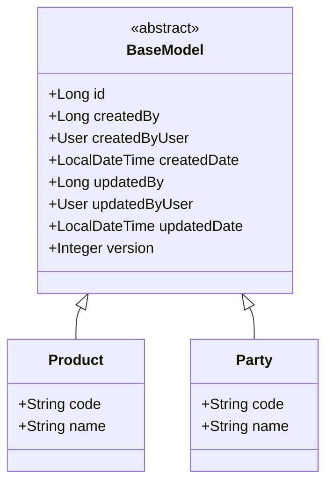

# BaseModel & Entity Inheritance Pattern

Dokumen ini menjelaskan pola pewarisan (inheritance) entitas di aplikasi ERP ini menggunakan class `BaseModel`. Seluruh entitas bisnis wajib mengikuti pola ini untuk menjaga standarisasi identitas dan audit trail.

## 1. Class Hierarchy

Semua entitas bisnis (Master Data, Inventory, Transaction) harus meng-extend class `com.solusi.erp.core.model.BaseModel`.



## 2. Strategi Dual-Column Mapping

Untuk mendukung performa sekaligus kemudahan navigasi objek, kita menggunakan strategi **Dual-Column Mapping** pada kolom audit.

### Definisi di Code
```java
// 1. Kolom Fisik (ID User) - Digunakan oleh Spring Data JPA Auditing
@CreatedBy
@Column(name = "created_by_user_id", updatable = false)
private Long createdBy;

// 2. Kolom Navigasi (Object User) - Read-Only untuk mempermudah Join/Display
@ManyToOne(fetch = FetchType.LAZY)
@JoinColumn(name = "created_by_user_id", insertable = false, updatable = false)
private User createdByUser;
```

### Keuntungan:
1.  **Integritas Database**: Database menyimpan ID (BigInt) yang memiliki Foreign Key ke tabel `users`.
2.  **Performa Write**: Saat `save()`, Hibernate tidak perlu melakukan query tambahan untuk mencari objek `User`, cukup mengambil ID dari Security Context.
3.  **Kemudahan Read**: Saat rendering UI/Mapper, kita bisa mengakses data profil user (misal: `entity.getCreatedByUser().getProfile().getFullName()`) tanpa query manual.

## 3. DTO Inheritance Pattern (`BaseAuditResponse`)

Untuk mendukung tampilan audit di UI secara otomatis, seluruh DTO (baik `*Request` maupun `*Response`) wajib mewarisi class `BaseAuditResponse`.

### Keuntungan:
1.  **Otomatisasi UI**: Metadata audit (siapa & kapan) tersedia secara konsisten di semua form edit.
2.  **Generic Access**: Memungkinkan `AuditInfoInterceptor` untuk secara otomatis menyediakan variabel `auditInfo` ke Thymeleaf.
3.  **Clean Code**: Menghapus boilerplate field `id`, `version`, dan audit di setiap file DTO.

## 4. Optimistic Locking
`BaseModel` menyertakan atribut `version` dengan anotasi `@Version`. Ini digunakan untuk mencegah **Lost Updates** jika dua user mencoba mengedit data yang sama secara bersamaan. Jika terjadi konflik, Spring akan melempar `ObjectOptimisticLockingFailureException`.

## 5. Pola Metadata pada Modul DDD (Advanced)

Pada modul yang menggunakan **Pure DDD + Clean Architecture** (seperti `news` dan `approval`), kita menghindari penggunaan inheritance `BaseModel` secara langsung di level Domain untuk menjaga **Domain Purity**.

Sebagai gantinya, kita menggunakan pola **Metadata Object** melalui class `com.solusi.erp.core.domain.model.AuditMetadata`.

### Cara Kerja:
1.  **Domain Layer**: Entity Domain memiliki atribut `private final AuditMetadata metadata` yang membungkus `id`, `version`, dan field audit lainnya.
2.  **Infrastructure Layer**: `PersistenceMapper` bertanggung jawab memetakan field-field dari `BaseModel` (di class Entity JPA) ke dalam objek `AuditMetadata` (di class Entity Domain).

### Keuntungan:
- **Persistence Ignorance**: Objek Domain tidak perlu tahu tentang anotasi `@Version` atau `@CreatedBy`.
- **Consistency**: Aturan *Optimistic Locking* tetap ditegakkan karena `version` dibawa dari database ke domain dan kembali lagi saat proses simpan.
- **Ubiquitous Language**: Atribut teknis terisolasi dari atribut bisnis murni.
