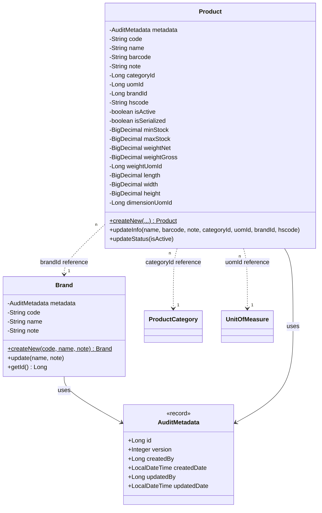

# Class Diagram - Inventory Module

> **Dokumen Modular**: Diagram ini mencakup model domain dan entitas persistence Inventory. Modul yang belum diimplementasikan (Sales, Procurement) akan memiliki dokumen diagramnya masing-masing.

Diagram ini menggambarkan dua lapisan:
- **Domain Layer** (Pure Java, menggunakan `AuditMetadata`): `Brand`, `Product`
- **Infrastructure/JPA Layer** (menggunakan `BaseModel`): `Facility`, `Grid`, `Container`, `StockAdjustment`, `StockBalance`, `InventoryMovement`, `ValuationLayer`

---

## 1. Clean Arch Domain Models (Vertical Slices)

Modul-modul yang sudah sepenuhnya Clean Architecture menggunakan Pure Java domain model:



---

## 2. JPA Infrastructure Models (`inventory.model`)

Model-model ini di-mapping langsung ke tabel database menggunakan `BaseModel`. Mereka merupakan JPA entity yang dipakai oleh modul transaksi inventory (Stock Adjustment, Movement, Valuation).

```mermaid
classDiagram
    class BaseModel {
        <<abstract>>
        +Long id
        +Long createdBy
        +User createdByUser
        +LocalDateTime createdDate
        +Long updatedBy
        +User updatedByUser
        +LocalDateTime updatedDate
        +Integer version
    }

    class Facility {
        +String code
        +String name
        +Long ownerId
        +Address address
        +String note
        +Boolean isActive
    }

    class Grid {
        +Facility facility
        +String code
        +String name
        +String note
        +Boolean isActive
    }

    class Container {
        +Grid grid
        +String code
        +String name
        +BigDecimal capacity
        +String note
        +Boolean isActive
    }

    class StockAdjustment {
        +String code
        +LocalDate transactionDate
        +Facility facility
        +AdjustmentStatus status
        +String note
        +CurrencyAmount totalCost
        +List~StockAdjustmentLine~ lines
        +addLine(line)
        +markAsCompleted()
    }

    class StockAdjustmentLine {
        +StockAdjustment header
        +ProductEntity product
        +Grid grid
        +Container container
        +String serialNumber
        +BigDecimal quantity
        +BigDecimal unitCost
    }

    class StockBalance {
        +ProductEntity product
        +Container container
        +String serialNumber
        +BigDecimal qtyOnHand
        +BigDecimal qtyReserved
    }

    class InventoryMovement {
        +LocalDateTime transactionDate
        +ProductEntity product
        +Container container
        +String serialNumber
        +BigDecimal quantity
        +MovementType movementType
        +ReferenceType referenceType
        +Long referenceId
        +CurrencyAmount unitCost
    }

    class ValuationLayer {
        +ProductEntity product
        +Container container
        +BigDecimal qtyRemaining
        +CurrencyAmount unitCost
        +LocalDateTime receivedAt
    }

    class CurrencyAmount {
        <<embeddable>>
        +Long currencyId
        +BigDecimal exchangeRate
        +BigDecimal originalAmount
        +BigDecimal localAmount
    }

    BaseModel <|-- Facility
    BaseModel <|-- Grid
    BaseModel <|-- Container
    BaseModel <|-- StockAdjustment
    BaseModel <|-- StockAdjustmentLine
    BaseModel <|-- StockBalance
    BaseModel <|-- InventoryMovement
    BaseModel <|-- ValuationLayer

    Facility "1" *-- "n" Grid : contains
    Grid "1" *-- "n" Container : contains
    StockAdjustment "1" *-- "n" StockAdjustmentLine : has lines
    StockAdjustment "n" --> "1" Facility : located in
    StockBalance "n" --> "1" Container : physical location
    InventoryMovement "n" --> "1" Container : movement location
    ValuationLayer "n" --> "1" Container : valuation location
    StockAdjustment --> CurrencyAmount : totalCost
    InventoryMovement --> CurrencyAmount : unitCost
    ValuationLayer --> CurrencyAmount : unitCost
```



---

## 3. Alur Transaksi: Stock Adjustment

```
1. User membuat SA (DRAFT) → StockAdjustment.status = DRAFT
2. User menambah lines → StockAdjustment.addLine(line)
3. User klik "Process" → StockAdjustment.markAsCompleted()
4. @TransactionalEventListener di StockService menangkap StockAdjustedEvent:
   - Update inv_stock_balances (qty_on_hand naik/turun)
   - Insert ke inv_movements (audit trail)
   - Insert/update inv_valuation_layers (FIFO layer untuk penyesuaian positif)
```

## 4. Catatan Arsitektur: Cross-Module Decoupling

| Field | Teknik Decoupling |
|-------|------------------|
| `Facility.ownerId` | Long ID, bukan `@ManyToOne Party` |
| `CurrencyAmount.currencyId` | Long ID, bukan `@ManyToOne Currency` |
| `StockAdjustmentLine.product` | `@ManyToOne ProductEntity` (masih intra-inventory) |

> Inventory modul tidak boleh import entity dari `master.*` atau `security.*` secara langsung.
> Gunakan reference ID dan lookup via use case jika perlu menampilkan data lintas modul.
