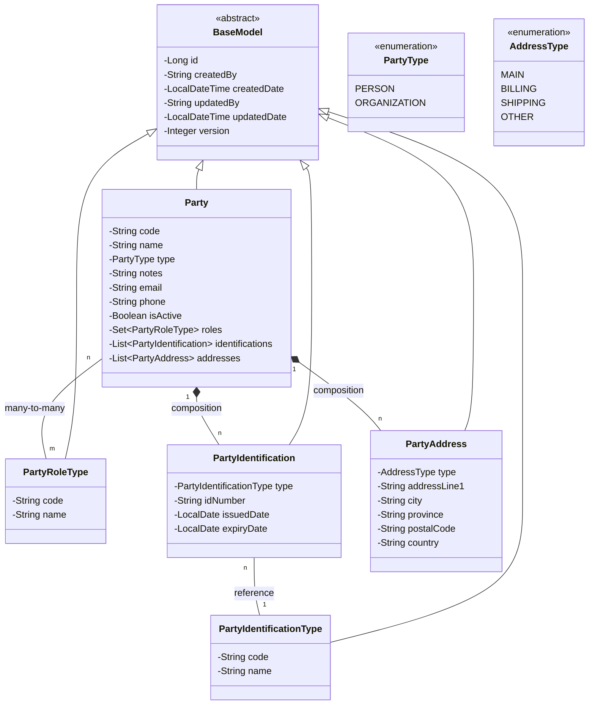

# Class Diagram - Business Partner (Party) Module

Dokumen ini menjelaskan struktur kelas dan hubungan antar entitas dalam modul Business Partner yang menggunakan pola **Universal Party Model**.

## Komponen Utama:
1.  **Party**: Entitas pusat. Satu baris mewakili satu individu atau satu organisasi fisik.
2.  **PartyRoleType**: Menentukan peran entitas tersebut (misal: Supplier, Customer). Relasi Many-to-Many memungkinkan satu PT menjadi Supplier sekaligus Customer.
3.  **PartyIdentification**: Menyimpan dokumen legal. Menggunakan `orphanRemoval=true` sehingga jika baris dihapus di UI, data di DB otomatis terhapus.
4.  **PartyAddress**: Mendukung multi-alamat untuk satu entitas (Kantor Pusat, Gudang, Alamat Tagihan).
