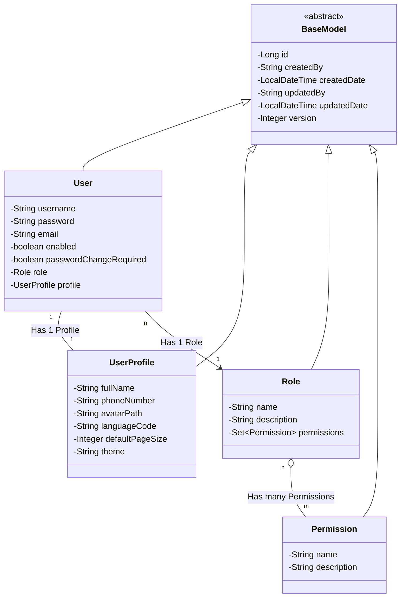

# Class Diagram - Security Module (RBAC)

> **Dokumen Modular**: Diagram ini hanya mencakup entitas di dalam modul Security. Modul bisnis lain (Sales, Inventory) akan memiliki dokumen diagramnya masing-masing.

Diagram ini menunjukkan hubungan antara kelas dasar audit dan sistem keamanan berbasis Role dan Permission.

## Penjelasan Struktur:
1.  **BaseModel**: Menyediakan kolom audit untuk semua entitas bisnis.
2.  **User**: Entitas utama pengguna. Sesuai mandat (1 User hanya memiliki 1 Role).
3.  **Role**: Grup akses (Contoh: `ADMIN`, `MANAGER`).
4.  **Permission**: Hak akses halus (Contoh: `INVENTORY_READ`, `SALES_WRITE`).
5.  **Relasi Role-Permission**: Many-to-Many (Gunakan tabel perantara `role_permissions` di database).

## Alur Otorisasi:
1. User login -> `UserDetailsServiceImpl` memuat entitas `User`.
2. `SecurityUser` (Wrapper) dibuat -> Semua Permission dari Role diubah menjadi `GrantedAuthority` seketika (*Pre-calculated*).
3. Authorities disimpan dalam session untuk efisiensi dan stabilitas render UI.
4. Spring Security menggunakan daftar Permission ini untuk mengecek `@PreAuthorize` dan `sec:authorize`.

## Alur Sinkronisasi Preferensi (i18n & UI):
1. **Login Sukses**: `CustomAuthenticationSuccessHandler` mencegat alur setelah autentikasi berhasil.
2. **Ekstraksi Profil**: Mengambil `UserProfile` dari objek `SecurityUser`.
3. **Set Locale**: `LocaleResolver` memperbarui locale session sesuai dengan `languageCode` yang tersimpan di database.
4. **Update Profil**: Saat user mengubah preferensi di halaman Profil, `ProfileController` memperbarui database sekaligus memperbarui locale session secara *real-time*.
