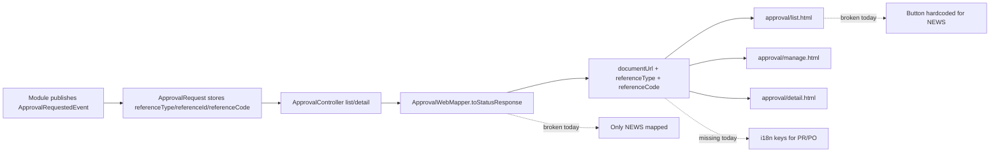

# Approval Reference Links & i18n Fix Plan

## Executive Summary

Approval UI saat ini belum konsisten merender hyperlink dokumen sumber untuk semua `referenceType`.

Temuan utama:

1. `ApprovalWebMapper` baru mengenal `NEWS`, jadi `documentUrl` untuk `PURCHASE_REQUISITION` dan `PURCHASE_ORDER` selalu `null`.
2. `common/approval/list.html` masih hardcode aksi dokumen hanya untuk `NEWS`, lalu fallback ke `#<referenceId>`, sehingga PR terlihat seperti gagal render.
3. i18n tipe dokumen juga belum lengkap; baru ada key untuk `news`, belum ada untuk `purchase_requisition` dan `purchase_order`.
4. Arah link yang disepakati untuk approval review adalah **halaman view/read-only**, bukan edit.

## Architecture Diagram

## Deep Dive

### 1. Root Cause

#### Mapper is too narrow

`ApprovalWebMapper` memiliki `DOCUMENT_URL_PATTERNS` yang saat ini hanya berisi:

- `NEWS -> /common/news/`

Akibatnya:

- `PURCHASE_REQUISITION` tidak menghasilkan `documentUrl`
- `PURCHASE_ORDER` juga tidak menghasilkan `documentUrl`

#### List template is hardcoded

`common/approval/list.html` tidak memakai `item.documentUrl`. Template ini:

- menampilkan tombol "Lihat & Proses" hanya jika `item.referenceType == 'NEWS'`
- menampilkan fallback teks `#<referenceId>` untuk tipe lain

Jadi walaupun mapper nanti diperbaiki, template list tetap harus ikut diperbaiki.

#### i18n is incomplete

Template approval memakai key dinamis:

- `label.approval.reference-type.<lowercase_reference_type>`

Saat ini yang ada baru:

- `label.approval.reference-type.news`

Yang belum ada:

- `label.approval.reference-type.purchase_requisition`
- `label.approval.reference-type.purchase_order`

### 2. Surface Area yang Terdampak

#### Pending approval list

`/common/approval`

Perlu diubah supaya tombol dokumen sumber dirender berdasarkan `item.documentUrl`, bukan berdasarkan hardcode `NEWS`.

#### Approval detail

`/common/approval/{id}/view`

Halaman ini sebenarnya sudah siap karena tombol "View Document" memakai `approval.documentUrl`; bug utamanya ada di resolver URL.

#### Manage approval

`/common/approval/manage`

Halaman ini sudah memakai `item.documentUrl`, jadi akan ikut membaik setelah mapper diperluas. Tetap perlu dicek i18n badge-nya karena memakai key dinamis yang sama.

### 3. Related Finding

Approval flow yang benar-benar terlihat di codebase saat ini:

- `NEWS`
- `PURCHASE_REQUISITION`
- `PURCHASE_ORDER`

Saya tidak menemukan `SUPPLIER_PRICE_LIST` pada `ApprovalRequestedEvent` flow saat ini. Jadi contoh URL SPL lebih tepat diperlakukan sebagai referensi UX/perilaku target, bukan reference type approval aktif yang sudah tersambung end-to-end.

## Recommendation

### Recommended Fix Strategy

1. **Perluas resolver dokumen di approval web layer**
   - Tambahkan mapping `referenceType -> view URL`
   - Minimal:
     - `NEWS -> /common/news/{id}`
     - `PURCHASE_REQUISITION -> /purchasing/purchase-requisitions/view/{id}`
     - `PURCHASE_ORDER -> /purchasing/purchase-orders/view/{id}`

2. **Hilangkan hardcode NEWS di approval list**
   - Render tombol dokumen sumber jika `item.documentUrl != null`
   - Fallback `#<referenceId>` hanya dipakai bila benar-benar belum ada resolver

3. **Lengkapi i18n tipe dokumen**
   - Tambah key di `messages.properties` dan `messages_id.properties`
   - Minimal untuk `purchase_requisition` dan `purchase_order`

4. **Tambah regression test yang fokus ke akar masalah**
   - `ApprovalWebMapperTest`: verifikasi `documentUrl` untuk `NEWS`, `PURCHASE_REQUISITION`, `PURCHASE_ORDER`
   - Tambah satu web/controller/template assertion agar approval list tidak lagi bergantung pada hardcode `NEWS`

5. **Jalankan unit test tanpa clean**
   - Ikuti workflow bug fixing yang diminta: ubah code + test, lalu jalankan unit test tanpa `clean`

## Proposed Execution Plan

1. Perbaiki resolver URL approval agar reference document memakai halaman view/read-only.
2. Ubah template pending approval list agar aksi dokumen memakai `documentUrl` generik.
3. Tambahkan i18n key untuk tipe dokumen approval yang sudah aktif.
4. Perbarui unit test mapper dan test web/template yang paling relevan.
5. Jalankan unit test tanpa clean, lalu minta feedback manual test sebelum lanjut ke iterasi berikutnya.

## Notes

- Kalau nanti ingin approval dipakai untuk modul lain juga, lebih aman memindahkan mapping `referenceType -> documentUrl` ke resolver yang eksplisit/terpusat daripada terus menambah `if` di template.
- Purchase Order sangat mungkin ikut terdampak walau bug yang terlihat saat ini muncul di Purchase Requisition.
