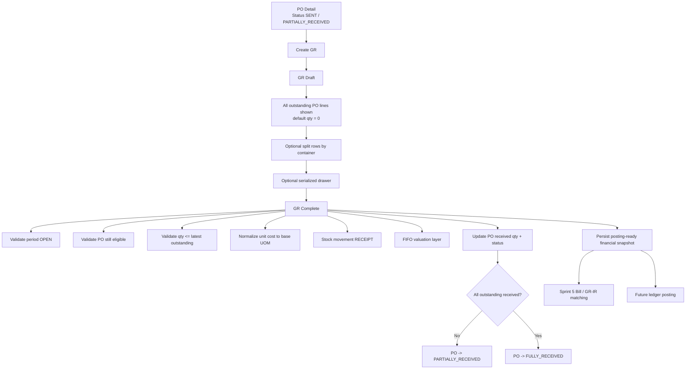

# Brainstorming Summary — Sprint 4 Goods Receipt Full Coverage

## Executive Summary

This document upgrades the earlier MVP discussion into **full Sprint 4 proposal coverage**. The goal is not only to describe the preferred implementation, but to classify every major Sprint 4 proposal point into:

- **Keep** — accepted largely as proposed
- **Adjust** — accepted, but changed to fit business decisions or the current codebase
- **Defer** — still acknowledged, but intentionally postponed beyond Sprint 4 core

The final direction is:

1. Sprint 4 remains the **inventory recognition point** of the procurement flow.
2. The practical scope is **local Goods Receipt** built on top of existing Purchase Order and stock foundations.
3. The system should implement **GR Draft -> Complete**, stock/FIFO posting, PO receiving updates, serialized support, and accounting-safe period validation.
4. Real journal ledger posting, import/PPh22 handling, and over-receipt tolerance are **deferred**.

## Architecture Diagram

## Deep-Dive

## 1. Final Business Contract

### Core decisions already locked

1. **1 GR = 1 PO**
2. GR may only be created from PO status **`SENT`** or **`PARTIALLY_RECEIVED`**
3. **Partial receipt is normal**
4. **No over-receipt at all**
5. **Container is mandatory**
6. **Grid and facility derive from container**
7. **UOM is locked to the PO line**
8. **Completed GR is immutable**
9. Serialized products are in-scope and use the **drawer** pattern
10. Missing serial numbers are auto-generated **only on COMPLETE**
11. `receiptDate` must be in an **OPEN accounting period**
12. GR uses **PO unit price + PO exchange rate**
13. GR tax follows the **PO tax snapshot proportionally**
14. Import/PPh22/cukai receiving is **not part of Sprint 4 core**

## 2. Sprint 4 Proposal Coverage Matrix

| Proposal Area | Status | Final Direction |
|---|---|---|
| Sprint goal: GR is inventory recognition point | **Keep** | GR remains the point where stock and valuation become real |
| Sprint goal: GR also creates real auto-journal | **Defer** | Persist posting-ready financial snapshot now; real ledger posting later |
| Dependency: PO `APPROVED` is sufficient source | **Adjust** | Source PO must already be `SENT` or `PARTIALLY_RECEIVED` |
| Header `exchange_rate` may differ from PO | **Adjust** | GR exchange rate follows the PO; no free re-valuation at receipt |
| GR header with `po_id`, supplier, facility, currency snapshot | **Keep** | Header stays PO-driven |
| GR line `po_line_id`, product, quantity, unit_price | **Keep** | Core line structure is still valid |
| GR line `grid_id` / `container_id` nullable | **Adjust** | `containerId` is mandatory; grid and facility derive from container |
| Status `DRAFT -> COMPLETED` only | **Keep** | No additional GR approval step |
| Rule: qty must be <= PO outstanding | **Keep** | Hard validation stays |
| Rule: over-receipt tolerance config | **Adjust** | Business rule becomes hard reject; no tolerance in Sprint 4 |
| Setting `gr.over_receipt_tolerance_pct` | **Defer** | Not used while over-receipt is globally forbidden |
| Rule: `receipt_date` must be period OPEN | **Keep** | Still enforced even without real ledger posting |
| Rule: Product and UOM must be active | **Adjust** | Product must be active; UOM is effectively inherited/locked from PO line |
| FIFO oldest-layer-first | **Keep** | Existing stock architecture already matches this direction |
| UOM conversion during GR | **Keep** | Still required below workflow layer |
| Valuation layer created from receipt | **Keep** | Mandatory part of GR COMPLETE |
| `localAmount = po_unit_price * exchange_rate / conversionFactor` | **Keep** | Critical normalization rule must be enforced |
| GR COMPLETE is one atomic transaction | **Keep** | One completion boundary for stock + valuation + PO update + snapshot persistence |
| Pre-validation includes schema/COA checks | **Defer** | Postponed until real journal posting exists |
| Auto-journal rollback if posting fails | **Defer** | Replace with rollback on stock/valuation/PO update failure only |
| PO line `received_quantity += GR qty` | **Keep** | Still core to the flow |
| PO status `PARTIALLY_RECEIVED/FULLY_RECEIVED` | **Keep** | Still core to the flow |
| Partial GR example with changing GR exchange rate | **Adjust** | Same pattern kept, but exchange rate should follow the PO, not vary per GR |
| PKP/VAT branch | **Adjust** | Still in scope, but derived from PO tax snapshot proportionally |
| Import/PPh22 branch | **Defer** | Skip for Sprint 4 core; requires broader import domain |
| Edge case: concurrent GR optimistic lock | **Keep** | Still needed; stale draft should fail and require refresh |
| Edge case: valuation layer never deleted | **Keep** | Historical audit trail must remain intact |
| Appendix C sequence `GR-{date:yyyyMM}-{seq}` | **Keep** | Use normal sequence generator pattern |
| Appendix C retry/lock behavior on sequence | **Keep** | Follow repository-wide sequence discipline |
| Financial statement impact of GR | **Adjust** | Business impact is accepted; actual ledger realization is deferred |

## 3. Full Sprint 4 Shape After Classification

### 3.1 Goods Receipt document model

Suggested aggregate:

- `GoodsReceipt`
  - `id`
  - `code`
  - `receiptDate`
  - `poId`
  - `supplierId`
  - `facilityId`
  - `currencyId`
  - `exchangeRate`
  - `status`
  - `note`

- `GoodsReceiptLine`
  - `id`
  - `headerId`
  - `poLineId`
  - `productId`
  - `quantityReceived`
  - `uomId`
  - `containerId`
  - `unitPrice`
  - `serialNumber`
  - `note`

### 3.2 Important model rules

1. A single PO line may appear multiple times in the same GR because receipt may be split by container.
2. Rows with qty `0` are **UI-only** and must not be persisted.
3. Draft edit screens should be rebuilt from:
   - persisted draft rows, plus
   - synthetic outstanding PO rows with qty `0`
4. `containerId` is the canonical operational location.
5. `gridId` and `facilityId` should be treated as derived information for UI/validation, not the main source of truth on the receipt line.

## 4. UI/UX Direction

### Entry and module ownership

- **Create flow** starts from **PO detail**
- GR module ownership feels like **Inventory / Warehouse**
- Main namespace should be:
  - **`/inventory/goods-receipts`**

### Screens

1. **PO Detail**
   - Add **Create Goods Receipt**
   - Add **Receipts (n)** smart button / filtered navigation

2. **GR List**
   - Inventory-oriented monitoring and audit list

3. **GR Detail**
   - Read-only review once completed

4. **GR Form**
   - Header prefilled from PO
   - All outstanding PO lines shown
   - Qty default `0`
   - Inline **Split Row**
   - Container selection required
   - Serialized rows use **drawer**

### Drafting behavior

- Save Draft allowed
- Complete is the irreversible posting point
- If PO outstanding changes because another GR completed first:
  - **Save and Complete must fail**
  - User must refresh and rebuild from latest PO state

## 5. Serialized Product Handling

Serialized receiving should follow the **stock adjustment** model:

- open drawer for serialized rows
- drawer quantity determines required serial count in base UOM
- user serials are accepted as-is
- missing serials are auto-generated only when GR is completed
- backend processes serialized inbound as unit-level stock movements

This is the safest fit because the codebase already has both:

- drawer UI pattern
- backend per-unit serial processing pattern

## 6. FIFO and Valuation Rules

### Keep

- receipt creates stock movement
- receipt creates valuation layer
- oldest layer consumed first on later issue/COGS

### Mandatory adjustment

**Unit cost must be normalized to base UOM before valuation layer creation.**

Without that, the current stock utility risks creating materially wrong FIFO layers whenever purchase UOM differs from product base UOM.

### Required valuation snapshot data

Even without real journal posting yet, Sprint 4 should persist enough financial detail for future reuse:

- PO exchange rate
- original unit price
- base quantity
- local unit cost per base UOM
- inventory amount
- proportional tax basis
- proportional VAT amount where applicable
- total future GR/IR amount

## 7. Financial Variants

### In scope now

#### Local non-PKP / no tax

- GR uses PO commercial value
- inventory amount flows into valuation snapshot

#### Local PKP / VAT

- GR follows PO tax snapshot proportionally to received quantity
- no GR-side recalculation independent from PO

### Out of scope for Sprint 4 core

#### Import / PPh22 / cukai

This branch should be **deferred** because it requires a broader import purchasing domain and would add customs/duty concepts beyond the currently mature local PO flow.

## 8. Completion Transaction Boundary

Sprint 4 COMPLETE should remain atomic, but the final step set is now:

1. Validate period OPEN
2. Validate PO is still eligible (`SENT` / `PARTIALLY_RECEIVED`)
3. Validate each active qty against latest outstanding
4. Normalize quantity to base UOM
5. Normalize cost to base UOM
6. Write stock movement(s)
7. Create valuation layer(s)
8. Update PO line received quantity
9. Update PO header status
10. Persist posting-ready financial snapshot

### Explicitly deferred from this transaction

- schema lookup validation
- COA account validation
- real journal entry creation

## 9. Edge Cases

| Scenario | Final Direction |
|---|---|
| Over-receipt | Hard reject, no tolerance |
| Stale draft because another GR finished first | Fail and force refresh |
| Concurrent GR completion | Use optimistic locking on PO line / PO aggregate |
| GR against cancelled or no-longer-eligible PO | Reject |
| Serialized row with incomplete serial input | Auto-generate remainder only on COMPLETE |
| Valuation layer cleanup | Never delete; zero-remaining layers stay auditable |
| Route/report back-reference | Use `ReferenceType.GOODS_RECEIPT` with `/inventory/goods-receipts/...` |

## 10. Permissions and Application Surface Additions

These are not deeply specified in the proposal, but are required to make Sprint 4 operationally complete:

- `GOODS-RECEIPT_READ`
- `GOODS-RECEIPT_CREATE`
- `GOODS-RECEIPT_UPDATE`
- `GOODS-RECEIPT_DELETE`
- `GOODS-RECEIPT_COMPLETE`

This keeps GR independent from PO permissions while matching the repository permission naming style.

## Recommendation

Treat Sprint 4 as **full local Goods Receipt coverage**, not as a partial placeholder and not as a full international procurement accounting sprint.

The most important recommendation is:

> Implement the real warehouse-facing GR workflow now, but classify anything that depends on a richer accounting or import domain as deferred instead of forcing it into Sprint 4.

That keeps Sprint 4:

- operationally useful
- internally consistent
- safe for Sprint 5
- realistic against the actual codebase

## Next Steps

1. Use this document as the source material for the implementation plan.
2. Build the plan around these concrete slices:
   - GR aggregate + persistence
   - PO detail document-flow entry point
   - Inventory GR list/detail/form
   - serialized drawer integration
   - completion transaction and stock/FIFO integration
   - optimistic locking / stale draft handling
   - permission + menu wiring
3. Keep a follow-up phase explicitly reserved for:
   - real journal posting
   - schema/COA validation during posting
   - import/PPh22/cukai
   - purchase return / reversal
