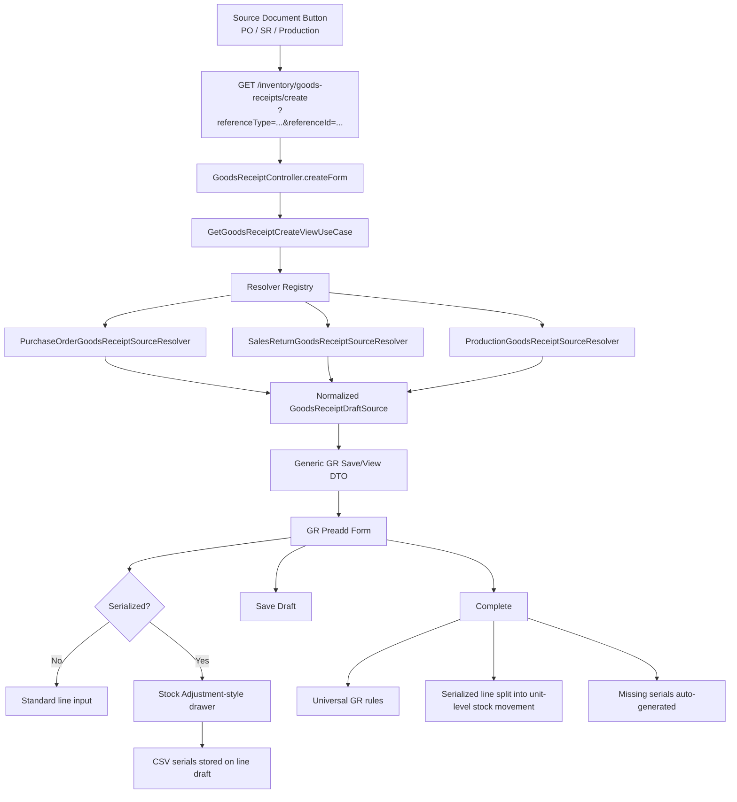

# Brainstorming Summary — GR Generic Preadd Direction

## Executive Summary

This discussion clarified that the current Goods Receipt preadd flow is only partially aligned with the intended business design. The current implementation is still too Purchase-Order-specific at the entrypoint and line-model level, while the target business shape is a **reference-based generic Goods Receipt** that can later support Purchase Order, Sales Return, Production, and other source documents.

The agreed direction is:

1. **Goods Receipt stays reference-based and generic**, not PO-specific.
2. Public create entrypoint should become:
   - `GET /inventory/goods-receipts/create?referenceType=PURCHASE_ORDER&referenceId=1`
3. Preadd loading should use **resolver per source type**, not `if/switch` logic inside GR controller/use case.
4. **Serialized line UX must follow Stock Adjustment exactly**:
   - one main row in the table
   - serial detail managed in drawer
   - serialized stock posted as unit-level movements only on COMPLETE
5. Because GR has not gone to production and no real data exists yet, the refactor should be a **clean cut generic**, not a staged compatibility bridge.

---

## Architecture Diagram

---

## Deep-Dive

## 1. Main Problem Identified

Two main inconsistencies were confirmed:

### A. UX mismatch with business expectation

The preadd Goods Receipt UI does not yet follow the Stock Adjustment interaction model, especially for serialized items.

Expected by business:

- serialized lines behave like Stock Adjustment
- one visible line in table
- drawer manages serial numbers
- if qty is 5 for a serialized product, drawer manages 5 unit serial slots
- missing serial numbers are auto-generated on COMPLETE

### B. Contract mismatch with generic source direction

Current create flow:

- `/inventory/goods-receipts/create?poId=1`

This is technically workable for PO only, but it leaks source identity into the GR public contract and does not scale well once Sales Return, Production, or future source documents are introduced.

---

## 2. Final Decisions from the Brainstorm

### 2.1 Entry Contract

Agreed direction:

- Use a **single generic GET entrypoint**
- Parameters:
  - `referenceType`
  - `referenceId`

Example:

- `/inventory/goods-receipts/create?referenceType=PURCHASE_ORDER&referenceId=1`

Why:

- simple and explicit
- source-agnostic at public API level
- future-safe for more source documents

### 2.2 Source Loading Strategy

Agreed direction:

- Use **resolver per source type**
- GR create-view must not branch deeply inside controller or use case

Recommended shape:

- `PurchaseOrderGoodsReceiptSourceResolver`
- `SalesReturnGoodsReceiptSourceResolver`
- `ProductionGoodsReceiptSourceResolver`

The resolver should:

- validate source-specific eligibility
- filter eligible/outstanding lines
- normalize source structure into a GR draft snapshot

### 2.3 Validation Ownership

Agreed direction:

- **Resolver owns source-specific validation**
- GR core owns only universal receiving rules

Examples:

- PO status eligibility belongs in PO resolver
- Sales Return-specific conditions belong in SR resolver
- generic GR validation stays in GR use case

This keeps GR truly agnostic from the lifecycle rules of each source document.

### 2.4 Serialized UX Direction

Agreed direction:

- **same flow as Stock Adjustment**

This means:

1. main table keeps one row per source line
2. serialized detail is managed in drawer
3. non-serialized lines remain standard aggregate input
4. serialized stock only becomes unit-level at COMPLETE

### 2.5 Draft Serial Storage

Agreed direction:

- follow Stock Adjustment pragmatically
- store drawer serial result temporarily as **CSV string per line**

Why:

- matches existing proven pattern
- avoids premature child-detail modeling
- current GR COMPLETE logic is already close to this approach

### 2.6 Domain Model Direction

Agreed direction:

- perform a **clean cut generic refactor**

Because:

- no real GR data exists yet
- still on development branch
- not yet in production

Implication:

- `poId` should no longer be the main identity of GR
- `poLineId` should no longer define GR line linkage

Target model:

- Header:
  - `referenceType`
  - `referenceId`
- Line:
  - `referenceLineId`

---

## 3. What This Means for Current GR Slice

The current GR slice is only partially generic today.

### Already moving in the right direction

- header already has `referenceType` and `referenceId`

### Still PO-specific

- controller create form still accepts `poId`
- create-view use case still loads PO directly
- create/update logic still works through `poLineId`
- line entity still persists `po_line_id`
- COMPLETE logic still validates through `receipt.getPoId()` and PO line grouping

Conclusion:

This is not just a template/UI adjustment. It is a **structural reshape of the GR slice** so that the generic model is real, not cosmetic.

---

## 4. Endpoint + Resolver Recommendation

Recommended flow:

1. Source document renders create button to generic GR endpoint
2. Controller accepts `referenceType` + `referenceId`
3. Create-view use case requests resolver by `referenceType`
4. Resolver returns normalized `GoodsReceiptDraftSource`
5. GR maps draft source to generic save/view DTO for preadd screen

Recommended resolver output should contain:

### Header snapshot

- `referenceType`
- `referenceId`
- `referenceCode`
- `supplierId`
- `facilityId`
- `currencyId`
- `exchangeRate`
- display names/codes needed by the preadd screen

### Line snapshot

- `referenceLineId`
- `productId`
- `productCode`
- `productName`
- `serialized`
- `uomId`
- `uomCode`
- `uomName`
- `defaultContainerId` when applicable
- `outstandingQty`
- `unitPrice`
- any receiving-specific hints needed by the form

---

## 5. Serialized Drawer + COMPLETE Recommendation

### UX target

Reuse Stock Adjustment interaction model as much as possible:

- drawer for serialized rows
- target/base quantity behavior
- dynamic serial row generation
- no explosion of main table rows

### COMPLETE behavior target

The current GR COMPLETE flow is already close and should be preserved conceptually:

- resolve serialized unit count from quantity/base quantity
- parse provided serials
- auto-generate missing serials
- post serialized stock as unit-level stock movement
- keep non-serialized lines as aggregate movements

### Draft persistence target

During draft:

- keep `serialNumber` as line-level CSV string

At COMPLETE:

- parse CSV
- fill missing serials
- create unit-level stock movements

This preserves parity with Stock Adjustment and avoids unnecessary model complexity for Sprint scope.

---

## 6. Recommendation

The recommended direction is:

### Recommendation A — Rebuild GR preadd as a true generic reference-based flow

Do **not** continue evolving GR as “PO-first with future patches”.

Instead:

1. make the public entrypoint generic now
2. move source knowledge into resolvers
3. clean-cut `poLineId` into `referenceLineId`
4. align serialized UX to Stock Adjustment exactly
5. keep draft serial storage pragmatic (CSV per line)

This gives the cleanest long-term result with the lowest future rework cost.

### Recommendation B — Treat this as slice reshape, not bugfix

This should be planned and implemented as a coordinated refactor touching:

- controller contract
- create-view use case
- resolver registry
- command/query DTOs
- domain line model
- persistence entity/migration
- COMPLETE flow validation path
- GR form template and page-specific JS

---

## 7. Actionable Next Steps

1. Create implementation plan for **GR generic preadd refactor**
2. Define a pure-Java resolver contract and normalized draft snapshot DTO
3. Replace current PO-only create-view use case with resolver-based flow
4. Refactor `poLineId` to `referenceLineId` across GR slice
5. Replace current GR form JS with Stock Adjustment-style drawer behavior for serialized lines
6. Keep current serialized COMPLETE semantics, but redirect validation away from PO-only assumptions
7. Add regression tests for:
   - generic create endpoint contract
   - resolver routing by reference type
   - serialized drawer prefill/save behavior
   - COMPLETE auto-generation of missing serials

---

## Final Position

The strange feeling in the current GR preadd is valid: the system is currently caught between two designs.

- The **business direction** already wants a generic receiving document.
- The **current implementation** is still partially shaped like “Purchase Order receiving form”.

The correct move is not to keep patching the PO-shaped version. The correct move is to **finish the genericization cleanly now**, while the feature is still in development and before production data exists.
