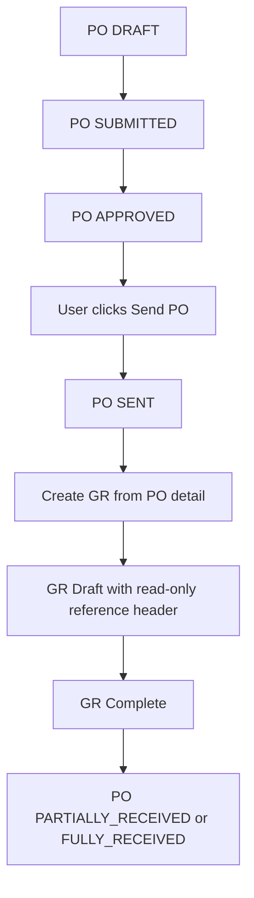

# Brainstorming Summary — SOL-53 / SOL-54 PO-GR Alignment

## Executive Summary

Sprint 4 Goods Receipt sudah berhasil membuka flow dasar PO -> GR, tetapi implementasi saat ini masih menyisakan gap antara aturan bisnis procurement dan surface UI yang dipakai user harian.

Diskusi ini menyepakati lima keputusan inti:

1. **PO lifecycle resmi** adalah `APPROVED -> SENT -> PARTIALLY_RECEIVED/FULLY_RECEIVED`.
2. **Tax PO wajib terisi**; transaksi non-pajak tetap harus memilih master tax eksplisit seperti zero-rate / non-tax, bukan `null`.
3. **GR domain harus digeneralisasi sekarang** dari `poId` menjadi `referenceId + referenceType`, tetapi **entry flow create tetap PO-only dulu**.
4. **Header create/pre-add GR** harus menampilkan snapshot reference secara **read-only**.
5. **GR list tidak boleh punya tombol create mandiri**; create hanya dari detail dokumen sumber.

## Flow Overview

## Deep Dive

### 1. Current implementation gap

Hasil pembacaan code dan dokumen menunjukkan kondisi berikut:

- `PurchaseOrderStatus` sudah mengenal status `SENT`, dan controller sudah punya endpoint `POST /purchasing/purchase-orders/{id}/send`.
- Tombol send memang ada di `purchase-orders/form.html`, tetapi flow UI belum utuh karena:
  - tombol tidak muncul di halaman detail/view yang paling natural dipakai setelah approval,
  - JavaScript form saat ini hanya menangani submit approval, belum menangani aksi send.
- `PurchaseOrderSaveRequest.taxId` masih optional, sehingga tax bisa kosong.
- `GoodsReceipt` aggregate, DTO, entity, repository, template, dan query masih memakai `poId` sebagai identitas sumber.
- `inventory/goods-receipts/list.html` masih menampilkan tombol create global, padahal create GR seharusnya source-driven.

### 2. SOL-53 — Purchase Order improvements

#### PO Tax wajib

Keputusan diskusi: tax tidak boleh `null`.

Implikasi teknis:

- Validasi harus dijaga di **dua lapis**:
  - request/web validation agar user langsung mendapat feedback,
  - domain validation agar rule tetap aman walau request datang dari luar UI.
- Form PO perlu menandai lookup Tax sebagai required.
- Skenario non-pajak tidak memakai `null`, tetapi tetap memilih master tax eksplisit yang mewakili zero/non-tax.

#### Send PO harus terlihat dan benar-benar bisa dipakai

Keputusan diskusi: setelah approval, procurement masih butuh aksi eksplisit **Send to Supplier** sebelum gudang boleh menerima barang.

Implikasi teknis:

- Tombol send harus tersedia di surface yang benar-benar dipakai user, minimal **PO detail/view**.
- Tombol send yang sudah ada di form edit juga harus benar-benar wired ke endpoint.
- PO detail hanya boleh mengizinkan create GR saat status sudah `SENT` atau `PARTIALLY_RECEIVED`.

### 3. SOL-54 — Goods Receipt improvements

#### Header create/pre-add harus informatif

Keputusan diskusi: header GR draft harus menampilkan snapshot read-only dari referensi sumber.

Minimal snapshot untuk flow PO:

- reference type
- reference code
- supplier
- facility
- currency
- exchange rate
- tanggal referensi bila relevan

Tujuannya adalah membuat user gudang tahu konteks penerimaan tanpa harus bolak-balik ke halaman PO.

#### GR list tidak boleh punya create button

GR bukan dokumen yang diinisiasi bebas dari module list. Ia merupakan dokumen turunan dari dokumen sumber. Karena itu:

- list berfungsi sebagai monitor/audit,
- create action hanya muncul dari view dokumen sumber yang eligible.

#### Domain GR harus future-proof

Keputusan diskusi: ganti `poId` menjadi `referenceId + referenceType` sekarang, walau UI create masih hanya dari PO.

Rekomendasi detail desain:

- Gunakan enum domain baru khusus GR, misalnya `GoodsReceiptReferenceType`, agar tidak bentrok dengan enum `ReferenceType` milik stock movement.
- Nilai awal yang aktif di UI cukup `PURCHASE_ORDER`.
- Mapping PO-specific seperti `poCode` di web layer tetap boleh dipertahankan sebagai derived/presentation field selama `referenceType == PURCHASE_ORDER`.

### 4. Scope boundary yang disepakati

**In scope sekarang**

- wajib tax PO
- tombol send PO
- wiring UI send PO
- GR pre-add header snapshot
- hapus tombol create dari list GR
- generalisasi domain/persistence GR ke reference model
- tetap menjaga create GR hanya dari PO

**Tidak dibuka sekarang**

- create GR dari Sales Return / Production / manual receipt
- perubahan lifecycle procurement selain yang diperlukan untuk `APPROVED -> SENT`
- perubahan accounting posting Sprint 4

## Recommendation

Kerjakan perubahan ini sebagai **alignment sprint 4**, bukan sebagai rewrite besar. Pendekatan paling aman adalah:

1. rapikan rule PO lebih dulu (`tax required`, `send action visible + wired`);
2. baru generalisasi model GR di domain/persistence;
3. setelah itu sesuaikan web layer GR agar tetap PO-only tetapi memakai snapshot reference yang lebih benar.

Pendekatan ini menjaga bugfix UI dan perbaikan domain tetap searah, tanpa membuka scope fitur reference lain terlalu dini.

## Implementation Handoff

Rencana implementasi rinci disimpan di:

`docs/superpowers/plans/2026-04-27-sol-53-sol-54-po-gr-alignment.md`
