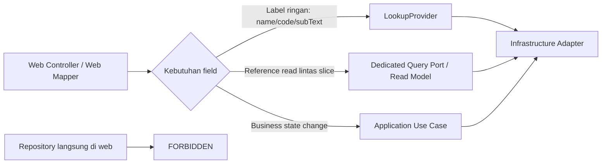

# Brainstorming Summary — Web-Layer Boundary Hardening for GR / PO / PR

## Executive Summary

Diskusi ini menyepakati bahwa masalah utama bukan pada **DTO flat** itu sendiri, melainkan pada **siapa yang melakukan enrichment** dan **jenis dependency apa yang diizinkan** di layer `web`.

Keputusan utamanya:

1. **DTO web boleh tetap flat** untuk SSR/Thymeleaf.
2. **Layer `web` tidak boleh inject repository langsung**, termasuk repository slice lain.
3. **`LookupProvider` tidak hanya untuk autocomplete**; ia boleh dipakai untuk label ringan seperti `name`, `code`, dan `subText`, termasuk prefill edit form.
4. Jika enrichment mulai butuh **pemahaman reference bisnis**, branching `referenceType`, atau fetch dokumen lintas slice, maka gunakan **query/read port** atau **application query read model**, bukan repository di `web`.
5. Goods Receipt dipilih sebagai target refactor pertama karena saat ini `GoodsReceiptWebMapper` masih meng-inject `PurchaseOrderRepository` untuk resolve `referenceCode`.
6. Dokumentasi arsitektur dan instruksi agent harus diperbarui agar rule ini terus dipatuhi di masa depan.

## Flow Overview

## Deep Dive

### 1. Apa yang dianggap coupling aman?

Coupling berikut dianggap **masih aman** untuk repo ini:

- `web.controller` atau `web.mapper` meng-inject **use case**
- `web.controller` atau `web.mapper` meng-inject **LookupProvider**
- `web.controller` membangun UI helper kecil seperti prefill autocomplete
- `infrastructure.adapter` meng-inject repository teknis/JPA

Contoh yang masih sehat di codebase:

- `PurchaseOrderWebMapper` memakai `PartyLookupProvider`, `FacilityLookupProvider`, `CurrencyLookupProvider`
- `PurchaseRequisitionWebMapper` memakai lookup provider untuk requester, supplier, facility, dan currency
- `FacilityController` memakai `PartyLookupProvider` dan `GeographicLookupProvider` untuk `buildFacilityUI(...)`

### 2. Apa yang dianggap anti-pattern?

Coupling berikut dianggap **melewati boundary**:

- class di `web.controller` / `web.mapper` meng-inject `Repository`
- `web` melakukan branching business-aware berdasarkan `referenceType` untuk fetch data slice lain
- `web` menjadi tempat orchestration read lintas slice
- field tampilan hanya bisa dirender karena `web` memanggil repo lain secara langsung

Contoh yang perlu dibersihkan:

- `GoodsReceiptWebMapper` meng-inject `PurchaseOrderRepository` untuk `resolveReferenceCode(...)`

### 3. `LookupProvider` itu sebenarnya untuk apa?

`LookupProvider` memang lahir dari kebutuhan autocomplete, tetapi pemakaiannya **lebih luas**:

- dropdown / autocomplete
- prefill nilai edit form
- render label ringan dari foreign key
- menjaga **single source of truth** untuk format display `name/subText`

Yang **bukan** tugas `LookupProvider`:

- menghitung state bisnis
- menyusun summary/detail kompleks lintas aggregate
- menjadi pengganti query use case penuh
- menampung branching bisnis besar berdasarkan `referenceType`

### 4. Arah implementasi yang dipilih

Untuk refactor awal, pendekatan yang paling realistis adalah:

1. **larang repository di `web`** secara eksplisit lewat dokumentasi dan test guardrail;
2. pindahkan resolve `referenceCode` GR ke **dedicated read-only port** yang diimplementasikan di infrastructure;
3. biarkan label ringan lain (`supplierName`, `facilityName`, `containerCode`, `uomCode`) tetap via `LookupProvider`;
4. dokumentasikan bahwa jika enrichment berkembang melebihi “label ringan”, langkah berikutnya adalah **application query read model**.

Ini memberi jalur transisi yang aman:

- **jangka pendek**: boundary web lebih bersih tanpa rewrite besar;
- **jangka menengah**: query read model bisa ditambahkan jika detail screen makin kompleks;
- **jangka panjang**: lebih siap jika modul dipisah menjadi service/BFF terpisah.

## Recommendation

Rekomendasi final untuk repo ini:

1. **Kodifikasi rule** di `docs/AGENTS.md` dan `docs/architecture/clean-ddd-cqrs-standard.md`.
2. Tambahkan **guardrail test** yang gagal bila ada repository dependency di package `web`.
3. Refactor **Goods Receipt** sebagai contoh pertama:
   - repository keluar dari `GoodsReceiptWebMapper`
   - resolve `referenceCode` pindah ke dedicated port + adapter
4. Gunakan **PO/PR sebagai positive examples** dalam dokumentasi:
   - lookup provider di web = boleh
   - repository di web = tidak boleh

## Implementation Handoff

Rencana implementasi rinci disimpan di:

`docs/superpowers/plans/2026-04-29-web-layer-boundary-hardening.md`
