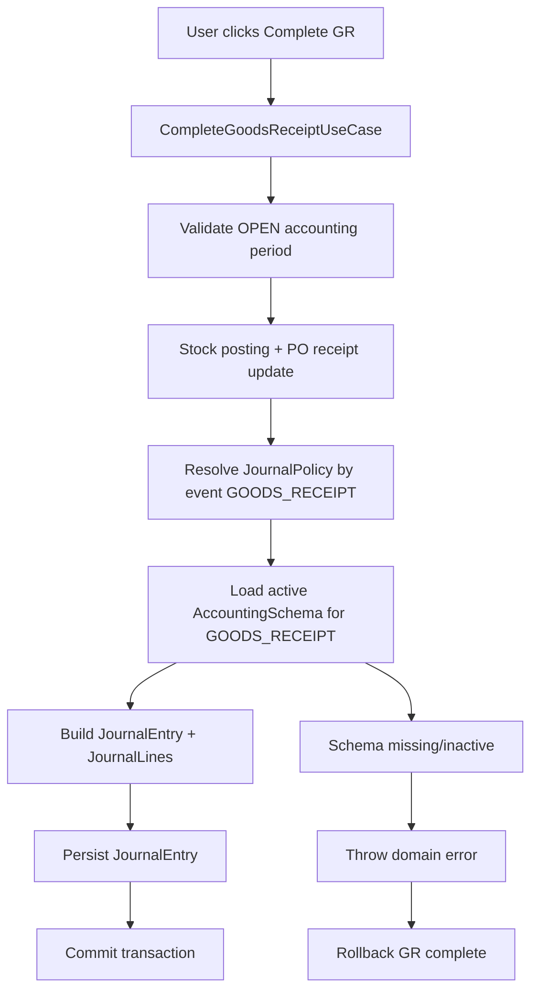

# Brainstorming Summary — GR Auto-Journal Event Core

**Date:** 2026-05-02  
**Mode:** Adaptive  
**Scope:** Sprint 4 continuation (GR -> Accounting integration)

## Executive Summary

Kita sepakat bahwa pemahaman bisnis utama sudah tepat: saat **Goods Receipt (GR) complete**, stok bertambah dan kewajiban interim muncul ke **GR/IR clearing**, bukan langsung menjadi AP invoice final.

Keputusan arsitektur: bangun **Journal Core event-based framework** sekarang (siap untuk banyak event), tetapi **event aktif pertama hanya `GOODS_RECEIPT`** agar delivery tetap aman dan terukur.

Untuk reliabilitas awal, posting jurnal dipilih **synchronous dalam transaksi yang sama** dengan GR complete: jika jurnal gagal, GR complete ikut gagal (atomic consistency).

## Architecture Diagram (Target Flow)

## Deep Dive

## 1. Business Policy (Chosen Baseline)

Posting rule untuk event `GOODS_RECEIPT`:

1. **Dr Inventory (net)**
2. **Dr Input Tax**
3. **Cr GR/IR Clearing (gross)**

Konteks lifecycle:
- GR complete = pengakuan barang + accrual interim (GR/IR)
- Vendor Bill (Sprint 5) = clear GR/IR -> AP vendor

## 2. Why Not Big-Bang All Events Immediately

Walau framework akan disiapkan untuk semua event, aktivasi sekaligus berisiko tinggi karena modul AP/AR/journal downstream belum semua mature. Aktivasi satu event dulu memberi:
- risiko regresi lebih rendah,
- observability lebih jelas,
- rollback scope lebih kecil,
- fondasi reusable tetap siap untuk `VENDOR_BILL`, `VENDOR_PAYMENT`, dll.

## 3. Proposed Journal Core Building Blocks

- **Domain Model**
  - `JournalEntry` (header: sourceRef, postingDate, status, eventType)
  - `JournalLine` (accountId, debit, credit, currency context)
- **Application Service**
  - `JournalPostingService`
  - `JournalPolicyResolver` (event -> policy)
  - `JournalPolicy` interface (pluggable per event)
- **Integration Points**
  - GR complete memanggil `JournalPostingService.post(event=GOODS_RECEIPT, source=GR)`
  - lookup schema aktif berdasarkan `SchemaEventType.GOODS_RECEIPT`
- **Safety**
  - idempotency key: `GOODS_RECEIPT:{grId}` untuk mencegah double posting
  - fail-fast jika schema tidak ada / tidak aktif / tidak valid

## 4. Transaction Strategy (Chosen)

**Synchronous + same transaction**

Konsekuensi:
- Pro: konsistensi kuat (tidak ada GR completed tanpa journal)
- Kontra: latensi complete sedikit naik

Keputusan ini cocok untuk fase awal dan bisa dievolusikan ke outbox async nanti jika throughput menuntut.

## 5. Compatibility with Current Codebase

Kondisi saat ini yang sudah ada:
- period OPEN check pada GR complete
- stock movement posting
- PO receiving update

Yang belum ada dan menjadi target implementasi berikutnya:
- schema enforcement di GR complete
- journal entry persistence
- event-policy execution untuk `GOODS_RECEIPT`

## Recommendation

Implementasi terbaik tahap berikutnya:

1. Build **full event-capable Journal Core framework** (generic design).
2. Activate only **`GOODS_RECEIPT`** policy in runtime.
3. Wire ke `CompleteGoodsReceiptUseCase` secara synchronous transactional.
4. Tambahkan guardrails:
   - schema active check (mandatory),
   - idempotency key,
   - integration tests untuk success + rollback path.

## Actionable Next Steps

1. Definisikan contract `JournalPostingService` + `JournalPolicy` + `JournalPolicyResolver`.
2. Buat aggregate/persistence `JournalEntry` dan `JournalLine`.
3. Implement policy `GoodsReceiptJournalPolicy` (Dr Inventory, Dr Input Tax, Cr GR/IR).
4. Wire ke `CompleteGoodsReceiptUseCaseImpl` sebelum final save commit.
5. Tambahkan test:
   - complete sukses -> journal created,
   - schema missing -> GR complete rollback,
   - duplicate complete/retry -> idempotent behavior.
6. Setelah stabil, lanjutkan aktivasi event berikutnya (Sprint 5: `VENDOR_BILL`, `VENDOR_PAYMENT`).
