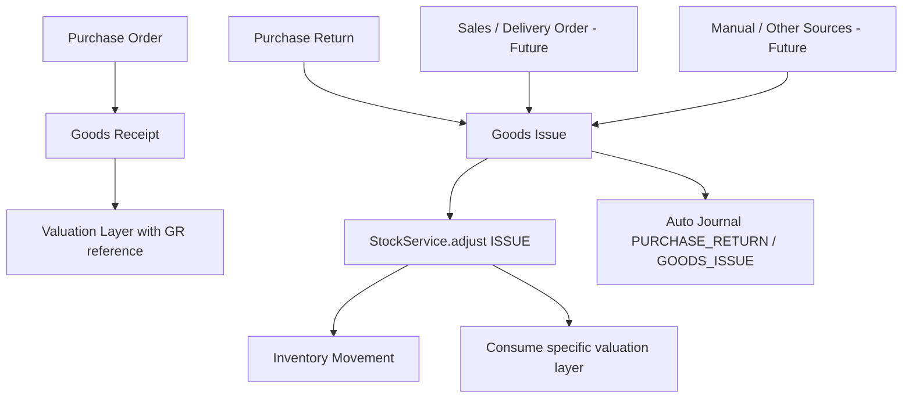

# Brainstorming: Generic Goods Issue (GI)

Tanggal: 2026-06-01
Status: Hasil diskusi / baseline desain awal

## Executive Summary

Goods Issue (GI) akan dibangun sebagai **dokumen inventory outbound generik**, mirror konseptual dari Goods Receipt (GR) yang sudah ada. Tujuannya agar semua flow barang keluar operasional dapat mengisi dokumen GI dengan cara masing-masing:

- **Purchase Return**: membuat/mengisi GI otomatis saat return dikonfirmasi.
- **Sales / Delivery Order**: kelak memakai GI sebagai dokumen outbound/picking/shipping.
- **Manual / future sources**: dapat ditambahkan lewat resolver/source adapter seperti pola GR.

Keputusan utama: **barang keluar dari Purchase Return akan lewat GI**, bukan langsung memanggil stock movement tanpa dokumen GI. GI menjadi lapisan dokumen fisik, sedangkan `StockService.adjust()` tetap menjadi primitive bawah untuk posting stock movement.

## Latar Belakang

Sebelumnya muncul pertanyaan apakah Purchase Return perlu langsung mengeluarkan stok atau lewat GI. Setelah diskusi, visi yang dipilih adalah:

> Jika ada barang keluar/masuk dari modul apa pun, modul tersebut cukup menyediakan data yang dibutuhkan oleh dokumen inventory fisik. Untuk inbound memakai GR, untuk outbound memakai GI. Cara pengisiannya bisa manual atau otomatis tergantung business flow.

Dengan visi ini, pola menjadi simetris:

| Arah | Dokumen fisik generik | Sumber awal | Sumber masa depan |
|---|---|---|---|
| Inbound | Goods Receipt (GR) | Purchase Order | Sales Return, Manual, Production |
| Outbound | Goods Issue (GI) | Purchase Return | Delivery Order, Manual, Production/Consumption, Scrap |

## Prinsip Desain

1. **GI adalah dokumen fisik outbound generik.**
   - Tidak dikunci ke Sales saja.
   - Tidak dikunci ke Purchase Return saja.
   - Source-specific logic masuk lewat resolver/use case seperti GR.

2. **Simpan snapshot yang cukup kaya.**
   - Preferensi desain: lebih baik menyimpan data historis lebih banyak daripada kurang, selama tidak menciptakan inkonsistensi besar.
   - Dokumen historis tidak boleh berubah makna hanya karena master data berubah.

3. **Stock movement tetap satu primitive.**
   - GI saat completed memanggil `StockService.adjust()` dengan `MovementType.ISSUE`.
   - `InventoryMovement` tetap menjadi ledger stock movement terpusat.
   - GI adalah dokumen operasional/audit di atas ledger stock.

4. **Specific-layer valuation untuk Purchase Return.**
   - Barang return harus mengonsumsi valuation layer dari GR asal, bukan FIFO oldest-first umum.
   - Ini penting untuk non-serial item agar nilai inventory keluar sama dengan nilai GR yang dikembalikan.

5. **Purchase Return diperlakukan sebagai reversal penerimaan.**
   - Untuk multi-currency, return memakai rate GR asli untuk nilai inventory dan liability clearing.
   - Tidak ada FX variance di Purchase Return jika konsepnya reversal murni.

## Flow Konseptual



## Keputusan Data Header GI

### Header Fields yang Disarankan

| Field | Wajib | Keterangan |
|---|---:|---|
| `id` | Ya | PK |
| `code` | Ya | Auto sequence, mis. `GI-{yyyyMM}-{seq}` |
| `issue_date` | Ya | Tanggal barang keluar / posting date |
| `reference_type` | Ya | Source dokumen, mis. `PURCHASE_RETURN`, `DELIVERY_ORDER`, `MANUAL` |
| `reference_id` | Ya, kecuali manual | ID dokumen sumber |
| `reference_code` | Snapshot opsional | Kode dokumen sumber untuk audit/listing cepat |
| `party_id` | Opsional/conditional | Pihak tujuan barang keluar; supplier untuk Purchase Return, customer untuk Delivery Order |
| `party_type` | Opsional/conditional | Kode role party, mis. `SUPPLIER`, `CUSTOMER`, `INTERNAL`, mengacu konsep PartyRoleType |
| `facility_id` | Ya | Satu GI header dibatasi satu facility/gudang |
| `currency_id` | Ya jika monetary | Currency source transaction/cost context |
| `exchange_rate` | Ya jika monetary | Untuk Purchase Return memakai rate GR asli; Sales bisa mengikuti aturan DO/invoice nanti |
| `status` | Ya | `DRAFT`, `COMPLETED`, `CANCELLED` |
| `note` / `notes` | Tidak | Catatan operasional |
| audit fields | Ya | Sesuai BaseModel |

### Keputusan Header

- Menggunakan **`party_id + party_type`**, bukan `supplier_id` atau `customer_id` terpisah.
- Alasannya: GI outbound bisa menuju supplier, customer, internal, atau pihak lain.
- `party_type` sebaiknya memakai kode role yang sudah dikenal sistem (`SUPPLIER`, `CUSTOMER`, `INTERNAL`, `COURIER`, dll) agar selaras dengan Party Role Type.
- Satu dokumen GI dibatasi pada **single facility per header**.

## Keputusan Data Line GI

### Line Fields yang Disarankan

| Field | Wajib | Keterangan |
|---|---:|---|
| `id` | Ya | PK |
| `header_id` | Ya | FK ke GI header |
| `reference_line_id` | Ya untuk source-based | Line sumber langsung, mis. Purchase Return line atau Delivery Order line |
| `product_id` | Ya | Produk yang dikeluarkan |
| `is_serialized` | Ya | Snapshot apakah produk serialized saat transaksi |
| `quantity_issued` | Ya | Qty transaksi keluar |
| `uom_id` | Ya | UoM transaksi |
| `base_quantity` | Ya | Qty dalam base UOM untuk stock posting |
| `facility_id` | Ya | Snapshot facility line, sama dengan header untuk saat ini |
| `grid_id` | Ya | Snapshot grid/zone saat issue |
| `container_id` | Ya | Bin/container asal barang |
| `serial_number` | Conditional | Untuk serialized item; bisa CSV seperti GR saat ini atau model detail serial terpisah nanti |
| `unit_cost` | Ya saat completed | Cost per base/unit issue yang di-resolve dari valuation layer/FIFO |
| `inventory_amount` | Ya saat completed | Nilai inventory yang dikredit |
| `tax_base_amount` | Opsional/source-specific | Untuk Purchase Return bisa mengikuti nilai DPP return |
| `tax_amount` | Opsional/source-specific | Untuk Purchase Return jika perlu pembalik pajak masukan |
| `clearing_amount` / `liability_amount` | Opsional/source-specific | Nilai GR/IR atau AP yang didebit saat return |
| `valuation_ref_type` | Conditional | Referensi asal valuation layer, mis. `GOODS_RECEIPT` untuk Purchase Return |
| `valuation_ref_id` | Conditional | ID dokumen/line asal valuation layer. Lihat catatan di bawah |
| `valuation_ref_line_id` | Recommended | ID line asal valuation layer, mis. GR line ID, agar specific-layer lebih presisi |
| audit fields | Ya | Sesuai BaseModel |

### Keputusan Line

- GI line menyimpan **dua jenis referensi**:
  1. `reference_line_id`: sumber langsung GI line, mis. Purchase Return line.
  2. `valuation_ref_*`: asal valuation/cost layer, mis. Goods Receipt/GR line.
- Ini dipilih karena Purchase Return membutuhkan specific-layer costing.
- Untuk Sales/Delivery Order, `valuation_ref_*` bisa null karena cost dapat ditentukan dengan FIFO biasa saat issue.
- GI line menyimpan snapshot **facility + grid + container**, meskipun grid bisa diturunkan dari container.

## Kenapa Grid Tetap Disimpan di GI Line?

Container sudah menjadi bagian dari grid, sehingga secara teknis `grid_id` bisa diturunkan dari `container_id`.

Namun GI adalah dokumen historis. Jika di masa depan container dipindah/reassign ke grid lain, dokumen GI lama tidak boleh ikut berubah lokasi historisnya. Karena itu dipilih:

> Simpan snapshot `facility_id`, `grid_id`, dan `container_id` di GI line.

Ini menjaga audit trail: barang saat itu keluar dari facility/grid/container tertentu.

## Lifecycle GI

Status yang dipilih:

```text
DRAFT -> COMPLETED -> CANCELLED
```

### DRAFT

- Dokumen masih bisa diedit.
- Belum memengaruhi stok.
- Bisa dibuat otomatis dari Purchase Return atau manual/source resolver lain.

### COMPLETED

- Memvalidasi accounting period open.
- Memvalidasi stock availability.
- Memvalidasi container/grid/facility consistency.
- Mem-post stock issue via `StockService.adjust()`.
- Mengonsumsi valuation layer:
  - Purchase Return: specific layer dari GR asal.
  - Sales/Delivery: FIFO umum atau policy lain nanti.
- Mem-post journal sesuai event/source.
- Dokumen dikunci dari edit normal.

### CANCELLED

- Untuk membatalkan GI yang sudah completed.
- Perlu reversal stock movement dan reversal journal.
- Detail implementasi bisa dibuat konservatif:
  - hanya boleh cancel jika belum ada downstream document yang bergantung,
  - atau menggunakan explicit reversal movement/document.

Catatan: GR saat ini hanya `DRAFT -> COMPLETED`. GI dipilih lebih lengkap karena outbound sering terkait surat jalan/return/shipping yang rawan koreksi.

## Purchase Return via GI

### Flow

```text
PO -> GR -> Valuation Layer
Purchase Return Confirm -> auto-create/complete GI -> stock issue -> journal return
```

### Aturan Valuasi

- Purchase Return harus mengambil barang dari **GR/GR line spesifik**.
- Serialized item:
  - return berdasarkan serial number,
  - serial harus masih on-hand di container/facility yang valid.
- Non-serialized item:
  - return berdasarkan remaining valuation layer dari GR line asal,
  - bukan FIFO oldest-first global.

### Implikasi ke Valuation Layer

Agar specific-layer bisa berjalan, `inv_valuation_layers` perlu ditambah referensi asal inbound:

| Field | Keterangan |
|---|---|
| `reference_type` | Mis. `GOODS_RECEIPT` |
| `reference_id` | ID GR header atau source document |
| `reference_line_id` | ID GR line, recommended untuk presisi |

Saat GR completed, valuation layer yang dibuat harus membawa referensi GR/GR line. Saat GI untuk Purchase Return completed, sistem mengonsumsi layer yang match dengan GR line tersebut.

## Multi-Currency dan Exchange Rate

Keputusan: **Purchase Return memakai reversal murni dengan rate GR asli**.

Contoh:

- GR menerima 1 unit @ USD 1.
- Rate GR: 17.500.
- Rate saat return: 17.800.

Untuk Purchase Return, inventory keluar di nilai buku layer GR:

```text
DR GR/IR Clearing / AP      17.500
   CR Inventory                     17.500
```

Tidak ada FX gain/loss karena return dianggap membatalkan penerimaan, bukan transaksi monetary baru.

### Kenapa FX Tidak Dihitung di Stock?

Stock valuation memakai cost layer asli. FX variance, jika ada, adalah fenomena jurnal/moneter, bukan perubahan harga barang di stock. Vendor Bill di codebase sudah punya pola FX variance pada level jurnal (`VB_FX_LOSS_AMT` / `VB_FX_GAIN_AMT`). Untuk Purchase Return dipilih tidak memakai variance karena memakai rate GR asli.

## Auto-Journal Considerations

Ada dua pendekatan event jurnal:

1. **Event generic GI** (`GOODS_ISSUE`) untuk semua outbound.
2. **Event source-specific** (`PURCHASE_RETURN`, `DELIVERY_ORDER`, dll) karena jurnal tiap sumber berbeda.

Untuk Purchase Return, disarankan memakai **event source-specific** karena jurnal return berbeda dari sales delivery/COGS.

### Purchase Return Journal

Jika Bill belum di-post:

```text
DR GR/IR Clearing
   CR Inventory
   CR Input VAT (jika tax reversal diperlukan)
```

Jika Bill sudah di-post:

```text
DR Accounts Payable
   CR Inventory
   CR Input VAT (jika tax reversal diperlukan)
```

Catatan:

- Nilai inventory memakai valuation layer GR asli.
- Nilai clearing/AP memakai rate GR asli untuk reversal murni.
- Tidak ada FX variance untuk Purchase Return.

## Source Resolver Model

GI sebaiknya meniru pola GR:

- `GoodsIssueSourceResolver`
- `GoodsIssueSourceResolverRegistry`
- Resolver pertama: `PurchaseReturnGoodsIssueSourceResolver`
- Resolver masa depan:
  - `DeliveryOrderGoodsIssueSourceResolver`
  - `ManualGoodsIssueSourceResolver`
  - `ProductionConsumptionGoodsIssueSourceResolver`

Resolver bertugas mengisi draft GI dari source:

- header reference,
- party,
- facility,
- currency/rate,
- line product/qty/uom/container/serial,
- valuation reference jika diperlukan.

## Reference Type Kandidat

Untuk GI:

```java
public enum GoodsIssueReferenceType {
    PURCHASE_RETURN,
    DELIVERY_ORDER,
    MANUAL,
    PRODUCTION,
    SCRAP,
    INTERNAL_USE
}
```

Untuk stock ledger `ReferenceType`, perlu ditambahkan minimal:

```java
PURCHASE_RETURN
```

Dan GI stock movement dapat memakai salah satu dari dua pola:

- `referenceType = GOODS_ISSUE`, `referenceId = giId`, lalu GI menyimpan source detail; atau
- `referenceType = PURCHASE_RETURN`, `referenceId = purchaseReturnId` untuk ledger source-specific.

Rekomendasi awal: gunakan `GOODS_ISSUE` di InventoryMovement agar ledger menunjuk ke dokumen fisik yang benar, sementara GI header menunjuk ke source bisnis (`PURCHASE_RETURN`). Jika laporan butuh source bisnis, join dari GI ke source.

## Data yang Sengaja Disimpan Walau Bisa Diturunkan

| Data | Bisa diturunkan dari | Kenapa tetap disimpan |
|---|---|---|
| `reference_code` | source document | Listing/audit cepat, tahan jika code source berubah |
| `party_type` | party roles | Menyimpan konteks role party saat transaksi |
| `facility_id` line | header/container | Snapshot historis |
| `grid_id` line | container | Snapshot historis jika container reassign |
| `is_serialized` | product master | Snapshot jika product setting berubah |
| `unit_cost` | valuation layer | Snapshot nilai saat completed |
| `inventory_amount` | qty × unit_cost | Audit dan journal trace |
| `valuation_ref_*` | source chain | Audit specific-layer dan reversal lebih mudah |

## Open Questions / Perlu Diputuskan Saat Plan

1. Apakah `serial_number` tetap CSV seperti GR sekarang, atau GI langsung memakai tabel detail serial per line?
   - Untuk konsistensi awal, CSV bisa cukup.
   - Untuk long-term WMS, tabel detail serial lebih baik.

2. Apakah `valuation_ref_id` menunjuk GR header atau valuation layer ID?
   - Rekomendasi: simpan `valuation_ref_type`, `valuation_ref_id` (header), dan `valuation_ref_line_id` (line).
   - Jika nanti valuation layer punya ID yang stabil dan perlu audit lebih detail, bisa tambah `valuation_layer_id` per consumption detail.

3. Apakah CANCELLED membuat reversal movement otomatis atau membuat dokumen reversal eksplisit?
   - Rekomendasi awal: reversal movement otomatis + jurnal reversal, dengan guard ketat.

4. Apakah GI completion selalu mem-post jurnal, atau jurnal tergantung source?
   - Rekomendasi: GI mem-post stock; source-specific use case menentukan jurnal atau event journal yang tepat.

5. Apakah Purchase Return confirm otomatis membuat GI dalam status COMPLETED atau membuat DRAFT GI dulu?
   - Rekomendasi awal: untuk Purchase Return, confirm return otomatis create+complete GI jika semua valid.
   - Jika bisnis butuh approval gudang, bisa create DRAFT GI dulu dan completed oleh warehouse.

## Recommendation

Bangun **Generic Goods Issue minimal tapi extensible** sebelum Purchase Return:

1. Buat modul GI generic sebagai mirror outbound dari GR.
2. Header memakai `party_id + party_type`, `facility_id`, `currency_id`, `exchange_rate`, `reference_type/reference_id`, status `DRAFT/COMPLETED/CANCELLED`.
3. Line menyimpan product, qty, UOM, base qty, facility/grid/container snapshot, serial, monetary snapshots, dan dua referensi: source line + valuation reference.
4. Tambahkan reference metadata ke `ValuationLayer` agar Purchase Return dapat consume specific GR layer.
5. Implement resolver pertama untuk Purchase Return.
6. Tunda resolver Sales/Delivery sampai modul Sales dikerjakan, tapi struktur GI sudah siap.

## Next Steps

1. Buat implementation plan untuk modul GI generic.
2. Pecah plan menjadi fase:
   - Stock valuation reference enhancement.
   - GI domain/entity/migration.
   - GI use cases + resolver registry.
   - GI UI/list/detail/create-from-source.
   - Purchase Return integration sebagai source pertama.
   - Accounting schema/event support.
3. Setelah plan disetujui, eksekusi task-by-task dengan test unit dan integration test.
