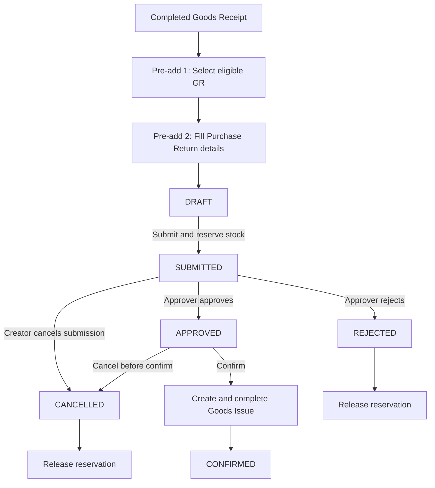

# Purchase Return Brainstorming Summary

Date: 2026-06-01

## Executive Summary

Purchase Return mencatat pengembalian fisik barang yang sebelumnya diterima dari supplier melalui Goods Receipt (GR). Implementasi fase awal fokus pada:

1. Purchase Return dengan approval flow.
2. Inventory reservation generik agar barang yang akan dikembalikan tidak dapat dikeluarkan atau dipindahkan oleh proses lain.
3. Integrasi otomatis ke Goods Issue (GI) saat Purchase Return dikonfirmasi.
4. Konsumsi valuation layer GR asal secara spesifik, bukan FIFO umum.

Satu Purchase Return hanya boleh merujuk ke satu GR. Filter Purchase Order (PO) pada halaman pemilihan source hanya membantu user menemukan GR yang relevan.

Debit Memo belum masuk scope fase awal. Seam dan monetary snapshot perlu disiapkan agar fase berikutnya dapat menangani pemotongan Vendor Bill, pajak, dan FX variance tanpa membongkar model utama.

## Scope

### Phase 1: Purchase Return

- CRUD draft Purchase Return.
- Approval mengikuti pola generic approval yang sudah digunakan PO dan PR.
- Reservation inventory generik.
- Source selector berbasis GR yang masih eligible.
- Pemilihan container aktual dan serial number aktual.
- Confirm Purchase Return membuat dan menyelesaikan GI secara otomatis.
- Posting journal sementara memakai event generic `GOODS_ISSUE`.

### Phase 2: Debit Memo and Accounting Refinement

- Tambahkan event journal khusus `PURCHASE_RETURN`.
- Ganti posting journal generic GI untuk flow Purchase Return dengan accounting policy khusus.
- Implementasikan Debit Memo untuk mengurangi Vendor Bill / Accounts Payable.
- Putuskan treatment pajak dan FX variance berdasarkan Vendor Bill.

> Important: event generic `GOODS_ISSUE` pada Phase 1 hanya solusi sementara. Flow Purchase Return wajib dipindahkan ke event `PURCHASE_RETURN` pada Phase 2.

## Business Flow



## Lifecycle Rules

| Status | Editable | Allowed Actions | Reservation |
| --- | --- | --- | --- |
| `DRAFT` | Yes | Save, Cancel, Submit | None |
| `SUBMITTED` | No | Approve, Reject, Cancel Submission by creator | Active |
| `APPROVED` | No | Confirm, Cancel | Active |
| `REJECTED` | No | View only | Released |
| `CANCELLED` | No | View only | Released |
| `CONFIRMED` | No | View only | Consumed by GI |

Additional rules:

- Submit must fail atomically if any requested reservation cannot be created.
- Reject is an approver decision and keeps its audit reason.
- Cancel Submission is available to the document creator while status is `SUBMITTED`.
- Confirm may be executed by any user with the required permission.
- Cancel after `CONFIRMED` is deferred for MVP because it requires stock reversal, journal reversal, and Debit Memo implications.
- Rejected or cancelled documents remain stored for audit. Do not hard-delete them.

## Source Document Rules

### Source Granularity

- Canonical Purchase Return source: one `GOODS_RECEIPT`.
- One Purchase Return cannot combine lines from multiple GR documents.
- A PO filter may be used in the selector to narrow eligible GR documents.
- The selector service should remain source-aware so additional return source flows can be added later.

### Eligible Goods Receipt

A GR is eligible when:

- status is `COMPLETED`;
- it has at least one line with returnable quantity greater than zero;
- its inventory remains physically available from the original GR valuation layer.

The pre-add source table should provide hyperlinks to the GR and PO view pages so users can inspect source details before continuing.

## Returnable Quantity

### Non-serialized Product

Purchase Return must consume the specific valuation layer created by the selected GR line. It must not consume inventory through general FIFO selection.

Conceptually:

```text
returnableQty(grLine) =
    quantity still on-hand from the original GR valuation layer
    - active reserved quantity from that valuation layer
```

This naturally excludes quantity already:

- returned through a confirmed Purchase Return;
- consumed by another outbound process such as sales delivery;
- held by another active reservation.

A single GR line may be split into multiple Purchase Return rows when the remaining stock is currently stored in multiple containers. Every row retains the same original GR valuation reference but records its actual current container.

### Serialized Product

- User must explicitly select serial numbers.
- Only serial numbers originating from the selected GR context are eligible.
- A serial remains eligible after moving to another container if it is still on-hand and unreserved.
- The Purchase Return row records the serial's actual current container.
- Return quantity is derived from the selected serial count.
- Each serial reservation has quantity `1`.
- Partial reservation of an abstract serialized quantity is forbidden.

## Generic Inventory Reservation

Reservation is an inventory-level capability, not a Purchase Return-only field.

### Required Behavior

```text
availableQty = onHandQty - reservedQty
```

All outbound processes must use `availableQty`. The GI generated for a Purchase Return may consume its own reservation.

### Reservation Shape

For non-serialized stock:

- owner reference type and ID, such as `PURCHASE_RETURN` and Purchase Return ID;
- product ID;
- facility, grid, and actual container;
- original GR valuation reference;
- reserved quantity;
- status such as `ACTIVE`, `CONSUMED`, or `RELEASED`.

For serialized stock:

- the same metadata;
- serial number;
- reserved quantity fixed to `1`.

### Transfer Rules

- Non-serialized stock transfer may only move available quantity. Reserved quantity cannot be moved.
- A reserved serial number cannot move container.
- After Reject, Cancel, or Cancel Submission, released stock can move again.

## Valuation and Accounting Boundary

### Inventory Value

Inventory leaving the warehouse must use the original GR valuation layer cost. Purchase Return does not accept a new editable return price.

This prevents incorrect valuation when different receipts have different prices:

```text
GR-001: 10 pcs @ 100,000
GR-002: 10 pcs @ 120,000

Return from GR-002 must reduce inventory using 120,000,
not the oldest FIFO layer from GR-001.
```

### Currency Rate

- Inventory reversal uses the original GR valuation value and rate snapshot.
- GI does not calculate FX variance.
- Debit Memo will decide AP reduction rate and FX variance handling in Phase 2.

### Temporary Phase 1 Journal

- Confirm Purchase Return creates and completes GI.
- GI temporarily posts generic event `GOODS_ISSUE`.
- The Phase 2 accounting event `PURCHASE_RETURN` must distinguish at least:
  - return before Vendor Bill: reverse GR/IR clearing against Inventory;
  - return after Vendor Bill: use Purchase Return clearing / AP adjustment flow and continue through Debit Memo.

## Date Rules

- `returnDate` is entered while the document is draft.
- `returnDate` becomes immutable after Submit.
- GI `issueDate` copies Purchase Return `returnDate`.
- Confirm requires an OPEN accounting period for `returnDate`.
- Backdated return is allowed only while its accounting period remains OPEN.

## Reason Codes

Header and each line require a reason code:

| Domain Code | Suggested i18n Key |
| --- | --- |
| `DAMAGED` | `label.purchase-return.reason.damaged` |
| `WRONG_ITEM` | `label.purchase-return.reason.wrong-item` |
| `QUALITY_ISSUE` | `label.purchase-return.reason.quality-issue` |
| `OVER_RECEIPT` | `label.purchase-return.reason.over-receipt` |
| `EXPIRED` | `label.purchase-return.reason.expired` |
| `OTHER` | `label.purchase-return.reason.other` |

Rules:

- Persist a stable enum/domain code.
- Render user-facing labels through i18n, never raw enum names.
- Header note and line note are optional.
- Note becomes required when reason code is `OTHER`.

## UI Flow

### List Page

Columns:

- Code
- Return Date
- Supplier
- Reference GR
- Source PO
- Status
- Total Quantity
- Total Amount
- Actions

The table action column only contains `View`. Submit, approval, confirm, and cancel actions live inside the form/view page.

Search should support:

- Purchase Return code;
- supplier;
- GR code;
- PO code.

### Pre-add 1: Select Return Source

Use a regular page, following the Vendor Bill multi-step flow rather than a modal.

Suggested filters:

- keyword for GR / PO code;
- supplier autocomplete;
- PO filter;
- receipt date range.

Suggested table columns:

- Select
- GR Code with hyperlink to GR view
- PO Code with hyperlink to PO view
- Supplier
- Receipt Date
- Facility
- Currency
- Returnable Lines
- Total Returnable Quantity

### Pre-add 2: Purchase Return Detail Form

Readonly source header:

- Reference GR
- Source PO
- Supplier
- Facility
- Currency
- Exchange Rate

Editable header:

- Return Date
- Reason Code
- Note
- Approver when submitting, following the existing PO / PR pattern

Line behavior:

- Load all eligible GR lines automatically with return quantity `0`.
- Allow user to delete rows from the draft UI.
- Keep an Add Line button so deleted lines can be added again.
- Add Line opens a multi-select modal selector with query-level exclusion.
- Display readonly outstanding returnable quantity.
- Lock product, UOM source reference, and GR valuation reference.
- Require line reason code.
- Keep line note optional unless reason is `OTHER`.

For non-serialized rows:

- allow qty input;
- select actual current container from eligible inventory for the GR layer;
- split a GR line into multiple rows when returning from multiple containers.

For serialized rows:

- open a serial selector modal;
- show only eligible serials from the selected GR context;
- display actual current container;
- derive qty from selected serial count.

### View Page

The view page contains:

- document header and line details;
- Purchase Return status;
- reservation summary;
- generic approval panel and approval history drawer;
- status-aware Submit, Cancel Submission, Confirm, and Cancel actions;
- link to generated GI after confirmation.

## Approval Integration

Follow the existing generic approval pattern used by Purchase Order and Purchase Requisition:

- submit requires selecting an approver;
- publish approval request using reference type `PURCHASE_RETURN`;
- use the generic approval panel and history drawer;
- listen for approved and rejected events to transition Purchase Return status;
- release reservation when rejected;
- cancel the approval request when creator cancels submission.

## Goods Issue Integration

Purchase Return must implement the existing `PurchaseReturnGoodsIssueSourcePort` seam.

At Confirm:

1. Validate status is `APPROVED`.
2. Validate `returnDate` accounting period is OPEN.
3. Validate active reservation ownership and quantities.
4. Create GI draft with reference type `PURCHASE_RETURN`.
5. Copy header snapshots: supplier, facility, currency, exchange rate, and note.
6. Copy line snapshots: product, UOM, actual location, serial numbers, monetary values, and original GR valuation references.
7. Complete GI atomically.
8. Mark reservations consumed.
9. Mark Purchase Return `CONFIRMED`.
10. Store or resolve the generated GI reference for the view page.

Idempotency guard: a Purchase Return must never produce more than one completed GI.

## Suggested Permissions

Keep the exact permission wiring aligned with project conventions:

- `PURCHASE-RETURN_READ`
- `PURCHASE-RETURN_CREATE`
- `PURCHASE-RETURN_UPDATE`
- `PURCHASE-RETURN_SUBMIT`
- `PURCHASE-RETURN_CONFIRM`
- `PURCHASE-RETURN_CANCEL`

Approval processing continues to use the generic approval feature. Admin should receive all new permissions through migration seeding.

## Deferred Questions for Phase 2

The following decisions are intentionally deferred until Debit Memo design:

1. Debit Memo lifecycle and approval requirements.
2. Whether Debit Memo uses original Vendor Bill rate or return-date rate.
3. FX gain/loss account and posting behavior.
4. Input VAT reversal timing and value source.
5. Partial Debit Memo against one or multiple Vendor Bills.
6. Cancellation and reversal flow after Purchase Return is already `CONFIRMED`.

## Recommended Next Step

Create an implementation plan that separates the work into:

1. generic inventory reservation foundation;
2. Purchase Return domain and persistence;
3. source selectors and two-step UI;
4. generic approval integration;
5. GI resolver and confirm integration;
6. tests and smoke flow;
7. documentation and explicit Phase 2 accounting TODO.
