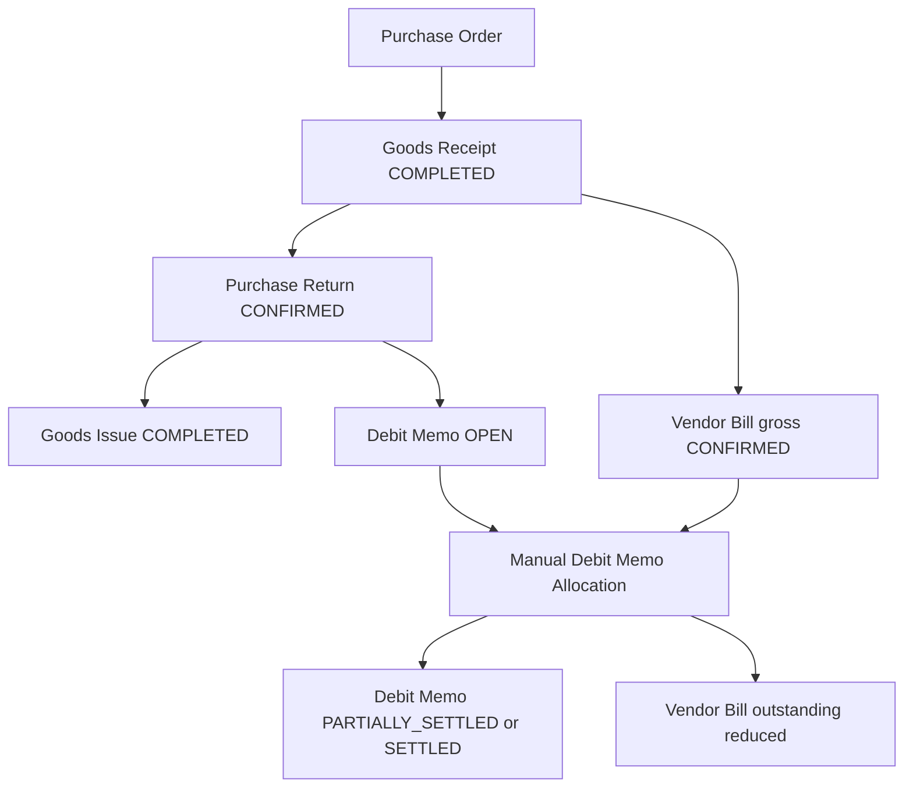

# Brainstorming: Vendor Debit Memo

Date: 2026-06-02
Status: IN PROGRESS - checkpoint diskusi

## Executive Summary

Vendor Debit Memo mencatat kredit dari supplier akibat Purchase Return yang sudah dikonfirmasi. Debit Memo dibuat otomatis ketika Purchase Return mencapai `CONFIRMED`, tetapi belum mem-post jurnal selama belum dialokasikan ke Vendor Bill.

Keputusan baseline:

1. Purchase Return tetap dapat dikonfirmasi sebelum Vendor Bill tersedia.
2. Confirm Purchase Return otomatis membuat Debit Memo berstatus `OPEN`.
3. Vendor Bill tetap dibuat gross dari Goods Receipt awal, walaupun sebagian atau seluruh barang sudah diretur.
4. Debit Memo tidak dikunci ke satu Vendor Bill tertentu.
5. Allocation Debit Memo dilakukan manual setelah Vendor Bill memiliki `documentStatus=CONFIRMED` dan settlement masih terbuka.
6. Allocation hanya boleh menuju Vendor Bill dengan vendor dan currency yang sama.
7. Debit Memo boleh dialokasikan sebagian dan bertahap ke beberapa Vendor Bill.
8. Jurnal pengurangan Accounts Payable dan reversal Input VAT baru dipost ketika allocation Debit Memo dikonfirmasi.

## Scope Diskusi

### Included

- Debit Memo otomatis dari Purchase Return.
- Lifecycle Debit Memo dan allocation.
- Eligibility Vendor Bill untuk allocation.
- Partial allocation dan multi-Vendor-Bill allocation.
- Pemisahan jurnal Purchase Return dari jurnal Apply Debit Memo.
- Penggantian placeholder accounting Phase 1.
- Pembaruan accounting schema dev seeder.

### Deferred atau Belum Dikunci

- Refund dari vendor untuk Debit Memo yang tidak akan dipakai ke invoice berikutnya.
- Cancellation atau reversal setelah Debit Memo dialokasikan.
- FX policy final untuk multi-currency.
- Detail approval Debit Memo atau allocation.
- Treatment dokumen pajak eksternal dan tanggal reversal pajak.
- Apakah allocation dibuat sebagai dokumen header tersendiri atau hanya child record Debit Memo.

## Business Context

Purchase Return Phase 1 sudah tersedia dengan flow fisik:

```text
PO -> Goods Receipt -> Purchase Return -> Goods Issue
```

Vendor Bill saat ini dibuat manual dari Goods Receipt billable. Karena Purchase Return dapat selesai sebelum Vendor Bill dibuat, Debit Memo tidak boleh bergantung pada keberadaan Vendor Bill ketika Purchase Return dikonfirmasi.

Flow target:



## Core Domain Decisions

### Debit Memo Is Independent from a Specific Vendor Bill

Debit Memo memiliki dua konsep referensi yang berbeda:

1. **Source reference**: Purchase Return yang menyebabkan Debit Memo dibuat.
2. **Application reference**: satu atau beberapa Vendor Bill yang menerima allocation.

Debit Memo tidak boleh dikunci hanya ke Vendor Bill yang berasal dari GR atau PO yang sama. Allocation boleh menuju Vendor Bill lain selama:

- vendor sama;
- currency sama;
- Vendor Bill memiliki `documentStatus=CONFIRMED`;
- Vendor Bill memiliki `settlementStatus=OPEN` atau `PARTIALLY_SETTLED`;
- Vendor Bill masih memiliki `outstandingAmount > 0`.

### Cardinality and Idempotency

Saat DM dibuat:

```text
1 Purchase Return CONFIRMED -> tepat 1 Debit Memo
```

DM line menyimpan rincian item dari Purchase Return. DM bukan dibuat per GI line dan bukan dibuat per Vendor Bill.

Saat DM dialokasikan:

```text
1 Debit Memo -> banyak DMA -> banyak Vendor Bill
```

Contoh:

```text
PR-001
  Return Product A = 600,000
  Return Product B = 400,000

-> DM-001 total = 1,000,000
     Line A = 600,000
     Line B = 400,000

-> DMA-001
     DM-001 -> VB-001 = 600,000

-> DMA-002
     DM-001 -> VB-002 = 400,000
```

Database guard:

```text
UNIQUE (purchase_return_id)
```

Confirm Purchase Return bersifat atomik:

```text
1. validate Purchase Return APPROVED
2. create + complete GI
3. post PURCHASE_RETURN journal
4. consume reservation
5. create Debit Memo OPEN
6. mark Purchase Return CONFIRMED
7. commit
```

Jika satu langkah gagal, seluruh transaksi rollback. Retry tidak boleh menghasilkan GI, journal, atau DM ganda.

Purchase Return membutuhkan status tambahan:

```text
REVERSED
```

`CANCELLED` dipakai ketika dokumen berhenti sebelum confirm. `REVERSED` dipakai ketika Purchase Return yang sudah confirmed dibalik melalui reversal GI dan jurnal.

### Invoice Remains Gross

Untuk MVP dipilih flow sederhana:

1. Vendor Bill tetap dibuat gross seperti biasa berdasarkan GR awal.
2. Debit Memo diaplikasikan setelah Vendor Bill dikonfirmasi.
3. Debit Memo mengurangi outstanding Accounts Payable melalui allocation eksplisit.

Sistem belum perlu mengurangi billable quantity Vendor Bill hanya karena Purchase Return sudah terjadi.

### Debit Memo Lifecycle

Lifecycle:

```text
OPEN -> PARTIALLY_SETTLED -> SETTLED
OPEN -> CANCELLED
```

Makna status:

| Status | Keterangan |
|---|---|
| `OPEN` | Debit Memo sudah dibuat dari Purchase Return dan belum memiliki confirmed consumption. |
| `PARTIALLY_SETTLED` | Sebagian saldo sudah dikonsumsi oleh confirmed DMA atau, pada fase lanjutan, Vendor Refund. |
| `SETTLED` | Seluruh saldo Debit Memo sudah dikonsumsi. |
| `CANCELLED` | Debit Memo dibatalkan sebelum pernah memiliki confirmed consumption. |

Debit Memo hanya boleh dibatalkan jika belum pernah memiliki confirmed allocation. Jika sudah pernah dialokasikan, koreksi harus dimulai dari reversal allocation agar audit trail dan jurnal tetap eksplisit.

### Debit Memo Allocation Lifecycle

Allocation adalah dokumen tersendiri dengan nomor internal:

```text
DMA-{yyyyMM}-{seq}
```

Lifecycle:

```text
DRAFT -> CONFIRMED
DRAFT -> CANCELLED
CONFIRMED -> REVERSED
```

Aturan awal:

- satu allocation header hanya menangani satu Debit Memo;
- satu allocation boleh memiliki beberapa Vendor Bill lines;
- user dapat menyiapkan draft dan mengecek recap sebelum confirm;
- confirm mem-post jurnal dan mengurangi outstanding Vendor Bill secara atomik;
- confirmed allocation tidak boleh diedit atau dihapus;
- koreksi confirmed allocation memakai reversal eksplisit.

### Allocation Rules

Debit Memo boleh dialokasikan:

- ke satu Vendor Bill;
- bertahap ke Vendor Bill yang sama;
- ke beberapa Vendor Bill;
- pada tanggal yang berbeda.

Nilai allocation tidak boleh:

- melebihi remaining balance Debit Memo;
- melebihi outstanding Vendor Bill;
- nol atau negatif;
- memakai vendor atau currency yang berbeda.

Vendor Bill dengan `settlementStatus=SETTLED` tidak eligible karena tidak memiliki outstanding.

Contoh:

```text
DM-001 amount             = 1,000,000
VB-001 outstanding        =   600,000
VB-002 outstanding        =   700,000

DM-001 -> VB-001 applied  =   600,000
DM-001 -> VB-002 applied  =   400,000

DM-001 status             = SETTLED
VB-001 outstanding        = 0
VB-002 outstanding        = 300,000
```

## Accounting Boundary

### Generic Auto-Journal Reversal Standard

Codebase existing memiliki dua pola:

- manual journal reversal sudah membuat journal baru dengan `reversalOfId`;
- cancel GI masih mem-post event kedua memakai amount negatif dan tanggal GI lama.

Target standard: seluruh auto-journal reversal memakai linked reversal journal.

```text
Original journal JE-100
  status       = POSTED

Reversal journal JE-120
  reversalOfId = JE-100
  postingDate  = reversalDate
  lines        = debit/credit original yang dibalik
```

Jangan mengirim amount negatif ke accounting schema. Schema menerima amount positif untuk normal posting. Reversal membalik final journal lines dari jurnal asal.

Tambahkan use case generik:

```text
ReversePostedJournalUseCase
  execute(originalJournalEntryId, reversalDate, description)
```

Use case berlaku untuk auto-journal dan dapat memakai primitive reversal yang sudah tersedia pada journal aggregate. Guard:

- original journal harus `POSTED`;
- reversal chain tidak diperbolehkan;
- satu journal hanya boleh direverse sekali;
- `reversalDate` period wajib `OPEN`;
- unique guard `reversalOfId`.

Pemakaian:

```text
Reverse DMA:
  reverse applyJournalEntryId
  simpan reversalJournalEntryId

Reverse PR:
  reverse GI stock
  reverse purchaseReturnJournalEntryId
  simpan reversalJournalEntryId
```

Existing generic GI cancellation perlu dimigrasikan dari negative amount posting ke linked journal reversal dengan `reversalDate` input baru agar pola reversal terpusat, mudah dipelihara, dan scalable.

### Generic Stock Movement Reversal Standard

Stock ledger mengikuti prinsip linked reversal seperti journal.

Saat GI completed:

```text
InventoryMovement IM-100
  movementType = ISSUE
  reference    = GI-001
```

Saat GI reverse:

```text
InventoryMovement IM-120
  movementType          = RECEIPT
  reference             = GI-001
  reversalOfMovementId  = IM-100
  transactionDate       = reversalDate
```

Aturan:

- serialized item: satu reversal movement menunjuk tepat satu issue movement asal;
- non-serial item: reversal quantity wajib sama dengan movement asal untuk MVP full reversal;
- movement asal hanya boleh direverse sekali;
- movement asal harus berasal dari dokumen yang sedang direverse;
- target facility wajib sama;
- target container wajib aktif dan valid;
- serial belum boleh on-hand;
- period reversal wajib `OPEN`.

Tambahkan relasi:

```text
InventoryMovement.reversalOfMovementId
```

Relasi ini meningkatkan audit stock, menjaga retry idempotent, membedakan receipt normal dari reversal, dan menjadi primitive generik untuk cancellation atau reversal dokumen inventory lain di masa depan.

### Valuation Layer for Stock Reversal

Saat PR confirmed, GI mengonsumsi valuation layer GR asal. Jika PR di-reverse, inventory masuk kembali menggunakan historical issue cost.

Contoh:

```text
GR-001 layer:
10 pcs @ 100,000

PR -> GI:
issue 4 pcs @ 100,000
remaining original layer = 6 pcs

PR reversal:
receipt reversal 4 pcs @ 100,000
```

Reversal membuat valuation layer inbound baru. Jangan menambah quantity kembali ke layer GR lama secara diam-diam.

Suggested reversal layer:

```text
ValuationLayer
  referenceType          = GOODS_ISSUE
  referenceId            = GI-001
  referenceLineId        = GI line
  reversalOfMovementId   = IM issue asal
  unitCost               = historical issue unitCost
  remainingQuantity      = reversed quantity
```

Layer reversal dapat dikonsumsi oleh FIFO outbound berikutnya seperti inbound layer biasa. Layer baru menjaga histori kronologis dan tidak merusak audit konsumsi layer GR asal.

### Stock Reversal Reference Type

Jangan menambah enum spesifik seperti `GOODS_ISSUE_REVERSAL`.

Inventory movement reversal tetap menunjuk dokumen fisik:

```text
referenceType          = GOODS_ISSUE
referenceId            = GI-001
referenceCode          = GI-001
movementType           = RECEIPT
reversalOfMovementId   = IM-100
```

Valuation layer reversal juga memakai:

```text
referenceType          = GOODS_ISSUE
referenceId            = GI-001
referenceLineId        = GI line
reversalOfMovementId   = IM-100
```

Reversal dibedakan oleh `reversalOfMovementId`, bukan pertumbuhan enum reference type. Pola ini dapat digunakan untuk GR atau stock adjustment reversal pada fase lanjutan.

### Generic GI Cancellation Ownership

Generic GI cancellation ikut distandarkan:

```text
GI COMPLETED -> CANCELLED
```

Form cancel meminta:

```text
reversalDate
reversalReason
target location per line
```

Aturan:

- reversal selalu penuh;
- default target location memakai lokasi issue historis;
- container aktif lain dalam facility sama boleh dipilih;
- gunakan linked stock movement reversal;
- gunakan linked journal reversal;
- jangan mem-post amount negatif;
- period `reversalDate` wajib `OPEN`;
- source-specific guard tetap berlaku.

Ownership:

- GI source-based seperti `PURCHASE_RETURN` hanya boleh dibalik dari source module;
- tombol cancel direct pada GI source-based disembunyikan;
- backend tetap menolak direct cancellation GI source-based;
- GI manual / generic boleh dibatalkan langsung dari detail GI.

### Why There Is No Double Reduction

Goods Issue dari Purchase Return dan Debit Memo Allocation mencatat dua tanggung jawab berbeda:

- Purchase Return / GI membalik inventory dan Goods Receipt clearing.
- Debit Memo Allocation mengurangi Accounts Payable dan membalik Input VAT invoice.

Contoh:

```text
DPP barang = 100
Input VAT  =  11
Gross      = 111
```

#### 1. Goods Receipt Completed

```text
DR Inventory              100
   CR GR/IR Clearing          100
```

#### 2. Purchase Return Confirmed -> Goods Issue Completed

```text
DR GR/IR Clearing         100
   CR Inventory               100
```

#### 3. Vendor Bill Confirmed Gross

```text
DR GR/IR Clearing         100
DR Input VAT               11
   CR Accounts Payable        111
```

#### 4. Debit Memo Allocation Confirmed

```text
DR Accounts Payable       111
   CR GR/IR Clearing          100
   CR Input VAT                11
```

Hasil akhir:

| Akun | Saldo Bersih |
|---|---:|
| Inventory | 0 |
| GR/IR Clearing | 0 |
| Input VAT | 0 |
| Accounts Payable | 0 |

Tidak ada pengurangan ganda karena GI tidak mengurangi AP dan allocation Debit Memo tidak mengurangi inventory.

### Partial Allocation Proration

User memasukkan nilai gross allocation. Sistem otomatis memprorata DPP dan tax berdasarkan saldo Debit Memo.

Contoh:

```text
DM gross      = 111
DM DPP        = 100
DM Input VAT  =  11

Apply gross   = 55.5
Applied DPP   = 50
Applied VAT   =  5.5
```

Allocation terakhir memakai remainder agar total allocation DPP dan tax tepat sama dengan snapshot Debit Memo walaupun terjadi pembulatan.

### Multi-Currency and FX Policy

Purchase Return memakai historical GR rate agar reversal inventory tepat. Debit Memo menyimpan amount original currency dan base amount historis dari Purchase Return / GR asal.

Contoh:

```text
GR DPP             USD 100 @ 15,000 = IDR 1,500,000
Purchase Return    USD 100            inventory reversal IDR 1,500,000
Vendor Bill gross  USD 111 @ 16,000 = IDR 1,776,000
DM apply           USD 111
```

Purchase Return journal:

```text
DR GR/IR Clearing   1,500,000
   CR Inventory         1,500,000
```

DMA allocation line menyimpan immutable snapshot:

```text
appliedGrossOriginal
appliedDppOriginal
appliedTaxOriginal
vendorBillExchangeRate
apReductionBase
grirReversalBase
taxReversalBase
fxGainBase
fxLossBase
```

Perhitungan konseptual:

```text
allocationRatio   = appliedGrossOriginal / debitMemoGrossOriginal
grirReversalBase  = debitMemoDppBase * allocationRatio
taxReversalBase   = debitMemoTaxBase * allocationRatio
apReductionBase   = appliedGrossOriginal * vendorBillExchangeRate
fxDifferenceBase  = apReductionBase - grirReversalBase - taxReversalBase
```

Allocation terakhir memakai remainder base amounts untuk menghindari selisih pembulatan.

FX mapping:

```text
fxDifferenceBase > 0 -> CR FX Gain
fxDifferenceBase < 0 -> DR FX Loss
```

- AP berkurang sesuai base liability Vendor Bill target;
- GR/IR reversal mengikuti historical base amount Debit Memo asal;
- Input VAT reversal mengikuti snapshot base Debit Memo asal;
- selisih dibukukan sebagai FX gain/loss;
- snapshot allocation immutable untuk audit.

## Concurrency and Confirm Revalidation

Vendor Payment dan DMA dapat dikonfirmasi hampir bersamaan terhadap Vendor Bill yang sama. Sistem wajib mencegah over-settlement dan outstanding negatif.

Contoh race condition:

```text
VB outstanding = 1,000,000

User A confirm Vendor Payment = 800,000
User B confirm DMA            = 500,000
```

Saat confirm DMA:

1. lock Debit Memo header;
2. lock seluruh Vendor Bill target;
3. hitung ulang remaining balance Debit Memo dari confirmed DMA terbaru;
4. hitung ulang outstanding Vendor Bill dari confirmed payment dan confirmed DMA terbaru;
5. tolak confirm jika saldo DM atau outstanding VB tidak lagi mencukupi;
6. post journal;
7. update status/projection settlement secara atomik.

Saat confirm Vendor Payment:

1. lock seluruh Vendor Bill target;
2. hitung ulang outstanding Vendor Bill termasuk confirmed DMA terbaru;
3. tolak confirm jika payment allocation melebihi outstanding aktual;
4. post journal dan update settlement secara atomik.

Gunakan pessimistic row lock pada jalur confirm. Draft tetap boleh memakai optimistic locking biasa.

Pesan error harus spesifik:

```text
Outstanding Vendor Bill berubah. Muat ulang draft allocation.
Saldo Debit Memo berubah. Muat ulang draft allocation.
```

## Replacement of Phase 1 Accounting Placeholder

Purchase Return Phase 1 masih memakai jurnal generic Goods Issue:

```text
GOODS_ISSUE
DR COGS
   CR Inventory
```

Jurnal ini hanya placeholder sementara dan tidak tepat untuk Purchase Return.

Phase berikutnya wajib mempertahankan `GOODS_ISSUE` untuk outbound generik, tetapi merutekan GI dari Purchase Return ke event khusus:

```text
PURCHASE_RETURN
DR GR/IR Clearing
   CR Inventory
```

Routing konseptual:

```text
GoodsIssue.referenceType == PURCHASE_RETURN
    -> post SchemaEventType.PURCHASE_RETURN
else
    -> post SchemaEventType.GOODS_ISSUE
```

### Suggested Schema Events and Variables

Event baru untuk Purchase Return:

```text
SchemaEventType.PURCHASE_RETURN

PR_GRIR_CLEARING_AMT
PR_INVENTORY_AMT
```

Event baru untuk confirmed Debit Memo Allocation:

```text
SchemaEventType.DEBIT_MEMO_APPLICATION

DMA_AP_AMT
DMA_GRIR_CLEARING_AMT
DMA_TAX_AMT
DMA_FX_LOSS_AMT
DMA_FX_GAIN_AMT
```

Nama final variable masih dapat disesuaikan saat implementation planning.

## Accounting Schema Seeder Impact

File berikut perlu diperbarui:

```text
docs/database/dev-seeder/D220__accounting_schema.sql
```

Seeder harus:

1. mempertahankan schema `GOODS_ISSUE`;
2. menambahkan header `PURCHASE_RETURN`;
3. menambahkan header `DEBIT_MEMO_APPLICATION`;
4. menambahkan line mapping untuk kedua event baru;
5. memperluas blok cleanup idempotent;
6. memperbarui validation queries dan expected line counts.

Conceptual mapping:

```sql
(@schema_pr,  'PR_GRIR_CLEARING_AMT',  @coa_grir_clearing,         'DEBIT'),
(@schema_pr,  'PR_INVENTORY_AMT',      @coa_merchandise_inventory, 'CREDIT'),

(@schema_dma, 'DMA_AP_AMT',            @coa_accounts_payable,      'DEBIT'),
(@schema_dma, 'DMA_GRIR_CLEARING_AMT', @coa_grir_clearing,         'CREDIT'),
(@schema_dma, 'DMA_TAX_AMT',           @coa_input_vat,             'CREDIT')
```

Dev seeder bukan migration production. Implementasi juga memerlukan migration MariaDB dan H2 untuk schema dan data baru, serta update E2E seed.

### Legacy Phase 1 Data Policy

Proyek belum memiliki data production. Tidak perlu membangun migration koreksi atau rekonsiliasi untuk Purchase Return Phase 1 lama yang memakai placeholder journal `GOODS_ISSUE`.

Policy:

- behavior baru berlaku forward-only;
- dev/test database boleh di-reset;
- legacy local data boleh diabaikan;
- jangan menambah corrective journal automation atau audit report legacy pada scope ini.

## UI Direction

### Menu Structure

```text
Finance & Accounting
  Accounts Payable
    Vendor Bills
    Vendor Payments
    Debit Memos
    Debit Memo Allocations
```

### Debit Memo List

Columns:

```text
Code
Memo Date
Vendor
Currency
Source Purchase Return
Gross
Settled
Remaining
Settlement Status
Actions: View
```

### Debit Memo Detail

```text
Header summary
Source Purchase Return link
Generated GI link
External metadata form
Line snapshots
Settlement recap
DMA history

Actions:
  Update Metadata
  Allocate
  Cancel
```

### Debit Memo Allocation List

Columns:

```text
Code
Allocation Date
Debit Memo
Vendor
Currency
Applied Gross
Status
Actions: View / Edit draft / Delete draft
```

### Debit Memo Allocation Detail

```text
Header
DM summary
Allocation lines with VB links
Journal links

Actions:
  Edit draft
  Confirm
  Cancel draft
  Reverse confirmed
```

### Cross-Links

```text
Purchase Return detail -> Debit Memo detail
Debit Memo detail      -> Purchase Return, generated GI, DMA history
Vendor Bill detail     -> DMA history, Apply Debit Memo
DMA detail             -> Debit Memo, Vendor Bills, journal entries
```

### List Filters and Selectors

Debit Memo list filters:

```text
keyword: DM code / PR code / supplier memo number
vendor
settlementStatus
memoDate range
```

DMA list filters:

```text
keyword: DMA code / DM code / VB code
vendor
status
allocationDate range
```

VB selector ketika membuat DMA dari detail DM:

```text
Eligible jika:
documentStatus = CONFIRMED
settlementStatus IN (OPEN, PARTIALLY_SETTLED)
outstandingAmount > 0
vendor = DM.vendor
currency = DM.currency
```

Columns:

```text
Select
VB Code
Vendor Invoice Number
Bill Date
Due Date
Gross
Paid
DM Applied
Outstanding
Amount to Apply
```

DM selector ketika membuka **Apply Debit Memo** dari detail VB:

```text
Eligible jika:
settlementStatus IN (OPEN, PARTIALLY_SETTLED)
remainingAmount > 0
vendor = VB.vendor
currency = VB.currency
```

Columns:

```text
Select
DM Code
Source PR
Memo Date
Gross
Settled
Remaining
```

Semua list memakai pagination, sorting, dan search sesuai standar proyek. Selector memakai query-level filtering dan pagination, bukan load seluruh data lalu filter di JavaScript.

## Vendor Bill Settlement Refactor

Vendor Bill tidak lagi memakai satu status yang mencampur lifecycle dokumen dan pembayaran kas.

Model target:

```text
Document Status:
DRAFT -> CONFIRMED
DRAFT -> CANCELLED

Settlement Status:
OPEN -> PARTIALLY_SETTLED -> SETTLED
```

Outstanding Vendor Bill menjadi read-side projection:

```text
outstandingAmount =
    totalAmount
    - confirmedPaymentAmount
    - confirmedDebitMemoAppliedAmount
```

Detail Vendor Bill harus memisahkan komponen settlement:

```text
Total Invoice
Paid Amount
Debit Memo Applied Amount
Outstanding Amount
Settlement Status
```

Istilah `PARTIAL_PAID` dan `PAID` tidak lagi tepat sebagai status dokumen karena tagihan dapat diselesaikan oleh Debit Memo tanpa pembayaran kas.

### Vendor Bill Detail

Halaman detail Vendor Bill menyediakan shortcut:

```text
Apply Debit Memo
```

Tombol hanya muncul jika:

- Vendor Bill memiliki `documentStatus=CONFIRMED`;
- Vendor Bill memiliki `settlementStatus=OPEN` atau `PARTIALLY_SETTLED`;
- Vendor Bill memiliki outstanding;
- tersedia Debit Memo `OPEN` atau `PARTIALLY_SETTLED` untuk vendor dan currency yang sama.

Tombol **Apply Debit Memo** adalah shortcut untuk membuat draft Debit Memo Allocation dengan Vendor Bill tersebut sudah terpilih. Entry point utama tetap halaman detail Debit Memo melalui tombol **Allocate**.

Jika entry point berasal dari detail Vendor Bill:

1. buka modal selector DM eligible berdasarkan vendor dan currency;
2. user memilih tepat satu DM;
3. redirect ke draft DMA baru dengan DM dan VB tersebut sudah terpilih;
4. jika ingin memakai DM lain, buat DMA berikutnya.

Satu DMA tetap hanya menangani satu DM, termasuk ketika target VB sama:

```text
VB-001 outstanding = 1,000,000
DM-001 remaining   =   400,000
DM-002 remaining   =   300,000

DMA-001: DM-001 -> VB-001 = 400,000
DMA-002: DM-002 -> VB-001 = 300,000

VB-001 outstanding = 300,000
```

### Debit Memo Detail

Halaman detail Debit Memo menjadi entry point utama:

```text
Allocate
```

Allocation UI dapat mengikuti pola Vendor Payment:

```text
Debit Memo Amount
Applied Amount
Unapplied Amount

Allocation Lines:
Vendor Bill | Outstanding | Amount to Apply
```

## Approval and Permissions

Untuk MVP, Debit Memo dan Debit Memo Allocation tidak memakai approval tambahan.

Alasan:

- Debit Memo dibuat otomatis dari Purchase Return yang sudah melewati approval;
- DMA tetap dikontrol melalui permission confirm dan reverse;
- model ini mengikuti kompleksitas operasional Vendor Payment saat ini.

Permission awal:

```text
DEBIT-MEMO_READ
DEBIT-MEMO_CANCEL
DEBIT-MEMO-ALLOCATION_READ
DEBIT-MEMO-ALLOCATION_CREATE
DEBIT-MEMO-ALLOCATION_UPDATE
DEBIT-MEMO-ALLOCATION_CONFIRM
DEBIT-MEMO-ALLOCATION_CANCEL
DEBIT-MEMO-ALLOCATION_REVERSE
```

### Reversal Permission Boundary

Pisahkan cancel sebelum posting dari reversal sesudah posting:

```text
PURCHASE-RETURN_CANCEL
  DRAFT / SUBMITTED / APPROVED -> CANCELLED

PURCHASE-RETURN_REVERSE
  CONFIRMED -> REVERSED
```

Aturan tambahan:

- `GOODS-ISSUE_CANCEL` tetap untuk GI manual / generic;
- GI source-based ditolak backend dari direct cancellation walaupun user memiliki `GOODS-ISSUE_CANCEL`;
- `JOURNAL-ENTRY_REVERSE` tetap hanya untuk manual journal;
- user tidak boleh reverse auto-journal langsung dari halaman journal entry;
- `ReversePostedJournalUseCase` adalah internal application API tanpa permission publik tersendiri;
- source module memanggil internal API melalui use case bisnisnya.

Pemanggil internal:

```text
Reverse DMA use case
Reverse Purchase Return use case
Cancel generic GI use case
```

## Cancellation and Reversal Policy

Gunakan guard konservatif dan reversal eksplisit:

| Dokumen | Kondisi | Tindakan |
|---|---|---|
| Purchase Return `CONFIRMED` | DM belum pernah dialokasikan | Boleh dibatalkan melalui reversal GI, reversal jurnal Purchase Return, dan cancel DM. |
| Purchase Return `CONFIRMED` | Ada DMA aktif atau pernah confirmed tetapi belum di-reverse | Tolak cancellation sampai seluruh DMA terkait di-reverse. |
| Debit Memo `OPEN` | Belum pernah dialokasikan | Boleh cancel. |
| DMA `DRAFT` | Belum confirm | Boleh cancel. |
| DMA `CONFIRMED` | Sudah mem-post jurnal | Tidak boleh edit atau delete; gunakan **Reverse**. |
| DMA `REVERSED` | Final | View only. |

Jurnal DMA reversal:

```text
Original Apply:
DR Accounts Payable
   CR GR/IR Clearing
   CR Input VAT

Reversal:
DR GR/IR Clearing
DR Input VAT
   CR Accounts Payable
```

Efek reversal DMA:

- outstanding Vendor Bill naik kembali;
- settlement status Vendor Bill dihitung ulang;
- saldo Debit Memo tersedia kembali;
- reversal memakai tanggal reversal baru;
- accounting period tanggal reversal wajib `OPEN`.

Purchase Return `CONFIRMED` hanya boleh dibatalkan setelah seluruh DMA terkait sudah di-reverse.

### Confirmed Purchase Return Reversal

Purchase Return yang sudah confirmed memakai status akhir `REVERSED`, bukan `CANCELLED`.

Flow:

```text
PR-001 CONFIRMED
GI-001 COMPLETED
DM-001 OPEN / PARTIALLY_SETTLED / SETTLED

-> reverse seluruh DMA aktif bila ada
-> reverse PR

GI-001 CANCELLED
DM-001 CANCELLED
PR-001 REVERSED
```

Guard sebelum reverse PR:

```text
1. seluruh DMA milik DM sudah REVERSED atau CANCELLED
2. DM remaining balance kembali sama dengan gross DM
3. reversalDate period wajib OPEN
4. reversalReason wajib terisi
```

Flow transaksi reversal:

```text
1. validate guard downstream
2. reverse GI stock movement
3. post reversal journal PURCHASE_RETURN
4. set DM -> CANCELLED
5. set PR -> REVERSED
6. commit
```

Simpan pada Purchase Return:

```text
reversalDate
reversalReason
reversedByUserId
```

GI lama memakai lifecycle existing `COMPLETED -> CANCELLED`, sedangkan PR memakai `REVERSED` agar audit membedakan retur yang berhenti sebelum confirm dari transaksi fisik yang pernah dipost lalu dibalik.

### Purchase Return Reversal Stock Location

Saat PR di-reverse, barang masuk kembali ke inventory.

Aturan:

1. default lokasi reversal memakai facility, grid, dan container historis dari GI line;
2. sebelum reverse, tampilkan form lokasi inbound per line;
3. jika container historis masih aktif dan valid, prefill lokasi tersebut;
4. user boleh memilih container aktif lain dalam facility yang sama;
5. facility target wajib sama dengan facility PR untuk MVP;
6. jika barang perlu dipindah ke facility lain, lakukan stock transfer terpisah setelah reversal;
7. item serial wajib masuk kembali seluruhnya dan serial tidak boleh sudah on-hand;
8. reversal ditolak jika lokasi target tidak valid;
9. simpan snapshot lokasi reversal untuk audit.

Suggested child record:

```text
PurchaseReturnReversalLine
  purchaseReturnLineId
  productId
  quantity
  serialNumber
  targetFacilityId
  targetGridId
  targetContainerId
```

### Full Reversal Only

Purchase Return confirmed reversal wajib penuh untuk MVP.

```text
PR-001 confirmed return:
Product A = 10 pcs
Product B =  5 pcs

Reverse PR-001:
return inbound seluruh 10 pcs A dan 5 pcs B
```

Aturan:

- tidak ada partial line reversal;
- tidak ada partial quantity reversal;
- reversal mirror seluruh transaksi awal;
- untuk serialized item, seluruh serial dari GI asal wajib kembali;
- user hanya memilih lokasi target, bukan mengubah daftar serial;
- reversal gagal jika satu serial sudah on-hand;
- kebutuhan inbound parsial ditangani melalui dokumen inbound terpisah pada fase lanjutan.

## Vendor Refund Seam

Vendor Refund untuk saldo Debit Memo yang tidak akan dialokasikan ke invoice berikutnya ditunda dari MVP, tetapi lifecycle Debit Memo memakai istilah settlement netral sejak awal.

Flow fase lanjutan:

```text
Vendor Refund:
DRAFT -> CONFIRMED -> REVERSED
```

Vendor Refund mengonsumsi remaining balance Debit Memo seperti DMA, tetapi tidak dialokasikan ke Vendor Bill.

Jurnal konseptual:

```text
DR Bank
   CR GR/IR Clearing
   CR Input VAT
   +/- FX Gain/Loss
```

Detail Debit Memo menampilkan:

```text
Gross Amount
Allocated to Vendor Bills
Refunded by Vendor
Remaining Balance
Settlement Status
```

Untuk MVP, kolom refunded dapat tetap nol dan refund action belum tersedia.

## Document Dates and Period Guard

| Dokumen | Field Tanggal | Fungsi |
|---|---|---|
| Purchase Return | `returnDate` | Tanggal barang dikembalikan dan jurnal reversal inventory. |
| Debit Memo | `memoDate` | Snapshot readonly yang mengikuti `returnDate` karena DM dibuat otomatis. |
| DMA | `allocationDate` | Input user dan tanggal posting pengurangan AP. |
| DMA Reversal | `reversalDate` | Input user dan tanggal posting reversal. |
| Purchase Return confirmed cancellation | `reversalDate` | Input user dan tanggal reversal GI serta jurnal Purchase Return. |

Period guard:

```text
Confirm Purchase Return:
    returnDate period wajib OPEN

Confirm DMA:
    allocationDate period wajib OPEN

Reverse DMA:
    reversalDate period wajib OPEN

Cancel Purchase Return CONFIRMED:
    reversalDate period wajib OPEN
```

Backdate diperbolehkan selama period masih `OPEN`. Jurnal lama tidak diubah atau dihapus ketika period asal sudah closed; koreksi selalu mem-post reversal baru pada period open.

## Tax Metadata and Timing

Untuk MVP, reversal Input VAT dipost pada `allocationDate`. Debit Memo menyimpan metadata eksternal opsional agar flow pajak dapat diperluas:

```text
supplierMemoNumber
supplierMemoDate
taxDocumentNumber
taxDocumentDate
```

Metadata tersebut tidak mengubah tanggal posting jurnal MVP. Validasi dan treatment pajak lanjutan dapat ditambahkan ketika requirement fiskal lebih rinci tersedia.

### Tax Amount Source Policy

Debit Memo dapat dibuat sebelum Vendor Bill tersedia, sedangkan Input VAT baru diakui saat Vendor Bill dikonfirmasi.

Untuk MVP:

1. DM menyimpan snapshot estimasi tax dari GR / PO source:
   ```text
   taxAmountOriginal
   taxAmountBase
   ```
2. DM tidak mem-post jurnal pajak ketika dibuat.
3. DMA memakai saldo DPP dan tax snapshot DM untuk prorata otomatis.
4. DMA confirm memvalidasi nilai tax snapshot terhadap Vendor Bill target dan outstanding gross aktual.
5. Allocation terakhir memakai remainder agar total reversal tax tepat sama dengan snapshot DM.
6. Jika tax invoice aktual berbeda dari snapshot GR / PO, DMA confirm ditolak.
7. Tax override pada DMA tidak tersedia untuk MVP. Koreksi dilakukan melalui proses manual atau journal adjustment terpisah.

## Data Model Direction

Debit Memo menyimpan header dan line snapshot untuk audit, pajak, prorata, pembulatan, serta reversal.

### Debit Memo Header

```text
id
code                    DM-{yyyyMM}-{seq}
purchaseReturnId
purchaseReturnCode
vendorId
currencyId
memoDate
grossAmountOriginal
dppAmountOriginal
taxAmountOriginal
dppAmountBase
taxAmountBase
grossAmountBase
settlementStatus         OPEN / PARTIALLY_SETTLED / SETTLED / CANCELLED
supplierMemoNumber       optional
supplierMemoDate         optional
taxDocumentNumber        optional
taxDocumentDate          optional
notes                    optional
audit fields
```

### Debit Memo Line

Satu line mengikuti satu Purchase Return line:

```text
purchaseReturnLineId
productId
quantity
uomId
dppAmountOriginal
taxAmountOriginal
dppAmountBase
taxAmountBase
```

### Editable External Metadata

DM dibuat otomatis saat Purchase Return confirmed, tetapi dokumen supplier dapat diterima kemudian.

Readonly sejak DM dibuat:

```text
source Purchase Return
vendor
currency
memoDate
lines
DPP
tax
gross
base amounts
settlement status
```

Boleh dilengkapi atau dikoreksi tanpa reversal selama DM belum `CANCELLED`:

```text
supplierMemoNumber
supplierMemoDate
taxDocumentNumber
taxDocumentDate
notes
```

Metadata tetap boleh diedit ketika DM `PARTIALLY_SETTLED` atau `SETTLED` karena tidak mengubah nilai finansial. Gunakan audit fields dan optimistic locking.

Permission tambahan:

```text
DEBIT-MEMO_UPDATE-METADATA
```

### External Metadata Uniqueness

Constraint:

```text
UNIQUE (vendor_id, supplier_memo_number)
UNIQUE (tax_document_number)
```

Ketentuan:

- constraint `supplierMemoNumber` hanya relevan jika nomor terisi; beberapa DM boleh memiliki `NULL`;
- nomor memo supplier unik dalam scope vendor;
- nomor dokumen pajak unik secara global jika terisi;
- backend melakukan pre-validation dan menampilkan friendly error sebelum fallback database constraint.

Pesan error:

```text
Nomor debit memo supplier sudah digunakan untuk vendor ini.
Nomor dokumen pajak sudah digunakan.
```

### Debit Memo Monetary Invariants

Saat DM otomatis dibuat:

```text
line quantity > 0
line DPP original >= 0
line tax original >= 0
line DPP base >= 0
line tax base >= 0

header DPP original   = sum(line DPP original)
header tax original   = sum(line tax original)
header gross original = header DPP original + header tax original
header gross original > 0
```

Aturan tambahan:

- DM tidak boleh dibuat tanpa line;
- nilai finansial DM immutable setelah dibuat;
- amount memakai scale konsisten AP, yaitu `DECIMAL(19,4)`;
- perbedaan pembulatan line diselesaikan pada line terakhir;
- Purchase Return confirm ditolak jika DM gross menghasilkan nol;
- tax nol diperbolehkan untuk barang non-PPN;
- DPP nol dengan tax positif ditolak untuk MVP.

### Debit Memo Allocation Header

```text
id
code                    DMA-{yyyyMM}-{seq}
debitMemoId
allocationDate
status                  DRAFT / CONFIRMED / CANCELLED / REVERSED
reversalDate            optional
reversalReason          required when reversed
reversedByUserId        optional until reversed
applyJournalEntryId     optional until confirmed
reversalJournalEntryId  optional until reversed
notes                   optional
audit fields
```

### DMA Reversal Shape

Untuk MVP, action **Reverse** dilakukan pada DMA confirmed yang sama. Sistem tidak membuat dokumen DMA reversal baru.

```text
DMA-001 CONFIRMED
  -> action Reverse
  -> DMA-001 REVERSED
```

Metadata reversal:

```text
reversalDate
reversalReason          required
reversedByUserId
reversalJournalEntryId
```

Referensi jurnal:

```text
DMA-001
  applyJournalEntryId     -> JE-100
  reversalJournalEntryId  -> JE-120
```

Aturan:

- apply journal lama tetap immutable;
- sistem mem-post journal reversal baru;
- reversal hanya boleh dilakukan sekali;
- reversal menghitung ulang settlement Vendor Bill dan remaining balance DM;
- reversal wajib memakai period `OPEN`.

### Debit Memo Allocation Line

Satu line mengikuti satu Vendor Bill header, bukan product line Vendor Bill:

```text
vendorBillId
vendorBillCode
debitMemoRemainingAtDraft
vendorBillOutstandingAtDraft
appliedGrossOriginal
appliedDppOriginal
appliedTaxOriginal
vendorBillExchangeRate
apReductionBase
grirReversalBase
taxReversalBase
fxGainBase
fxLossBase
```

Allocation cukup pada level Vendor Bill header. DPP dan tax diprorata otomatis dari snapshot Debit Memo agar DMA berfungsi sebagai settlement AP, bukan operasi inventory.

### Draft DMA Stale Data Policy

Draft DMA menyimpan snapshot untuk tampilan dan audit draft:

```text
debitMemoRemainingAtDraft
vendorBillOutstandingAtDraft
```

Snapshot draft bukan dasar confirm.

Saat edit draft:

- muat remaining balance DM aktual;
- muat outstanding VB aktual;
- tampilkan warning jika nilai aktual berubah sejak draft disimpan;
- jangan auto-adjust allocation amount karena user harus menyadari perubahan.

Saat confirm:

- lock DM dan seluruh target VB;
- hitung ulang nilai aktual;
- tolak confirm jika allocation melebihi remaining DM atau outstanding VB terbaru;
- minta user reload dan edit draft.

Validasi draft:

```text
minimal satu line dengan appliedGrossOriginal > 0
sum(lines.appliedGrossOriginal) <= current DM remaining
setiap line appliedGrossOriginal <= current VB outstanding
tidak boleh ada VB duplicate dalam satu DMA
```

Draft DMA tidak mereservasi remaining balance DM maupun outstanding VB.

Konsekuensi:

- beberapa draft yang secara total melebihi saldo boleh tersimpan;
- draft yang ditinggalkan tidak memblokir Vendor Payment atau DMA lain;
- hanya confirmed DMA yang mengonsumsi saldo;
- confirm terakhir yang tidak lagi valid ditolak oleh lock dan revalidation.

UI menampilkan warning:

```text
Draft tidak mereservasi saldo. Nilai aktual divalidasi ulang saat confirm.
```

## Existing Documentation References

- `docs/modules/procurement/purchase-return.md`
- `docs/modules/inventory/goods-issue.md`
- `docs/modules/accountspayable/vendor-bill.md`
- `docs/modules/accountspayable/vendor-payment.md`
- `docs/modules/accounting/journal-entry.md`
- `docs/modules/accounting/accounting-schema.md`
- `docs/brainstorming/2026-06-01-purchase-return.md`
- `docs/brainstorming/2026-06-01-generic-goods-issue.md`
- `docs/plans/2026-06-01-purchase-return.md`

## External Reference Notes

Official ERP documentation reviewed during brainstorming:

- Microsoft Business Central documents applying purchase credit memos to one or multiple vendor ledger entries, including partial application.
- Microsoft Business Central documents vendor refund handling after a paid purchase invoice is returned.
- Oracle Payables documents credit and debit memos as supplier credits that can offset invoices and payments.

References:

- https://learn.microsoft.com/en-us/dynamics365/business-central/payables-how-apply-purchase-transactions-manually
- https://learn.microsoft.com/en-gb/dynamics365/business-central/purchasing-how-process-purchase-returns-cancellations
- https://docs.oracle.com/cd/E18727_01/doc.121/e12797/T295436T366808.htm
- https://docs.oracle.com/cd/E18727_01/doc.121/e13410/T446883T443958.htm

## Open Questions for Continued Discussion

### Domain and Lifecycle

1. **DECIDED:** Debit Memo memiliki status `CANCELLED`; cancellation hanya legal jika belum pernah memiliki confirmed allocation.
2. **DECIDED:** Debit Memo dan DMA tidak memakai approval tambahan untuk MVP. Purchase Return approval dianggap cukup untuk DM; DMA dikontrol oleh permission confirm/reverse.
3. **DECIDED:** Allocation adalah dokumen tersendiri dengan sequence `DMA-{yyyyMM}-{seq}` dan lifecycle `DRAFT -> CONFIRMED`, `DRAFT -> CANCELLED`, `CONFIRMED -> REVERSED`.
4. **DECIDED:** Satu DMA memakai satu DM dan dapat mengalokasikan saldo ke beberapa VB header; allocation tidak dilakukan pada product line VB.
5. **DECIDED:** MVP memakai satu Debit Memo per allocation header dan memperbolehkan beberapa Vendor Bill lines.

### Accounting and FX

6. **DECIDED:** Jurnal Purchase Return memakai `returnDate`; jurnal DMA memakai `allocationDate`; reversal memakai `reversalDate`.
7. **DECIDED:** Purchase Return dan DM memakai historical GR rate untuk base reversal; AP reduction DMA memakai Vendor Bill target rate.
8. **DECIDED:** Selisih base antara AP reduction dan historical DM clearing/tax reversal dipost sebagai FX gain/loss saat DMA confirm.
9. **DECIDED:** Allocation line menyimpan original-currency amounts, Vendor Bill rate, base snapshots, dan FX gain/loss secara immutable.
10. **DECIDED:** Setiap confirm/reversal wajib memakai period `OPEN`; jurnal lama tidak diubah ketika period asal closed dan koreksi selalu mem-post reversal baru.

### Tax

11. **DECIDED:** Input VAT reversal DMA mengikuti snapshot tax GR / PO source dan prorata otomatis; tax mismatch terhadap invoice aktual ditolak untuk MVP tanpa override.
12. **DECIDED:** Simpan metadata opsional `supplierMemoNumber`, `supplierMemoDate`, `taxDocumentNumber`, dan `taxDocumentDate`.
13. **DECIDED:** Untuk MVP, tax reversal dipost mengikuti `allocationDate`; metadata tanggal pajak disimpan untuk perluasan berikutnya.

### Vendor Bill and Payment Interaction

14. **DECIDED:** Outstanding Vendor Bill dihitung sebagai `gross - confirmed payment allocations - confirmed debit memo allocations`.
15. **DECIDED:** Confirm DMA dan Vendor Payment memakai pessimistic row lock serta revalidation outstanding terbaru untuk mencegah over-settlement.
16. **DECIDED:** `PARTIAL_PAID` dan `PAID` tidak lagi dipakai sebagai status dokumen karena settlement dapat terjadi tanpa pembayaran kas.
17. **DECIDED:** Pisahkan `documentStatus` (`DRAFT`, `CONFIRMED`, `CANCELLED`) dan `settlementStatus` (`OPEN`, `PARTIALLY_SETTLED`, `SETTLED`).

### Refund

18. **DECIDED:** Saldo DM yang tidak dialokasikan dapat dikonsumsi oleh dokumen Vendor Refund pada fase lanjutan.
19. **DECIDED:** Vendor Refund menjadi dokumen terpisah dengan lifecycle `DRAFT -> CONFIRMED -> REVERSED` dan jurnal konseptual `DR Bank / CR GR/IR Clearing / CR Input VAT +/- FX`.
20. **DECIDED:** Vendor Refund deferred dari MVP, tetapi seam dan istilah settlement netral disiapkan sejak awal.

### Cancellation and Reversal

21. **DECIDED:** Purchase Return `CONFIRMED` boleh dibatalkan melalui reversal GI, reversal jurnal Purchase Return, dan cancel DM jika tidak ada DMA aktif.
22. **DECIDED:** Confirmed DMA tidak boleh dihapus; koreksi memakai action **Reverse**.
23. **DECIDED:** Reversal DMA eksplisit dan immutable agar audit trail serta jurnal tetap jelas.
24. **DECIDED:** Purchase Return cancellation ditolak sampai seluruh DMA terkait sudah di-reverse.

## Implementation Roadmap

Dokumen brainstorming ini menjadi roadmap kanonik. Setiap implementation plan wajib mereferensikan:

```text
docs/brainstorming/2026-06-02-vendor-debit-memo.md
```

Scope terlalu besar untuk satu implementation plan. Pecah menjadi phase linear:

```text
Phase A -> Phase B -> Phase C -> Phase D -> Phase E -> Phase F -> Phase G
```

### Phase A: Generic Reversal Foundation

Suggested plan:

```text
docs/plans/2026-06-02-generic-reversal-foundation.md
```

Scope:

- internal `ReversePostedJournalUseCase` untuk manual dan auto-journal;
- linked journal reversal memakai `reversalOfId` dan `reversalDate`;
- linked inventory movement reversal memakai `reversalOfMovementId`;
- inbound valuation layer reversal baru dengan historical issue cost;
- refactor generic GI cancellation agar memakai full reversal, target location form, linked stock reversal, dan linked journal reversal;
- source-based GI hanya boleh dibalik melalui source module.

### Phase B: Purchase Return Accounting Replacement

Suggested plan:

```text
docs/plans/2026-06-02-purchase-return-accounting.md
```

Depends on: Phase A.

Scope:

- tambah `SchemaEventType.PURCHASE_RETURN`;
- tambah `PR_GRIR_CLEARING_AMT` dan `PR_INVENTORY_AMT`;
- route GI source `PURCHASE_RETURN` ke jurnal Purchase Return;
- pertahankan `GOODS_ISSUE` untuk GI generik;
- update accounting schema migration, H2 mirror, E2E seed, dan `docs/database/dev-seeder/D220__accounting_schema.sql`;
- behavior forward-only; local dev/test database boleh reset.

### Phase C: Vendor Bill Settlement Refactor

Suggested plan:

```text
docs/plans/2026-06-02-vendor-bill-settlement-refactor.md
```

Scope:

- pisahkan `documentStatus` dan `settlementStatus`;
- ganti `PARTIAL_PAID` / `PAID` dengan projection settlement netral;
- hitung outstanding dari confirmed Vendor Payment dan kelak confirmed DMA;
- tambahkan pessimistic lock dan revalidation pada confirm Vendor Payment;
- update list, detail, docs, tests, migration, dan E2E.

### Phase D: Debit Memo Core

Suggested plan:

```text
docs/plans/2026-06-02-debit-memo-core.md
```

Depends on: Phase B.

Scope:

- auto-create tepat satu DM per confirmed PR;
- `UNIQUE (purchase_return_id)` untuk idempotency;
- DM header dan line monetary snapshot;
- settlement lifecycle `OPEN / PARTIALLY_SETTLED / SETTLED / CANCELLED`;
- editable external metadata non-finansial;
- metadata uniqueness dan friendly validation;
- DM sequence `DM-{yyyyMM}-{seq}`;
- PR detail cross-link ke DM.

### Phase E: Debit Memo Allocation

Suggested plan:

```text
docs/plans/2026-06-02-debit-memo-allocation.md
```

Depends on: Phase C and Phase D.

Scope:

- DMA sequence `DMA-{yyyyMM}-{seq}`;
- lifecycle `DRAFT / CONFIRMED / CANCELLED / REVERSED`;
- satu DMA memakai satu DM dan dapat memiliki beberapa VB header lines;
- draft tidak mereservasi saldo;
- stale draft warning;
- pessimistic lock dan confirm revalidation;
- gross input dengan prorata DPP dan tax;
- immutable FX snapshots;
- event `DEBIT_MEMO_APPLICATION`;
- linked journal reversal;
- update VB detail shortcut **Apply Debit Memo**.

### Phase F: Confirmed Purchase Return Reversal

Suggested plan:

```text
docs/plans/2026-06-02-purchase-return-reversal.md
```

Depends on: Phase A, Phase D, and Phase E.

Scope:

- tambah status PR `REVERSED`;
- tambah permission `PURCHASE-RETURN_REVERSE`;
- full reversal only;
- guard seluruh DMA sudah `REVERSED` atau `CANCELLED`;
- guard DM remaining kembali penuh;
- reversal location per line dengan default historical container;
- override hanya ke container aktif dalam facility sama;
- serial list immutable dan seluruh serial wajib kembali;
- reverse GI stock, reverse Purchase Return journal, cancel DM, lalu mark PR `REVERSED`.

### Phase G: UI, E2E, Documentation, and Final Integration

Suggested plan:

```text
docs/plans/2026-06-02-debit-memo-ui-e2e-docs.md
```

Depends on: Phase A through Phase F.

Scope:

- menu AP untuk Debit Memo dan DMA;
- list/detail/filter/sorting/pagination;
- query-level selectors;
- all cross-links;
- permission seeding;
- i18n;
- update module docs dan accounting docs;
- full E2E happy paths, partial allocation, multi-VB allocation, concurrency guards, reversal paths, dan smoke regression.

## Planning and Execution Rhythm

Rekomendasi: jangan menulis seluruh plan detail sekaligus.

Gunakan ritme:

```text
buat plan Phase A
-> review plan
-> implement Phase A
-> verify dan commit checkpoint
-> baca ulang roadmap + hasil implementasi
-> buat plan Phase B
-> lanjutkan pola yang sama sampai Phase G
```

Alasan:

- Phase berikutnya bergantung pada API dan migration aktual phase sebelumnya;
- plan yang ditulis terlalu awal cepat menjadi stale;
- review dan test gate lebih kecil;
- compaction dan pergantian sesi lebih aman;
- perubahan dapat di-commit bertahap tanpa mencampur terlalu banyak concern.

File plan berikutnya yang disarankan untuk dibuat:

```text
docs/plans/2026-06-02-generic-reversal-foundation.md
```

## Deferred Beyond MVP

- Vendor Refund implementation; seam lifecycle sudah didokumentasikan.
- Tax override pada DMA.
- Partial Purchase Return reversal.
- Cross-facility Purchase Return reversal.
- Legacy Phase 1 corrective journal automation.
