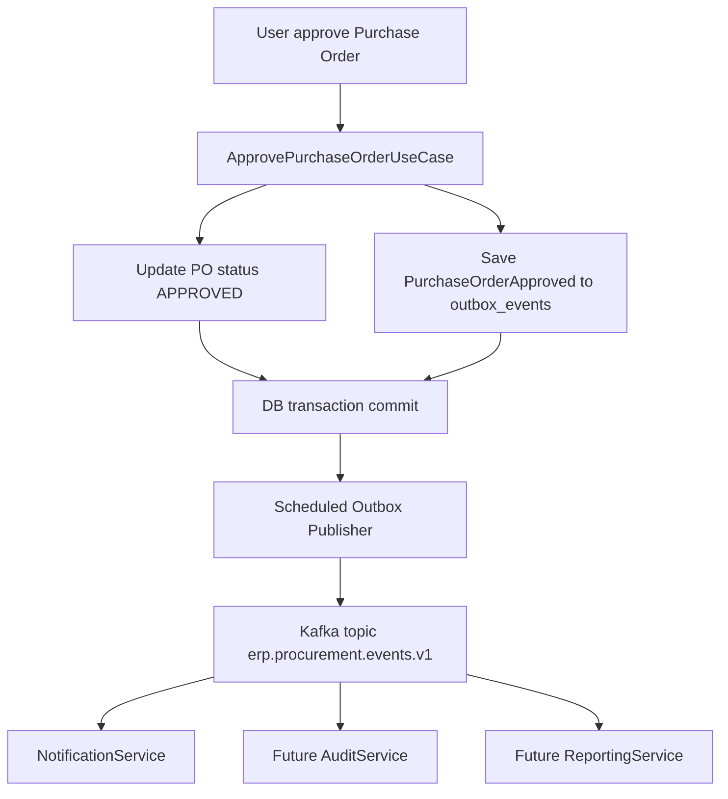

# Brainstorming: ERP Outbox Kafka POC

Tanggal: 2026-06-14
Status: Hasil diskusi / baseline desain awal

## Executive Summary

ERP monolith akan tetap menjadi sistem utama untuk transaksi bisnis. Untuk belajar microservice dan messaging, POC pertama akan menambahkan **integration event publishing** menggunakan Kafka, tetapi dengan boundary yang netral dan tidak bergantung pada NotificationService.

Event pertama:

```text
PurchaseOrderApproved v1
```

Event dikirim ke topic domain:

```text
erp.procurement.events.v1
```

ERP tidak mengirim perintah "send email". ERP hanya menyatakan fakta bisnis: Purchase Order sudah disetujui. NotificationService atau service lain bebas subscribe dan bereaksi terhadap event tersebut.

## Keputusan Utama

1. **Tetap monolith untuk ERP**
   - Tidak memecah modul Procurement, Inventory, AP, atau Accounting menjadi microservice pada POC ini.
   - Messaging dipakai sebagai jalur integrasi keluar, bukan sebagai alasan memecah domain utama.

2. **Menggunakan outbox pattern**
   - Use case bisnis menyimpan event ke tabel outbox dalam transaksi database yang sama dengan perubahan bisnis.
   - Kafka publish dilakukan oleh scheduled outbox publisher setelah transaksi commit.
   - Jika Kafka atau NotificationService mati, transaksi ERP tetap aman.

3. **Polling outbox dulu, CDC ditunda**
   - POC memakai scheduled polling agar fokus belajar Kafka messaging.
   - Debezium/CDC menjadi fase belajar lanjutan untuk use case projection, audit stream, reporting, atau integration feed.

4. **Topic berdasarkan domain bisnis**
   - Dipilih `erp.procurement.events.v1`, bukan `erp.notifications.events.v1`.
   - Alasan: event berasal dari domain Procurement dan dapat dikonsumsi oleh NotificationService, AuditService, ReportingService, atau service lain.

5. **Spring Kafka native**
   - Dipilih untuk mempelajari topic, key, partition, offset, consumer group, ack, retry, dan DLQ secara eksplisit.
   - Spring Cloud Stream tidak dipakai pada POC ini karena terlalu banyak menyembunyikan detail Kafka.

6. **Feature toggle untuk environment**
   - Messaging harus bisa dimatikan lewat konfigurasi.
   - Deployment ERP di OCI tidak terganggu jika Kafka atau NotificationService belum disiapkan.

## Flow Konseptual



## Clean Architecture Boundary

Modul bisnis tidak boleh tahu Kafka, SMTP, atau NotificationService. Use case hanya memanggil port application-level.

Struktur konseptual:

```text
com.solusi.erp.core.messaging
  application.port
    IntegrationEventPublisher

  domain.model
    IntegrationEvent
    EventEnvelope
    OutboxEvent
    OutboxStatus

  infrastructure.persistence
    JpaOutboxEvent
    OutboxEventRepository
    OutboxEventMapper

  infrastructure.publisher
    OutboxIntegrationEventPublisher
    ScheduledOutboxKafkaPublisher
    KafkaEventProducer

  config
    MessagingProperties
    MessagingConfig
```

Use case Procurement cukup melakukan:

```text
ApprovePurchaseOrderUseCaseImpl
  -> validate business rules
  -> update PurchaseOrder status APPROVED
  -> integrationEventPublisher.publish(PurchaseOrderApproved)
```

Implementasi `IntegrationEventPublisher` menyimpan event ke outbox, bukan langsung mengirim ke Kafka.

## Outbox Table Draft

Nama tabel:

```text
outbox_events
```

Field yang disarankan:

| Field | Tipe Konseptual | Keterangan |
|---|---|---|
| `id` | UUID / BIGINT | Primary key internal outbox |
| `event_id` | UUID | ID event global, dipakai untuk idempotency consumer |
| `event_type` | VARCHAR | Contoh `PurchaseOrderApproved` |
| `event_version` | INT | Versi kontrak event |
| `aggregate_type` | VARCHAR | Contoh `PurchaseOrder` |
| `aggregate_id` | VARCHAR | ID aggregate bisnis |
| `topic` | VARCHAR | Contoh `erp.procurement.events.v1` |
| `message_key` | VARCHAR | Key Kafka, direkomendasikan `aggregate_id` |
| `payload_json` | JSON / TEXT | Event envelope lengkap |
| `status` | VARCHAR | `PENDING`, `PUBLISHED`, `FAILED` |
| `attempt_count` | INT | Jumlah percobaan publish |
| `last_error` | TEXT | Error terakhir jika publish gagal |
| `next_attempt_at` | DATETIME | Untuk backoff retry |
| `published_at` | DATETIME | Waktu berhasil publish |
| audit fields | sesuai standar | Mengikuti pola audit project |

Index awal:

```text
idx_outbox_status_next_attempt(status, next_attempt_at)
uk_outbox_event_id(event_id)
```

## Event Envelope Standard

Semua integration event memakai envelope yang sama. Payload berbeda per event.

```json
{
  "eventId": "3f4d8f3a-7f2a-4d37-92f0-111111111111",
  "eventType": "PurchaseOrderApproved",
  "eventVersion": 1,
  "source": "erp-monolith",
  "occurredAt": "2026-06-14T10:30:00+07:00",
  "correlationId": "7e5d1a22-2222-4333-8444-555555555555",
  "aggregateType": "PurchaseOrder",
  "aggregateId": "123",
  "payload": {}
}
```

## PurchaseOrderApproved v1 Contract

Topic:

```text
erp.procurement.events.v1
```

Kafka message key:

```text
PurchaseOrder aggregateId
```

Payload:

```json
{
  "poId": 123,
  "poNumber": "PO-2606-00001",
  "requesterName": "Budi",
  "requesterEmail": "budi@example.com",
  "approverName": "Manager A",
  "approvedAt": "2026-06-14T10:30:00+07:00",
  "totalAmount": 15000000,
  "currencyCode": "IDR"
}
```

Catatan:

- Untuk POC, payload membawa snapshot recipient (`requesterName`, `requesterEmail`) agar NotificationService tidak perlu query ERP.
- Field baru di masa depan harus optional agar consumer lama tetap aman.
- Breaking change harus menaikkan `eventVersion`.

## Feature Toggle

Konfigurasi ERP harus bisa mematikan messaging:

```yaml
erp:
  messaging:
    enabled: false
```

Local development:

```yaml
erp:
  messaging:
    enabled: true
spring:
  kafka:
    bootstrap-servers: localhost:9092
```

Saat `enabled=false`:

- Use case ERP tetap berjalan normal.
- Outbox publisher tidak aktif.
- Tidak ada koneksi Kafka yang wajib tersedia.
- Deployment OCI tetap aman walaupun NotificationService belum dideploy.

## Local Kafka

Kafka lokal memakai:

```text
Kafka KRaft single-node
```

Alasan:

- Lebih modern daripada ZooKeeper mode.
- Lebih sedikit container.
- Cukup untuk POC producer, consumer, topic, retry, DLQ, dan outbox.
- Aplikasi Java tetap hanya memakai `spring.kafka.bootstrap-servers`.

## Retry Producer

Outbox publisher harus konservatif:

1. Ambil batch kecil event `PENDING` dengan `next_attempt_at <= now`.
2. Publish ke Kafka memakai `KafkaTemplate`.
3. Jika sukses, update `status=PUBLISHED` dan `published_at`.
4. Jika gagal, naikkan `attempt_count`, simpan `last_error`, dan set `next_attempt_at`.
5. Jangan menghapus outbox row pada POC agar mudah diaudit.

## Deferred

Hal berikut ditunda sampai POC stabil:

- Debezium CDC.
- Schema Registry, Avro, atau Protobuf.
- Shared event contract library.
- Multi-broker Kafka production cluster.
- Deploy Kafka/NotificationService ke OCI.
- UI monitoring outbox.

## Recommendation

Implementasi ERP sebaiknya dimulai dari shared `core.messaging` infrastructure yang bersih dari konsep NotificationService. POC pertama cukup mem-publish `PurchaseOrderApproved v1` lewat outbox polling ke topic `erp.procurement.events.v1`.

## Next Steps

1. Tambahkan dependency Spring Kafka di ERP dengan feature toggle.
2. Buat Flyway migration untuk `outbox_events`.
3. Buat port `IntegrationEventPublisher`.
4. Buat implementasi outbox publisher yang hanya menyimpan event ke database.
5. Tambahkan event publishing pada use case approve Purchase Order.
6. Buat scheduled publisher untuk publish outbox ke Kafka.
7. Tambahkan test untuk memastikan approve PO tetap sukses saat messaging disabled.
8. Tambahkan test untuk memastikan outbox row dibuat dalam transaksi approve PO.
