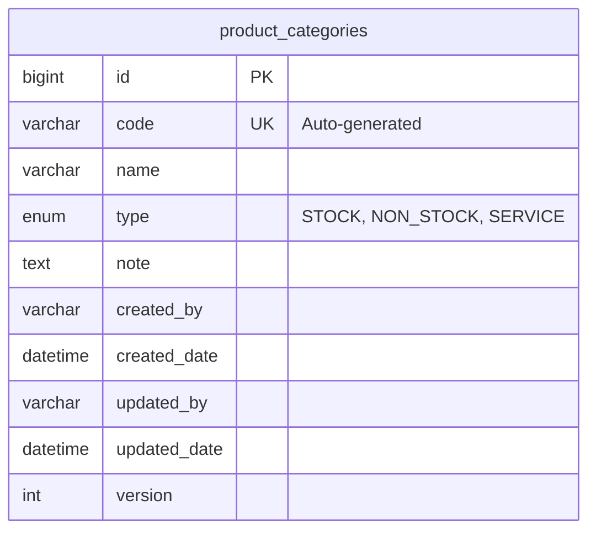

# Entity Relationship Diagram (ERD) - Inventory Module

## Detail Standarisasi:
1.  **Auto Code**: Kolom `code` tidak diinput manual, melainkan di-generate oleh `SequenceGeneratorService`.
2.  **Soft Read-Only**: Di level UI, kolom `code` ditampilkan sebagai `readonly` dengan background `bg-light`.
3.  **Auditing**: Mengikuti standar `BaseModel`.
