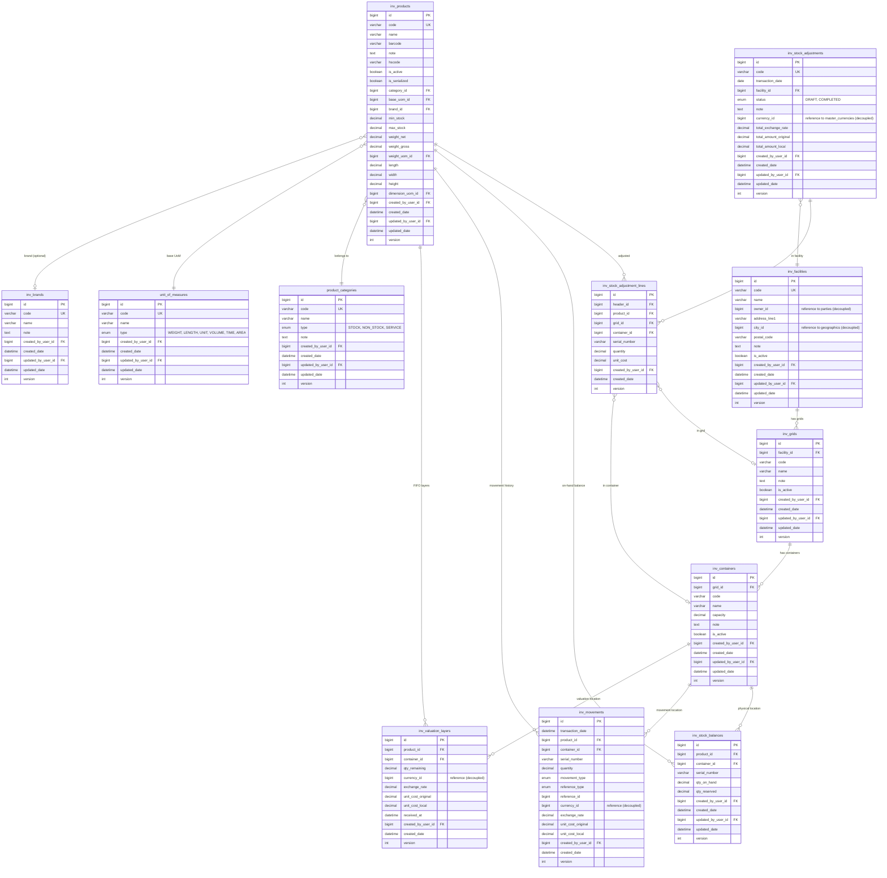

# Entity Relationship Diagram (ERD) - Inventory Module

## Detail Standarisasi:
1.  **Auto Code**: Kolom `code` tidak diinput manual, melainkan di-generate oleh `SequenceGeneratorService`.
2.  **Soft Read-Only**: Di level UI, kolom `code` ditampilkan sebagai `readonly` dengan background `bg-light`.
3.  **Auditing**: Semua tabel mengikuti standar `BaseModel` — kolom audit adalah `created_by_user_id` dan `updated_by_user_id` (BIGINT FK ke `users`).
4.  **Cross-Module Decoupling**: `inv_facilities.owner_id` → referensi ke `parties`; `CurrencyAmount` embeddable menyimpan `currency_id` (Long) bukan FK langsung ke `master_currencies`. Ini adalah pola cross-module yang disengaja untuk memutus coupling.
5.  **Stock Status**: `inv_stock_balances.qty_on_hand` dan `qty_reserved` menentukan `qty_available = qty_on_hand - qty_reserved`.
6.  **FIFO Valuation**: `inv_valuation_layers` menyimpan batch masuk. Saat stok keluar, layer dikonsumsi dari yang terlama (First In First Out).

