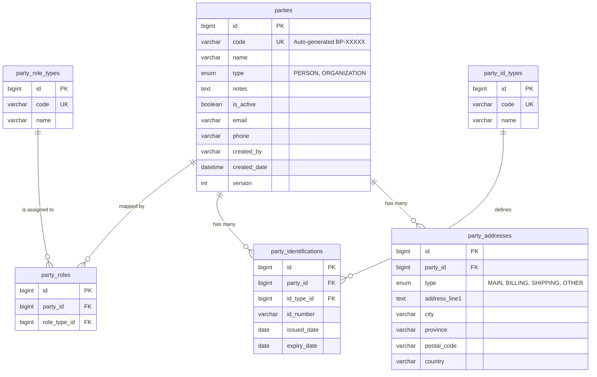

# Entity Relationship Diagram (ERD) - Business Partner Module

Diagram ini merincikan struktur tabel fisik di database untuk modul Business Partner.

## Spesifikasi Teknis:
1.  **Integritas Data**: Semua relasi menggunakan `FOREIGN KEY`. Tabel anak (`party_addresses`, `party_identifications`, `party_roles`) menggunakan `ON DELETE CASCADE` untuk menjaga kebersihan data jika Party dihapus.
2.  **Unique Constraints**: 
    *   `parties.code` bersifat unik.
    *   `party_role_types.code` dan `party_id_types.code` bersifat unik untuk lookup yang stabil di kode Java.
3.  **Auditing**: Tabel utama dan tabel detail memiliki kolom `created_by`, `created_date`, dan `version` untuk audit trail (mengikuti `BaseModel`).
