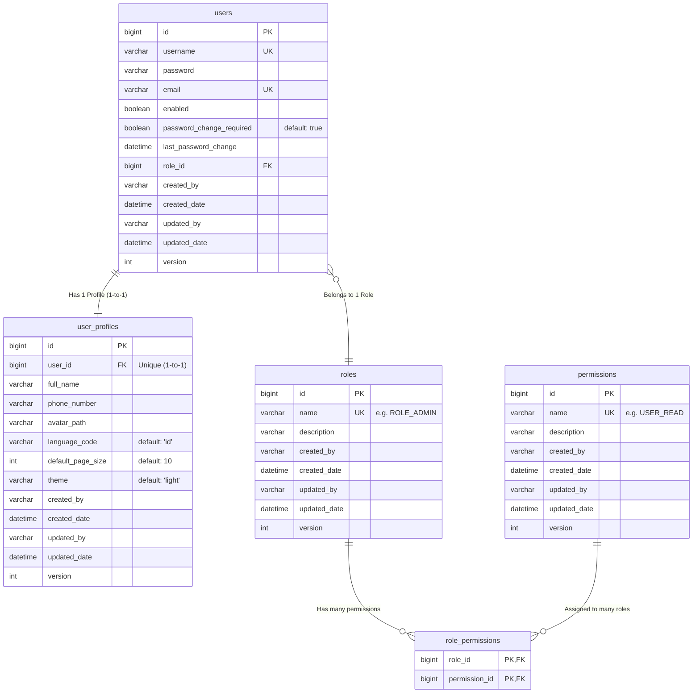

# Entity Relationship Diagram (ERD) - Security & RBAC Module

Diagram ini merincikan struktur tabel database yang akan diimplementasikan melalui script migrasi Flyway.

## Detail Tabel & Constraints:
1.  **Standard Columns**: Kolom `id`, `created_by`, `created_date`, `updated_by`, `updated_date`, dan `version` adalah kolom standar yang diwarisi dari `BaseModel` di kode Java.
2.  **users**: Kolom `username` dan `email` harus **UNIQUE**. `role_id` tidak boleh null.
2.  **user_profiles**: Kolom `user_id` memiliki **UNIQUE constraint** untuk menjamin relasi 1-to-1.
3.  **role_permissions**: Tabel perantara (junction table) untuk relasi Many-to-Many antara Role dan Permission.
4.  **Audit Columns**: Semua tabel (kecuali junction table) wajib memiliki kolom audit sesuai standar `BaseModel`.

## Strategi Otorisasi:
*   **DASHBOARD_READ**: Permission universal agar user bisa mengakses landing page.
*   **Granular Access**: Konten di dalam dashboard (chart, summary) dirender secara dinamis di level Thymeleaf menggunakan `sec:authorize` berdasarkan permission spesifik lainnya.
*   **Naming Convention**: 
    *   `MODUL-NAME_ACTION` (Dash untuk modul, Underscore untuk aksi).
    *   Contoh: `SALES-ORDER_READ`, `SALES-ORDER_CREATE`.
